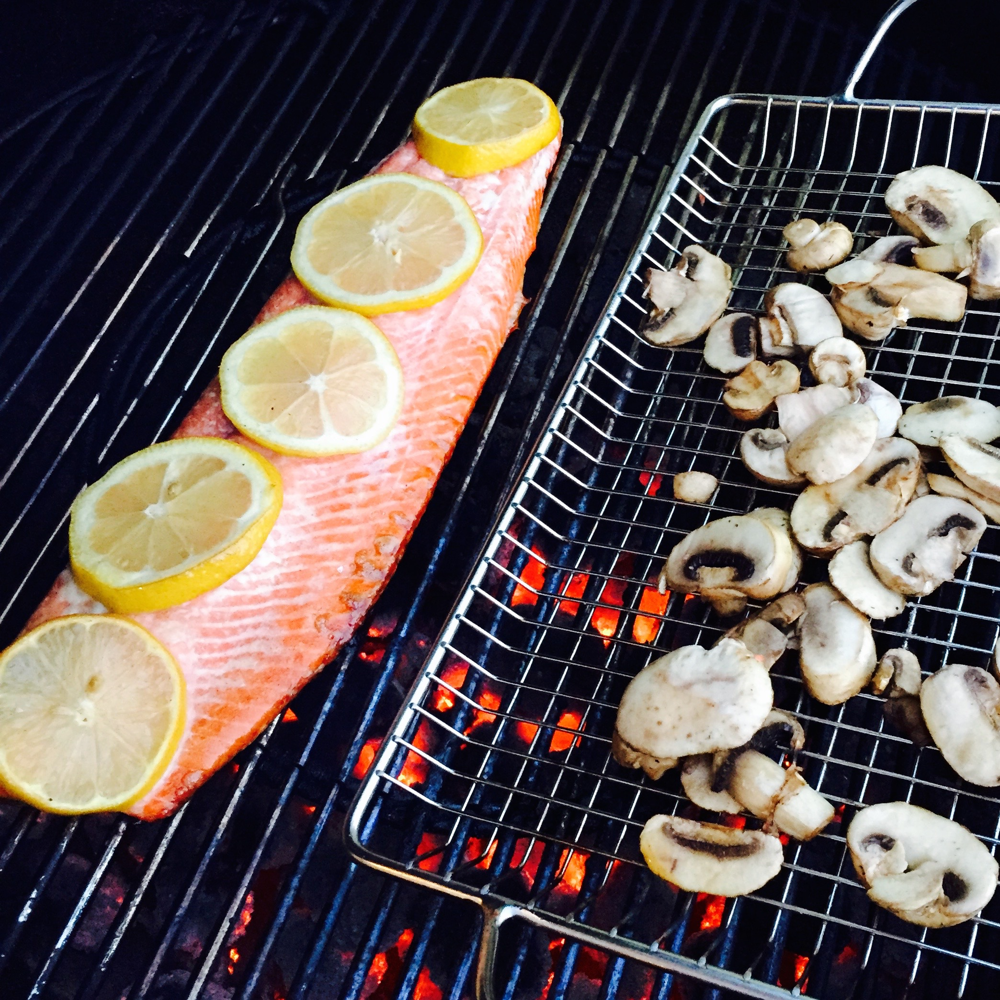

Copper River Salmon is my favorite salmon. I still remember the first time I had some copper river. It was in Seattle with my parents on our last hurrah family vacation the summer after my first year of graduate school. I didn't know salmon could taste like that. It was the first properly-cooked, wild-caught salmon I had ever tasted. When Carrie and I saw that Costco had wild-caught Copper River Sockeye for sale a few weeks ago, I had to get some. I went ahead and grilled it, along with some mushrooms. All I did was put some salt and lemon on it. With salmon that has so much flavor, you don't need a lot of extras. The fire video below is just me playing with the SloMo on the iPhone 6. (I recommend going to the Vimeo page to view it in HD if it won't let you view HD on the embedded player.)

<iframe src="https://player.vimeo.com/video/131098522?wmode=opaque&amp;api=1" width="400" height="300" frameborder="0" title="Cool Grilling SloMo" webkitallowfullscreen mozallowfullscreen="" allowfullscreen=""></iframe>
