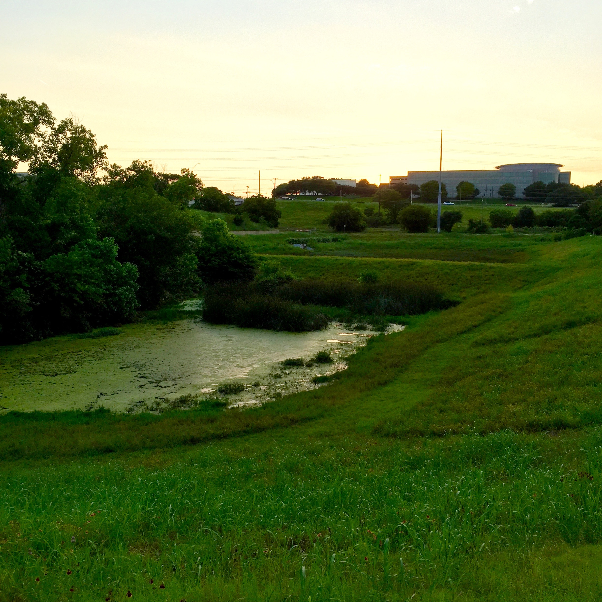

A few years ago I basically gave up bike riding. After having spent several years racing on and off, I had spent the better part of 2 years spending a lot of time on the bike, I got thin, got fit, and then decided that I was just tired of it.

I wasn't sure if it was watching a guy and his bike bounce down a hill (separately, but amazingly synchronized) at the last race I ever did. Or maybe it was the two people who rode into the shoulder while basically looking right at me in one week commuting home. Regardless, I was done cycling.

But something strange happened a few weeks ago. I went for a bike ride. And I just loved it. Every second of it. So I have been riding again. Not every day, not particularly fast, but riding. It has been great.

\[caption id="" align="alignnone" width="2448"\] For what's it's worth, I did not earn this view atop Ladera Norte. \[/caption\]

You just see so much stuff when you go ride. Neighborhoods, deer, other people, sunsets, hills, more deer, little details that you miss in a car, and yes, even more deer. I guess you would see them running, but 1) I'm usually focusing on whatever random part of me is hurting that run, and 2) you just don't go very far.

\[caption id="" align="alignnone" width="2448"\] Okay, I did get myself up to the top of Cat Mountain, but not the road in the picture... the short, steep hop from Mesa. \[/caption\]

I'm not saying that I'm going to get back into racing. Actually, I'm pretty certain I don't ever want to do that again. In fact, I don't want to ride to "train" for anything. I don't want to think about HR zones, or power curves, or Strava segments. I just need to exercise–I need to get back to that healthy person I knew a few years ago. I want to ride because it's a great way to get home instead of driving, it's fun and enjoyable, and it has the great side effect of burning calories. 

\[caption id="" align="alignnone" width="2448"\] Sunset light can even make runoff control look sort of pretty. \[/caption\]

So here's to riding. Here's to seeing the world a little more close up, at a little bit slower pace, and taking it in just that little bit more.
