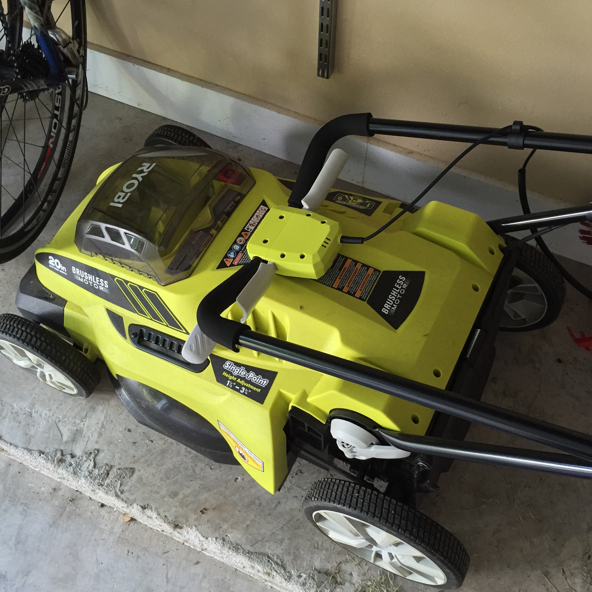

[Hackberry trees](http://www.na.fs.fed.us/spfo/pubs/silvics_manual/volume_2/celtis/occidentalis.htm) are terrible. Well, they may have uses other places, but in Austin they mainly act like weeds on steroids. At some point in the early spring, we went from being able to see our back fence, to not being able to see it. It was a hackberry explosion. 

I had been meaning to get out there for a while and cut them down. But that would require me using my little chainsaw, and it is corded. I had picked up a bunch of Ryobi 40V cordless stuff, and I just didn't want to use anything with a cord anymore. So the other weekend, I went pick up this at the Home Depot:

\[caption id="" align="alignnone" width="1338"\] Hello, welcome to the fold... \[/caption\]

It is amazing. Slap that 40V battery in and you are free to cut things without worrying about cords. Luckily, this same weekend was the beginning of bulk yard waste week for our neighborhood. I went to work with the chainsaw, and Carrie and I got everything out to the curb, including some random limbs that had come down during all the rain storms. It was nice to see this on our curb instead of in our backyard and against our fence:

\[caption id="" align="alignnone" width="2448"\] Off with you! \[/caption\]

I really cannot say enough good things about the Ryobi 40V line. We now have the lawnmower, the string trimmer, the tiller (it's actually just a different attachment for the body of the string trimmer), and the blower. All the same batteries, all the same cordless convenience. I love the stuff:

