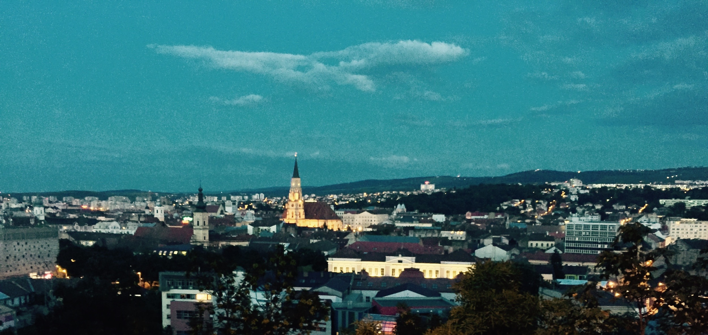
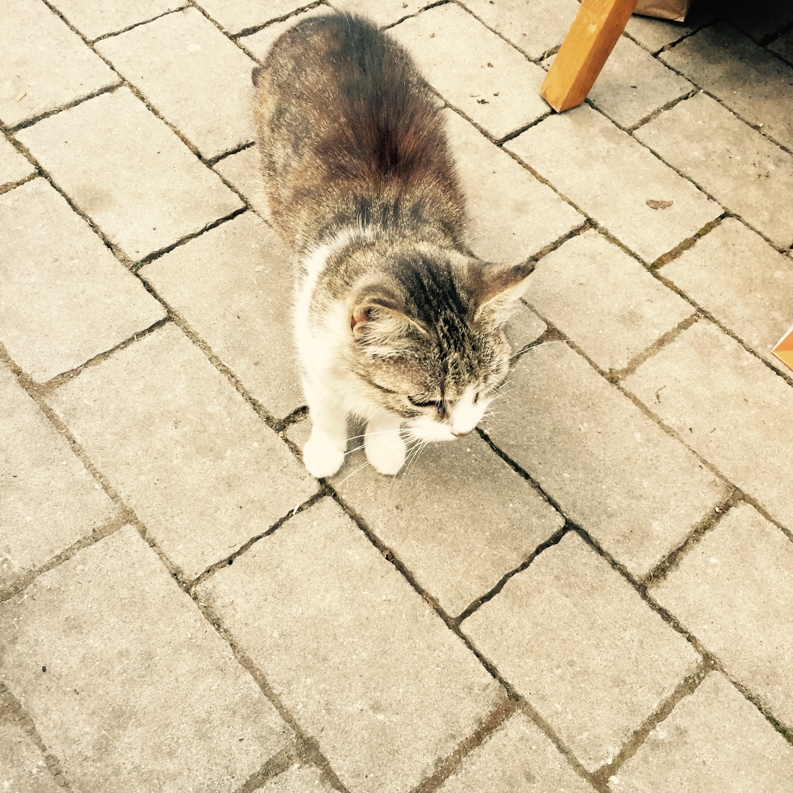

First off, let me say how much I love Lufthansa. They give you food on short, regional flights. I appreciate that. And it's real food, with hearty bread. The picture on the right I think is Budapest, as the captain mentioned we'd be flying over it shortly, and this was the biggest thing out the window at that time.

\[caption id="" align="alignnone" width="2448"\] Real food on a 1.5 hour flight. Amazing, much love to the Germans. \[/caption\]

\[caption id="" align="alignnone" width="2448"\] I think this Budapest from 35000 feet. \[/caption\]

My coworker and I arrived in [Cluj](https://en.wikipedia.org/wiki/Cluj-Napoca) without any travel hiccups, and given [some of the other issues](http://www.bbc.com/news/uk-northern-ireland-33226740) some other coworkers have had recently, we were both very thankful. That first day after an trans-oceanic flight is always weird. You're super tired, but you know the worst thing in the world would be to go to sleep for any significant amount of time. What's the best way to combat it? Walking and sight-seeing.

\[caption id="" align="alignnone" width="2448"\] Statue of Matthias Corvinus in front of St. Michael's Church \[/caption\]

\[caption id="" align="alignnone" width="2448"\] Dormition of the Theotokos Cathedral, and I'm not sure what the statue on this side signifies \[/caption\]

\[caption id="" align="alignnone" width="2448"\] Dormition of the Theotokos Cathedral and statue of Avram Iancu \[/caption\]

There are a lot of churches here, and down the street from the hotel in the city center are two of the most well known in Cluj, the Roman Catholic St. Michael's and the Orthodox Dormition of the Theotokos Cathedral.

The architecture is an interesting mix of Austrian and ugly Communist with a hint of medieval. 

\[caption id="" align="alignnone" width="1821"\] The National Theater \[/caption\]

\[caption id="" align="alignnone" width="1977"\] I love taking pictures down streets. It's the criss-cross of the wires and other stuff with the natural lines of the streets that I always find interesting. \[/caption\]

After lunch we walked around some more and saw some interesting things. I have no idea what these eyes are, but they just needed to be photographed. I love the styling on the Melody hotel sign... looks like something right out of the turn of the twentieth century.

\[caption id="" align="alignnone" width="1926"\] No clue \[/caption\]

\[caption id="" align="alignnone" width="1296"\] What an amazing sign, at night it lights up and changes colors. \[/caption\]

\[caption id="" align="alignnone" width="2448"\] Fishing in the Somesul Mic river. Not sure if he ever catches anything, but more power to him. \[/caption\]

The second day here was mainly taken up by being at the office (which is really awesome, and alas I didn't yet take any pictures of it). But after a beer at a rooftop bar (from which I took the picture below on the right), we headed off for supper at a really nice place with a fantastic outdoor space. And also... the weather has been amazing.

\[caption id="" align="alignnone" width="2448"\] The view from my hotel room \[/caption\]

\[caption id="" align="alignnone" width="2448"\] The view from the rooftop bar \[/caption\]

There were several cats roaming around the restaurant, looking for scraps. The tabby got pretty close to me, but managed to stay just far away enough that I couldn't touch him. He was looking for food. Me and a coworker shared that pork leg dish, and it was delicious.

\[caption id="" align="alignnone" width="1868"\] Black restaurant cat \[/caption\]

\[caption id="" align="alignnone" width="2448"\] Tabby restaurant cat \[/caption\]

\[caption id="" align="alignnone" width="2448"\] Delicious, delicious pork. So delicious. Those pickled peppers were awesome. \[/caption\]

After dinner our entire group took a nice walk in the park, and then climbed up the hill towards Hotel Belvedere to get a good view of the city at night time.

\[caption id="" align="alignnone" width="1862"\] You can rent paddle boats during the day from this place. \[/caption\]

\[caption id="" align="alignnone" width="2380"\] The old casino. \[/caption\]

\[caption id="" align="alignnone" width="2362"\] No idea, but it was a cool art installation. \[/caption\]

Cluj is really a beautiful city, and this shot at night I thought summed it up pretty well.

