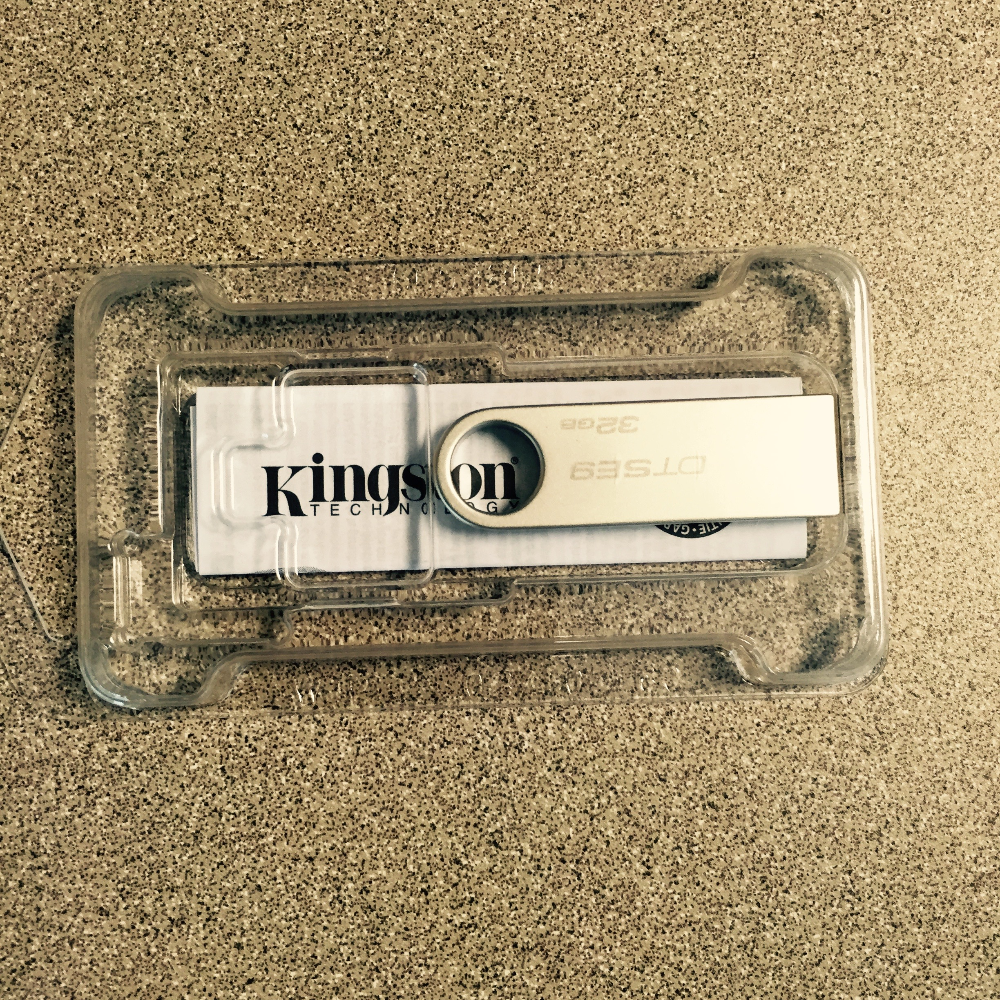

Today I experienced the future we were promised, a.k.a. [Amazon Prime Now](http://www.amazon.com/b/?node=10481056011). I wanted to try something out on my Mac that required a flash drive, and a coworker suggested a Kensington model with no silly moving plastic parts. I liked it, and decided to check Prime Now to see if they had it. 

They did! So since there is a $15-minimum-order rule, my coworker said to get him one as well. I placed the order on the app, and it told me it would be here b/w 2 and 4 PM.

Once the items were on their way, I got to watch a little purple dot on my phone drive around Austin with my package. When it was here, the delivery person called me, and I went downstairs to meet her, and lo and behold there were our drives in Amazon's frustration-free packaging. Pretty amazing, and free to Prime members. I highly recommend it.

