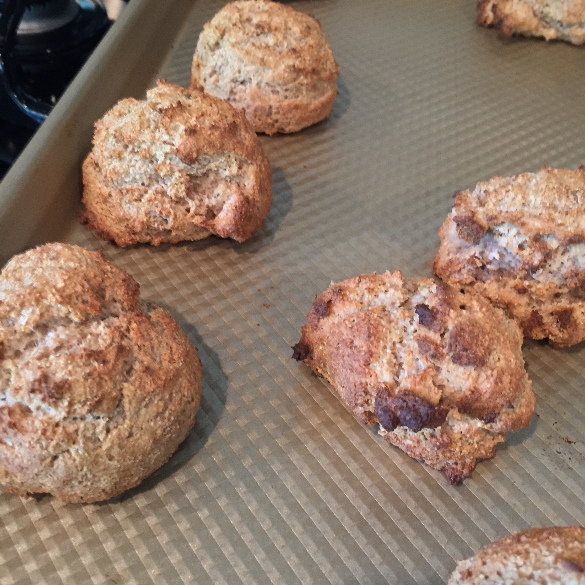

Many people know that I really enjoy a good biscuit. Several years ago I decided that Bisquick couldn't be that hard to produce, and decided to look up some good biscuit recipes on the internet. I wanted a completely-from-scratch biscuit. It had to start with all standard ingredients that we would normally have around the house (e.g. flour, butter, salt, etc.) and be relatively straight-forward to produce (i.e. I didn't want to have to spend 2 hours making biscuits).

I found a recipe, and have tweaked it over the years to make a biscuit that I think is really tasty. So I set out to make a batch this last Saturday, take a bunch of pictures, and post about it here. _This is not that post._

This is a post about the importance of butter. You see, when you cut cold butter into the dry mixture, distributing little butter pieces throughout the dough, you are preparing for the future. And that future is a 450˚ F convection oven.

The water in the butter turns to steam, and that steam pushes the biscuit dough out, making little bubbles. The fat parts coat the inside of the biscuit, and what you are left with is a fluffy, luscious biscuit. (By the way, these are drop biscuits, rolling out the dough to make flaky layers violated my 2nd rule above... sorry, BeBe.)

You know what happens when you don't put butter in your biscuit? This:

You get little dried-out hockey puck biscuits. They were gross, and sat like a lead weight. Sigh. I should have realized something wasn't quite right when I put them on the tray and I was 1.5 biscuits short of my usual amount. Carrie told me I had to post about this because people love posts about failure. So to not end on such a low note, here's a picture of Pierre:

