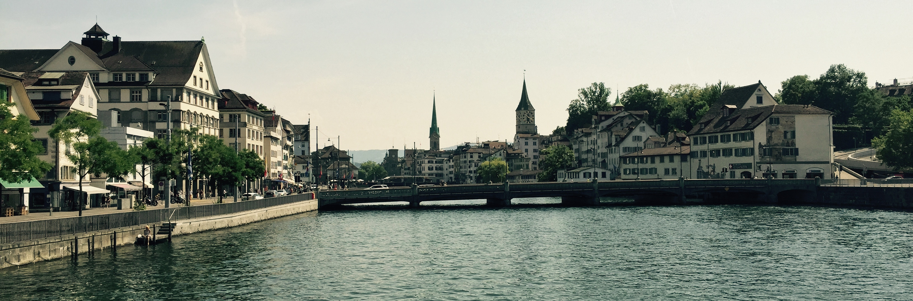

First of all, we had a great time. We stayed busy, and it was incredibly hot in Paris. But overall, it was great to see a few new places (for me at least), and as always great to see our friends living in Europe. 

I really wanted to get this post out of the way so that I wouldn't be stuck in posting. That seems to be how it always happens. You have something you want to write about, and you put off writing about it because it was a big deal, and then you never write anything else. I did not want that to happen.

A few observations from Paris:

- I love Paris. Absolutely loved it. Well, other than the lack of air conditioning. But other than that I was a huge fan. I mean, you can grab a bottle of fantastic wine, some amazing bread, some stellar cheese, and just go sit on the river and enjoy the evening. That's right, people are drinking alcohol in public and no riots are occurring. There was just a relaxed attitude about things such as that that I really appreciated.
- The Métro is great and super convenient.
- Window screens are a concept the rest of the world really needs to embrace.
- The cheese, oh, the cheese.
- The pastries... now that's how a pain au chocolat should be. So much delicious butter.
- Rose is amazing, and you can get an amazing bottle under €10.

We also spent some time in the Netherlands, and that is a place that Carrie and I both really dig. The Dutch always are a great people, and any place that is bike centric is just amazing.

Zurich was a new place for both of us, and I dug it. It was much smaller than I was expecting. The public transit is absolutely fantastic, and everybody, rich and poor, uses it. Since it was still pretty hot there, we went down to the lake with Allen and Nathalie for a swim, and that was a blast. I'd definitely like to go back there when it is cooler and clearer and go see the Alps.

So overall it was a great trip! I have posted some select photos on [Facebook](https://www.facebook.com/media/set/?set=a.10155848444270164.1073741829.678720163&type=1&l=2f470e9f80) and on [flickr](https://www.flickr.com/photos/djwhitebread/sets/72157655561329859). Now back to some regularly scheduled djwhitebread.
