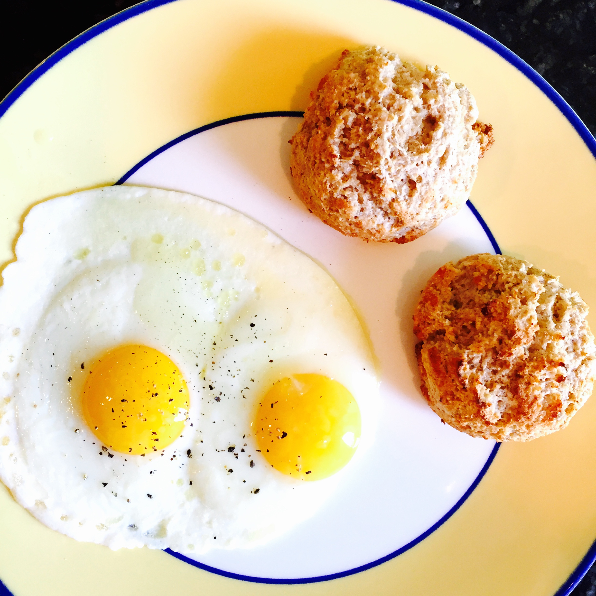

I'm not sure if people remember my [biscuit fail post](http://djwhitebread.com/blog/2015/6/8/the-tale-of-the-failed-biscuits), but it had been a while since then and I hadn't had the opportunity to make biscuits lately. I decided I would make a fresh batch this weekend. I also had some buttermilk leftover from the [eggplant dish](http://djwhitebread.com/blog/2015/7/22/the-amazing-eggplant), so this seemed like the perfect opportunity.

I used a combination of white wheat, AP, and rye flour. Instead of the yogurt that I normally put in I used buttermilk.

This time I sifted the flours, baking powder, and baking soda together (not pictured). I found it made smoother crumb in the finished biscuit. I also remembered the butter this time! Very key ingredient. I made a few sunny side up eggs to go with, and had a nice breakfast.

The recipe is below:

Ingredients:

- 1 cup White Wheat flour
- .5 cup Unbleached All-Purpose flour
- .5 cup Rye flour
- 4 teaspoons Baking Powder
- .25 teaspoons Baking Soda
- .75 teaspoons salt
- .5 teaspoons sugar
- 4 tablespoons butter
- 1.25 cups yogurt (or 1.5 cups buttermilk)

Preheat oven to 450˚F. I use convection bake on my oven, but if you don't have a convection oven don't worry.

Sift the flours, baking soda, and baking powder together. Add the salt and the sugar and give the dry mixture a few stirs to fully combine. Cut the butter (preferably very cold) into small chunks, and integrate into dry ingredients. Use a pastry knife to cut butter into dry ingredients until no single chunk of butter is bigger than a pea.

Pour 1 cup of the liquid into the mixture, and stir to combine as best as you can. There will most likely still be some dry parts (the whole wheat flour can soak up a lot of moisture) so wait a few minutes and then add the remainder. The mixture should be wet, but still hold together.

Partition out the biscuits using spoons, or as I prefer, a disher. The size disher I use gets about 11 biscuits on average. 

With convection cook the biscuits around 9 minutes. Without convection, cook until they start to brown on the outside (probably 15-20 minutes), rotating the pan every five minutes or so.
