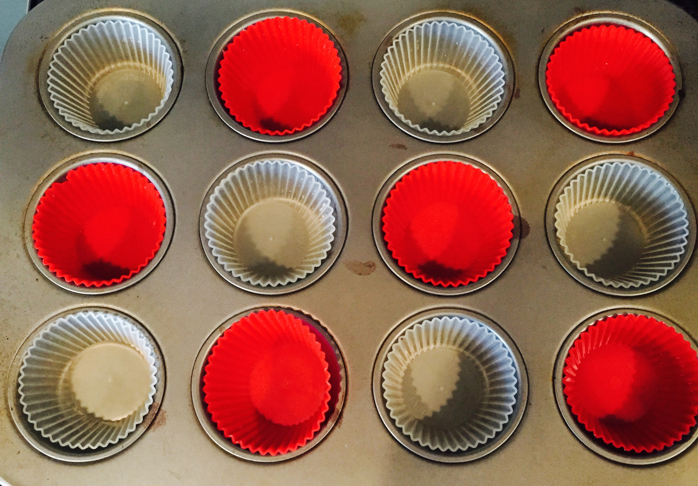

I love big breakfast. It's just a thing I got from my parents. This past Sunday morning, I was up early and wanted to make something different. I have done biscuits more times that I can count, I had just done waffles a few weeks ago (and they take forever), so I was looking for something different.

I started flipping through Carrie's [One Bowl Baking](http://www.amazon.com/One-Bowl-Baking-Delicious-Desserts/dp/0762448954/ref=sr_1_1?ie=UTF8&qid=1441066989&sr=8-1&keywords=one+bowl+baking) book looking for ideas, because she and I made the double-chocolate muffins out of here and they were delicious. I found the corn muffin recipe and this sounded like a good call. We had all the ingredients on hand, and it seemed like a good combination of things for a breakfast muffin.

The recipe was very simple, and I used our KitchenAid mixer which is on its last leg (foreshadowing) to blend everything. 

It was the standard process: mix wet ingredients, and then mix in all the dry ingredients. I love this book because it gives measurements by metric mass instead of volumetric. After everything was mixed I lined our muffin tin with sillicups (which are amazing, by the way) and got the disher out to start scooping. Once I put them in the oven that's where things got interesting.

As I was getting down to the bottom of the bowl I noticed that the mixture had a different, more grainy feel. It seemed that the mixer hadn't really been scraping the bottom, and thus the butter and sugar weren't properly mixed own there. I didn't think too much of it, but I really should have mixed it all by a couple of times as I had a suspicion the mixer wasn't doing a good job. I have entire post to write about how bad the modern-day KitchenAid mixer is.

Since we have a convection oven, I'm always playing somewhat of a guessing game to try and figure out times the first time I cook something. The oven has a "Convection Convert" button, but it drops the temperature down, and I'd much prefer it drop the time down and keep the original temp. Anyway... I noticed pretty early that some of the muffins were puffing up nicely, and some of them were super wet on top. What was basically happening was that a butter/sugar mixture was spilling out of the muffins that were from the bottom of the bowl. What ended up happening is I left them in there much longer than I should have trying to get all of them to dry up, and thus got several overcooked muffins.

But, they did taste really good, and I now I know how to get them in a good state. I will probably make a few edits to the recipe the next time I do it (reduce the sugar, play with the type of flour to use in addition to the corn meal). But paired with a few fried eggs, it was a good breakfast!
