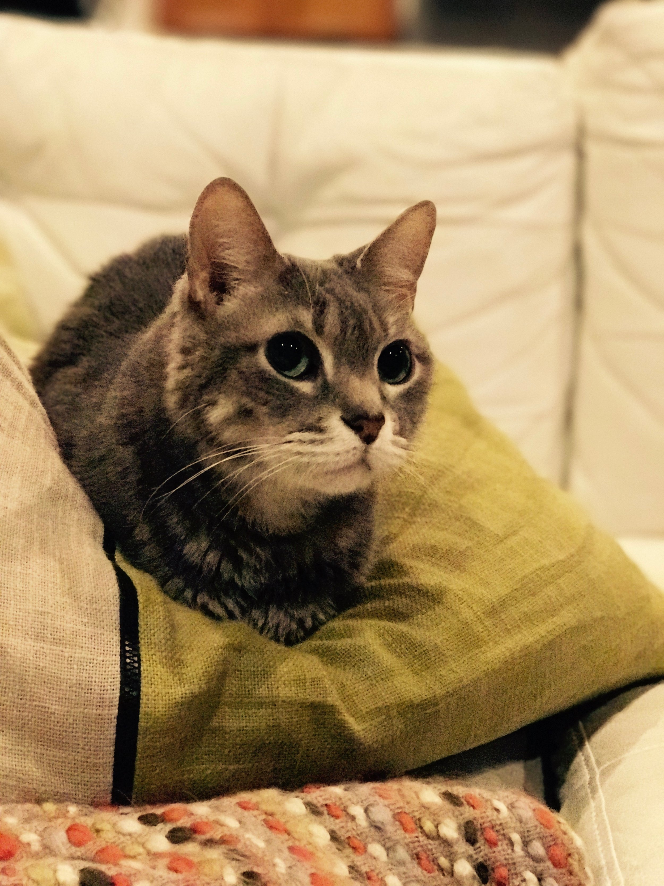

It's been a while since I fired up the ol'blog. November of 2015, in fact. Ah, those were simpler times. I had just discovered that you can sous vide a pork shoulder and make it taste like it came out of a smoker. I had just started singing in the choir at church. Oh, and the president wasn't a fascist narcissist with a white supremacist as one of his main advisors. Good times.

But alas, things have changed, and every piece of news coming from the new administration causes me more anxiety. I can't ignore it, but I have to do what I can to not let it consume me. I can try and make my little part of the world a better place. So on to the nice things.

First off: Pens! Nice Paper! Writing things by hand! I have always had an interest in fountain pens. In fact, Carrie gave me a pen for our wedding. I loved that pen–it unfortunately got stolen. But there is something so pleasant about writing with a fountain pen on high-quality paper. You don't have to use much pressure, and the pen just glides across the paper. 

And the inks. I love the thoughtfulness that comes from filling your pen and writing with that new color. It's deliberate, it's intentional. Plus, there are colors for days.

But alas, while I had written a good bit while I was a postdoc, I had not done much lately. The pens sat on my desk at work, with my few bottles of ink, but I rarely used them. Honestly, I felt like I spent more time cleaning out the crusty ink every six months when I would decide I wanted to write something than I did actually writing. 

However, in December, we went to visit some of our Meg and Harry in California. Harry mentioned to me that he had gotten into fountain pens lately, and thought it was something I'd like. I told him it was absolutely something I liked. Then the pens started coming out, all with different wonderful inks. When I noticed that his little daughter was scribbling on torn out Rhodia paper, I knew, yes, he had truly gotten into this. The interest in me was awoken!

So on that front, this month is InCoWriMo, or International Correspondence Writing Month. The goal is to write to somebody every day of February. So that's what I'm going to do, share the joy of writing with people by writing letters. I may not get a letter out every day, but I do intend to write 28 of them.

I'll post more specifics about pens and inks and papers and all the fun associated with it later. I know everybody is thrilled! ;)

So on to exercise. I had known for a while that I was getting bigger. After I hurt my back while we were in France, I basically stopped exercising. That was the beginning of October. To be honest, after the election, I used the ample amounts of holiday treats to try and not think about the terrible situation we had just gotten ourselves into.

So, the day after my birthday, I needed to know how bad it had gotten. I stepped on the scale and saw 249.8. That's the heaviest I have ever weighed in my entire life. I couldn't believe it. I decided enough was enough–I had to take action.

What was that action? To be honest, nothing drastic. Drastic doesn't stick, drastic isn't sustainable, drastic doesn't become habit. During the week I cut out starches. My body responds well to this, so this seemed like an easy start. I still feel satiated, but I'm trying to be more mindful of when I'm hungry versus when I'm just stuffing food in my face. On the weekends, I let myself cheat some, but I'm trying to be mindful about that. Do I really want this–is this really worth it. And if it is, I enjoy it without guilt. I also cut out drinking during the week. And lastly, sweets. This I had to do full on. I allow myself some dark chocolate after supper, but that's where I draw the line.

Unlike my previous stint of weight loss in 2015, this time I'm also exercising. I've only gotten in 1.5 weeks of consistent exercise, but I already feel better (and if it's placebo effect, I'll take it). Nothing crazy–a little bit of running and some weight workouts. I'm trying to keep the time in check to maximize my chance of success and consistency. I'm currently down over 12 pounds, and that makes me happy and makes me want to keep going. I have a long way to go, and it won't happen overnight, but that's ok.

So that's where I'm at. When I look out and see so much hate, so much fear, and policies and actions that make my stomach turn, I can either crumple under the anxiety, or I can try to improve my world. I'm not trying to humble brag here either. There are many people actually out their fighting in the streets, out there protesting, out there working hard to change people's minds and affect real change. But I have to start somewhere. I wasn't happy with myself, so exercise and food mindfulness are the first step there. And I need something joyful, and writing letters helps to spread that joy (and maybe some of those letters will go to my elected officials in Washington, D.C.).

Spread love - Whitebread

