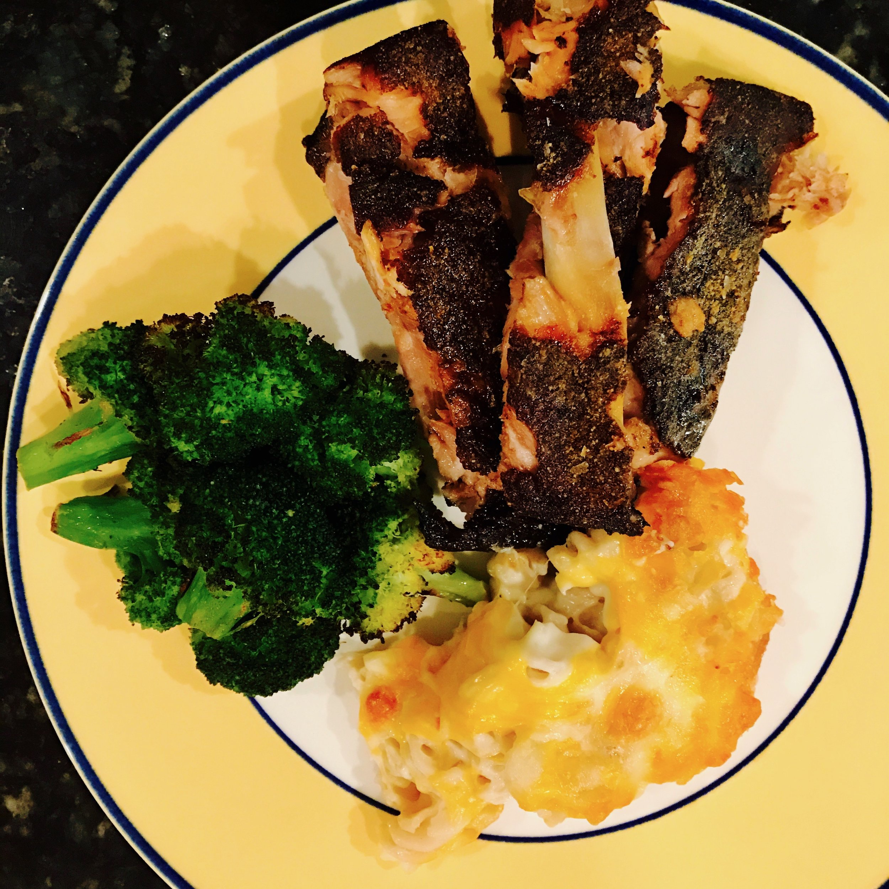

I have had good success with the pork shoulder in the sous vide, and I was curious how baby back ribs would turn out. It seemed like it would work without requiring as much time in the sous vide (the shoulder takes a 24 hour dip in the bath). So I used the [pork shoulder recipe](https://www.chefsteps.com/activities/smokerless-smoked-pork-shoulder) at [chef steps.com](https://www.chefsteps.com) as a starting point. (Funny side note, in just looking this up I saw that they actually have a [baby back rib recipe](https://www.chefsteps.com/activities/smokerless-smoked-ribs-incredible-barbecue-no-smoker-required). It varies slightly from what I did, so I may have to give this another try.)

I started the rack off with a thick coat of glaze that's a 1:2:4 ration of liquid aminos:liquid smoke:molasses. I do like this rub as it is full of umami and gives it that good smoky flavor without having to own a smoker. (Funny side note 2: liquid smoke isn't creepy. It's an amazingly straightforward product. Alton Brown did an episode of Good Eats where he explained it, so please–no shade.)

I did cut some slices into the ribs to help the glaze penetrate a little more. I had not brined these ribs at all, so I wanted to try and get some seasoning into the meat.

After the ribs were nicely soaked in the glaze, they got bagged up and dunked in the sous vide. (The bigger graduated tub I bought in January came in very handy here.) I put it at 70˚C (158˚F) for 6 hours. It isn't pictured here, but I did cover the water bath with plastic wrap. For a period of that long, and especially with water at that temperature, you are going to get a ton of evaporation if you don't cover the bath.

After their 6 hour stint in the bath, I removed from the bag and dried the ribs off. I put on another coat of glaze. The rub was pretty simple: kosher salt, ground mustard seed, garlic powder, smoked paprika, and black pepper.

Carrie had mentioned that mac and cheese would be perfect with this, so I whipped up a quick batch of that as well. I will do a post about the mac and cheese recipe I came up with soon. It does come out really tasty. To round out the meal I roasted some broccoli. We also opened a 2013 Toulouse Pinot Noir from Anderson Valley. The pinot stood up to the pork perfectly, and it turned out to be a great pairing.

All-in-all it was a great meal with my lovely wife. Eating at restaurants is awesome, but there is something amazingly satisfying about cooking an excellent meal at home. :)
