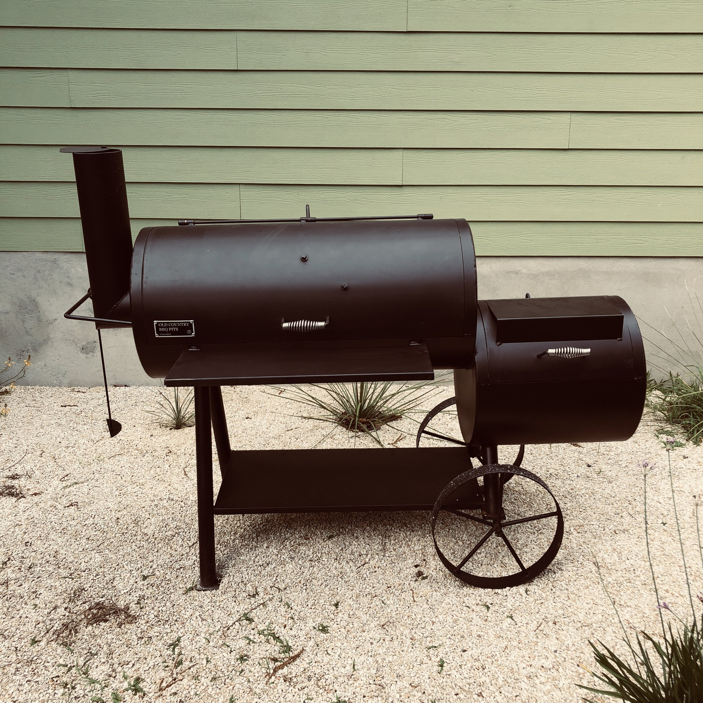
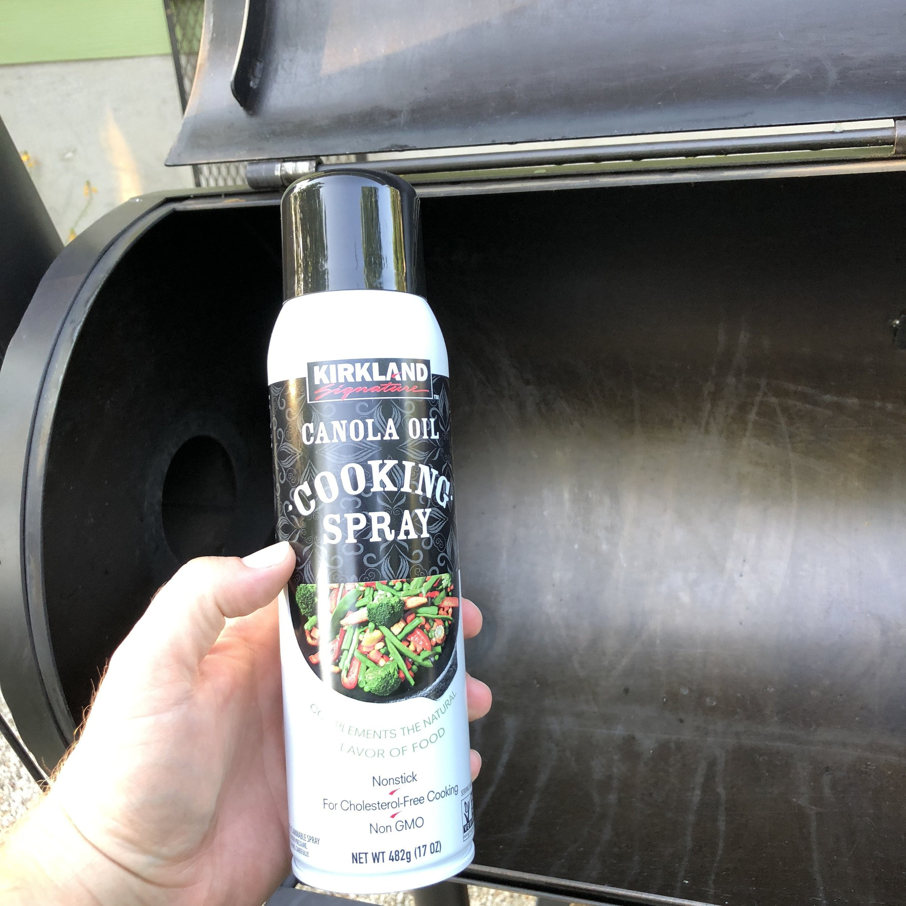
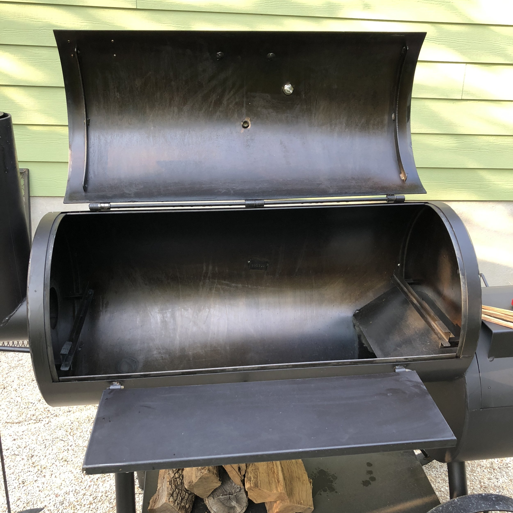
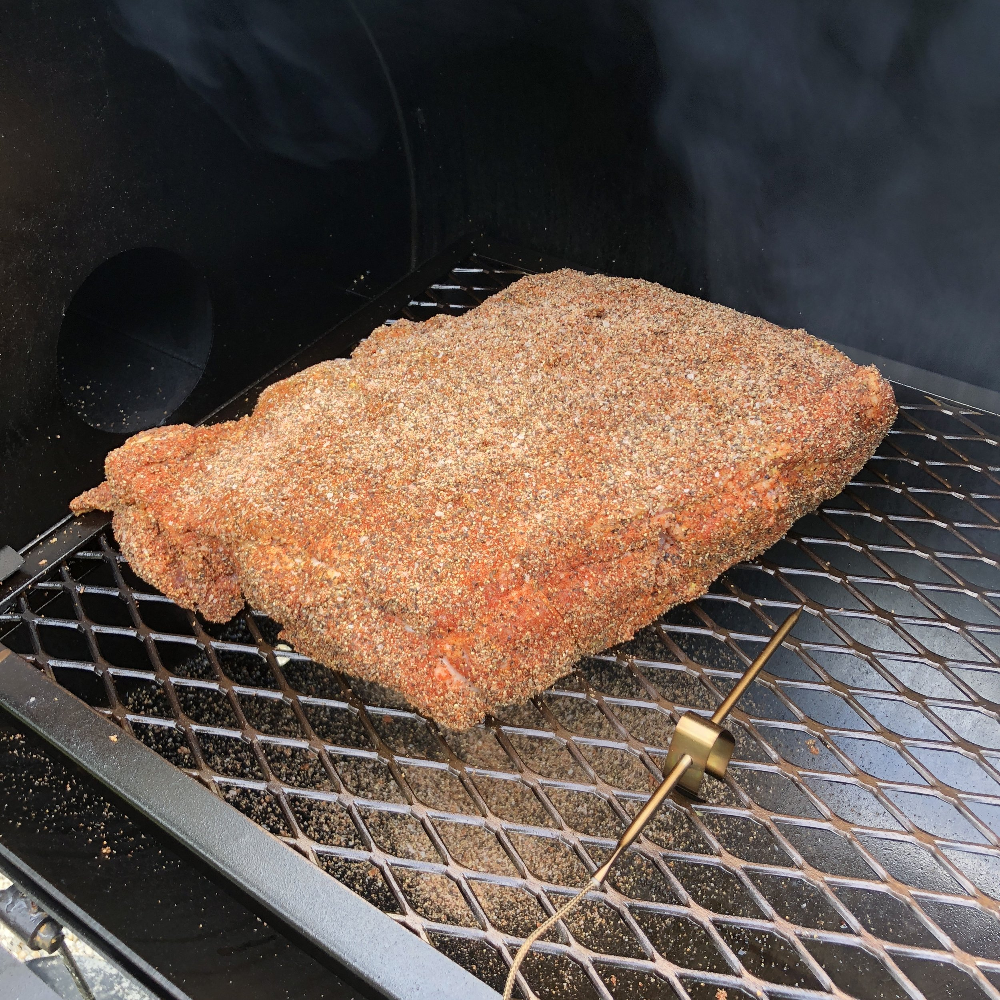
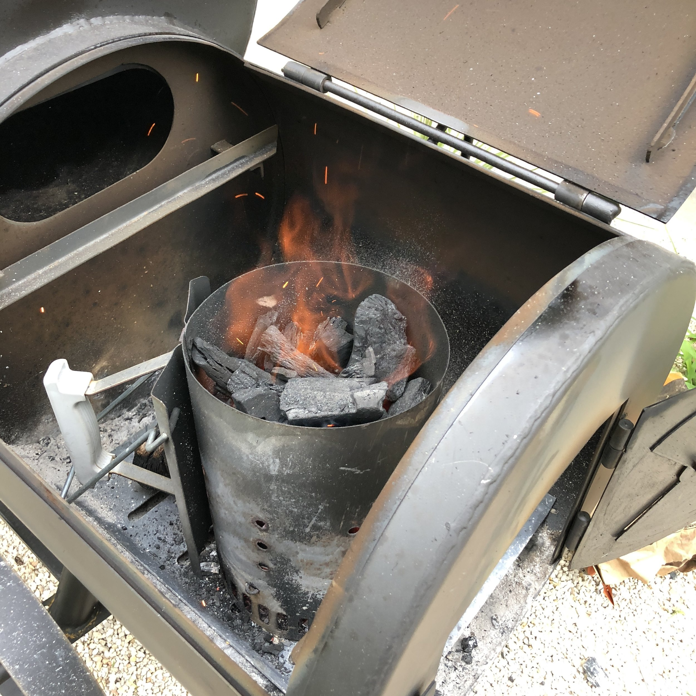
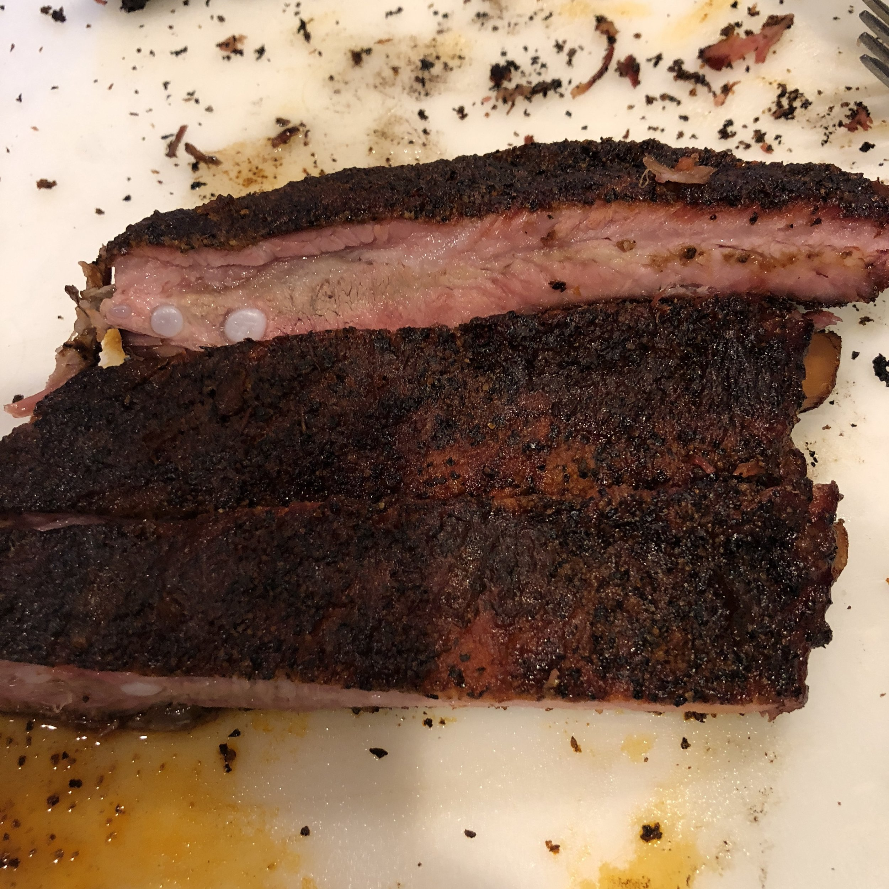
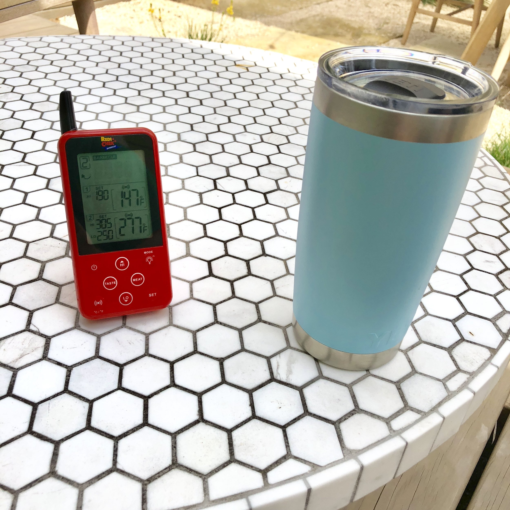
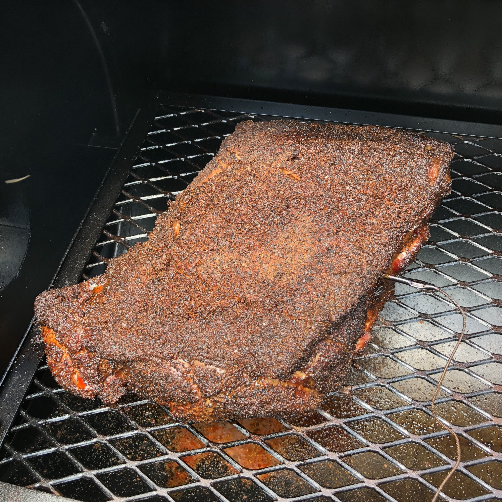
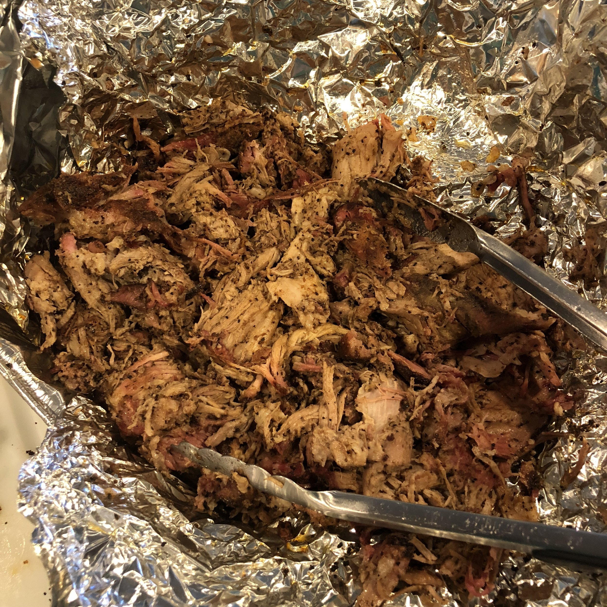
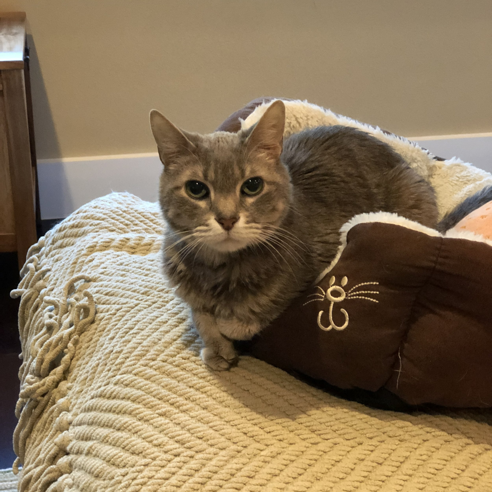

One of my goals for the year was to learn how to smoke a brisket. True, wood-fired barbecue is one of the main culinary traditions of Central Texas, especially barbecuing beef brisket. The time had finally come for me to get an offset smoker, a "stick-burner" as they are called, and start this journey into a new cooking genre. Three weeks ago, I (along with some help getting it home from my fellow National Instruments Meat Guild members) acquired an Old Country BBQ Pits Pecos:

I was very excited this about purchase. Given the fact that we got rid of our pickup truck last year, getting a 220 lb 6 ft long smoker home from the store isn't something you can do on a whim.

Heeding the advice from several people, instead of jumping right into brisket, I decided to start with pork shoulder as it is much more forgiving. I was not exactly sure how easy the temperature control would be, and so I didn't want to ruin a quality brisket. So on a Friday I hit up Costco to get a pork shoulder. A few notes: 1) they only come in a two pack, because Costco, and 2) Costco only sells boneless shoulders, which is not the usual. I also picked up a 3-pack of St. Louis style ribs to complete the porky adventure.

Before I could cook in it, however, I wanted to burn off the industrial gunk they coat the inside with, and then reseason the entire thing. 

After letting it burn really hot for a few hours (as well as then practicing my temperature control), I went to sleep decently confident that I could maintain a temperature revolving around 275 for the 8-10 hours this shoulder was going to take. 

The next morning, after getting up early to watch the royal wedding with some friends, it was time to get this pork smoking. I first tied up the shoulder, as the the fact that it is boneless made it somewhat unwieldy and "flappy." I made the rub, which was a simple combination of 2:2:1:1 ratio of Ground Black Pepper:Kosher Salt:Paprika:Garlic Powder. I also gave the shoulder a yellow mustard slather before I put the rub on. On the shoulder went at 9:30 AM:

I set up the smoker according to what seems to be accepted best practice. Started the fire with a chimney of lump charcoal, then through my logs on and got the fire going and the smoker nice and hot. Finally, when I put the pork on I added an aluminum foil pan full of water to help keep the inside of the cooker nice and moist.

I had my remote temperature probe set on the rack right by the shoulder to get a good idea of the air temp right by the meat. I then inserted the second probe into the center of the shoulder. My target was 190° F for the meat. I started the fire with oak, and then used cherry for a while, before switching back to oak eventually. 

There's not much to do while the meat is cooking except sit back, relax, stay out of the sun, and enjoy a beverage.

The pork was coming along nicely, but it wasn't quite ready to wrap in foil. A little while later, I noticed the sheet of fat on top split, and according to Aaron Franklin, that's when it's time to wrap it up (not pictured, as a big foil rectangle didn't seem that interesting). Around this time I did notice the temperature stall as well, which is expected. The foil helps to push through that stall. Around the time I wrapped the shoulder, I through the ribs on. I used a similar rub, but cut down on the salt to get a 2:1:1:1 ratio. The plan was to sauce the ribs after about 2 hours, so I had to make a sauce.

You may be asking why are you making a sauce when there are many, many quality BBQ sauces out there. One word: sugar. I'm not eating sugar and severely limiting my carbs right now (that's water in that Yeti, above, in case you were wondering), and almost all store bought BBQ sauces have a ton of sugar. The sauce was simple. First, chop some onion and saute in about 1 T of butter. Next, add a can of tomato paste and stir until it becomes fragrant and darkens. Finally add 1 cup of apple cider vinegar, and 3/4 cup of water. Now, I did add 2 T of brown sugar, as I was going to be ingesting a very small amount of the sauce (just the amount I put on while cooking), so I figured this little bit of sugar would be insignificant for the actual serving size. I let all that simmer down for a little while, but it never really was thick. I was going for a slightly thinner sauce that would spread nicely when I applied it to the ribs.

I hit my goal temp on the pork at around 8:45 minutes, and pulled it off. I then pulled the ribs off about 30 minutes later. I was pretty impressed with the results:

The pork pulled really easily, and was super juicy. The ribs had a perfect smoke ring, and left clean bones, but they didn't fall off the bone, so it was exactly was I shooting for. I did cook the other two racks the next weekend, and they didn't come out as tender, so I need to keep working on it. But overall, I was happy with the experience.

My temperature control was good, and I learned a lot that first day about keeping the temperature more consistent. I did use full size logs, and most of the people I talk to recommend cutting them in half first, so I will probably try the second shoulder with half logs to try and see if I get even more consistency.

Brisket, here I come!

> Pierre asks, "So when are you going to smoke some fish, human?"
