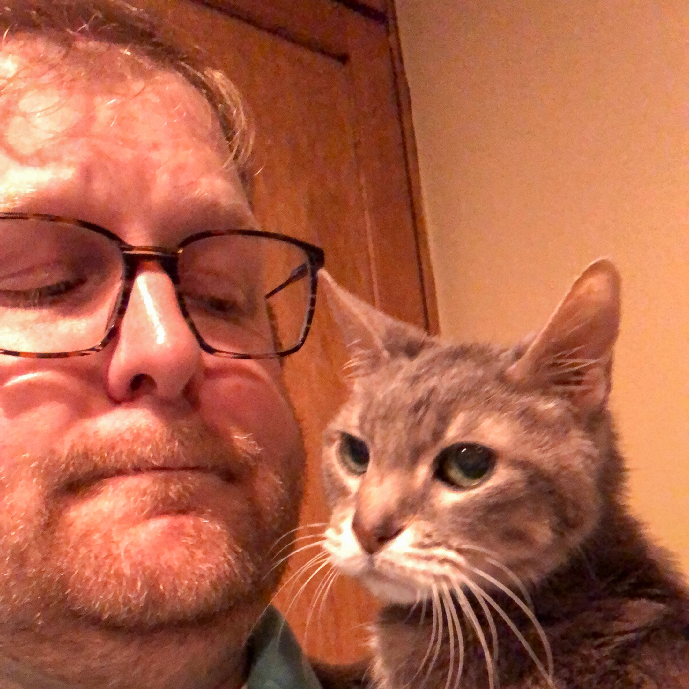
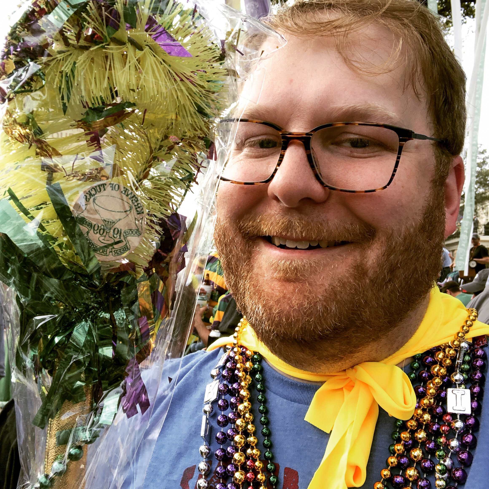
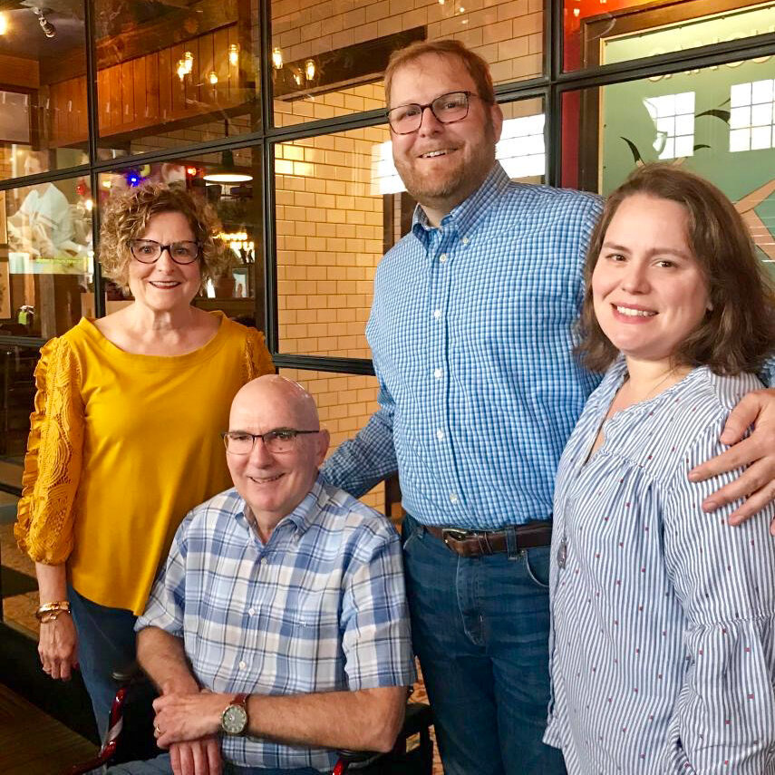
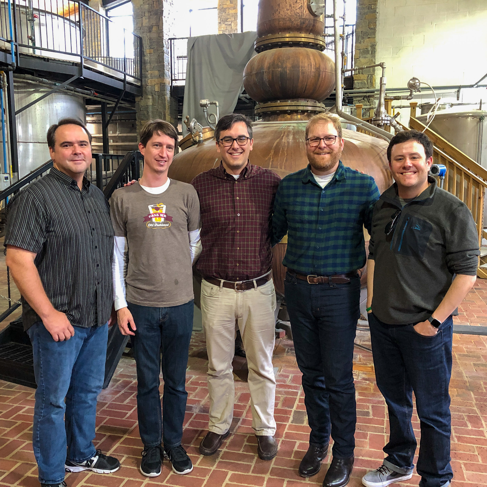
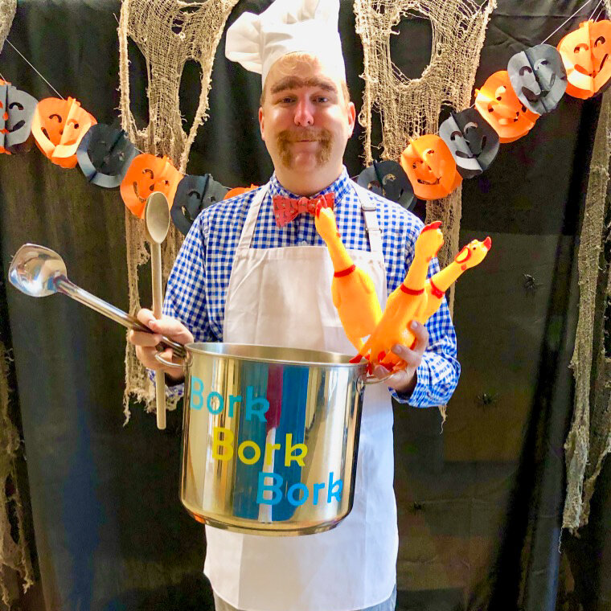
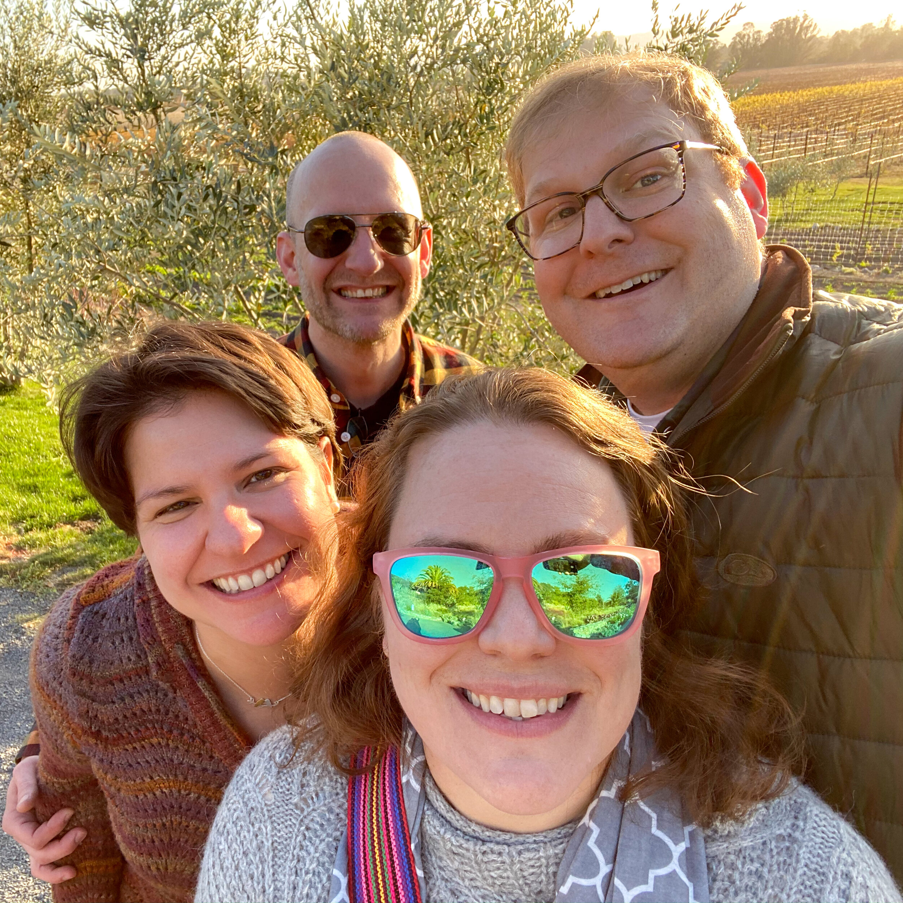
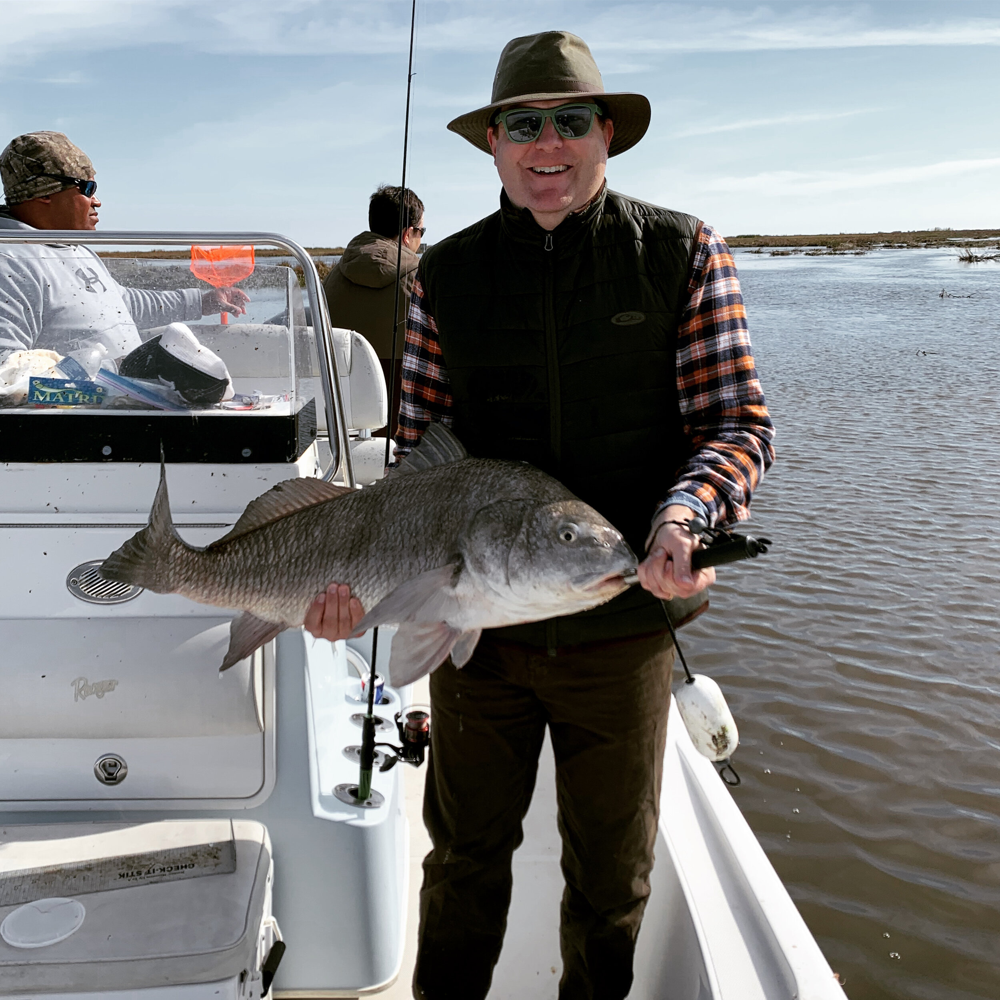
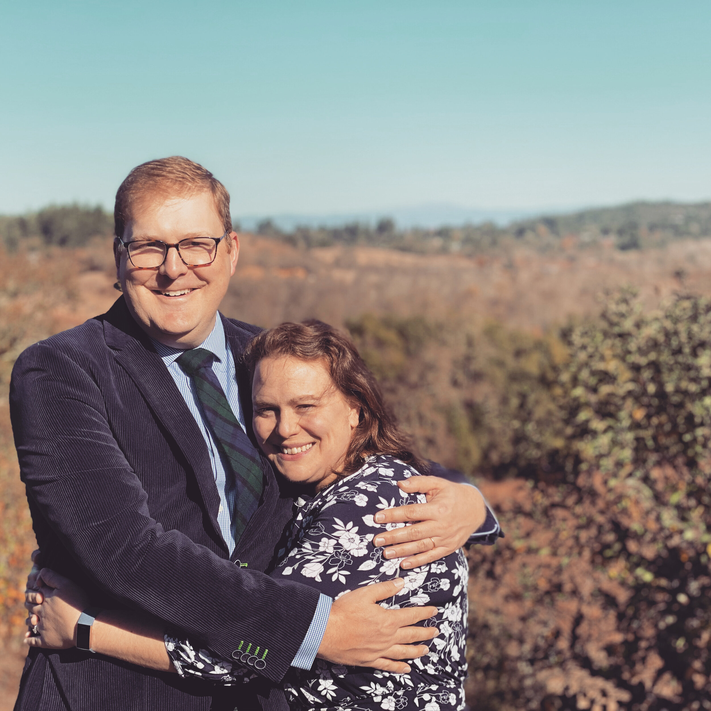
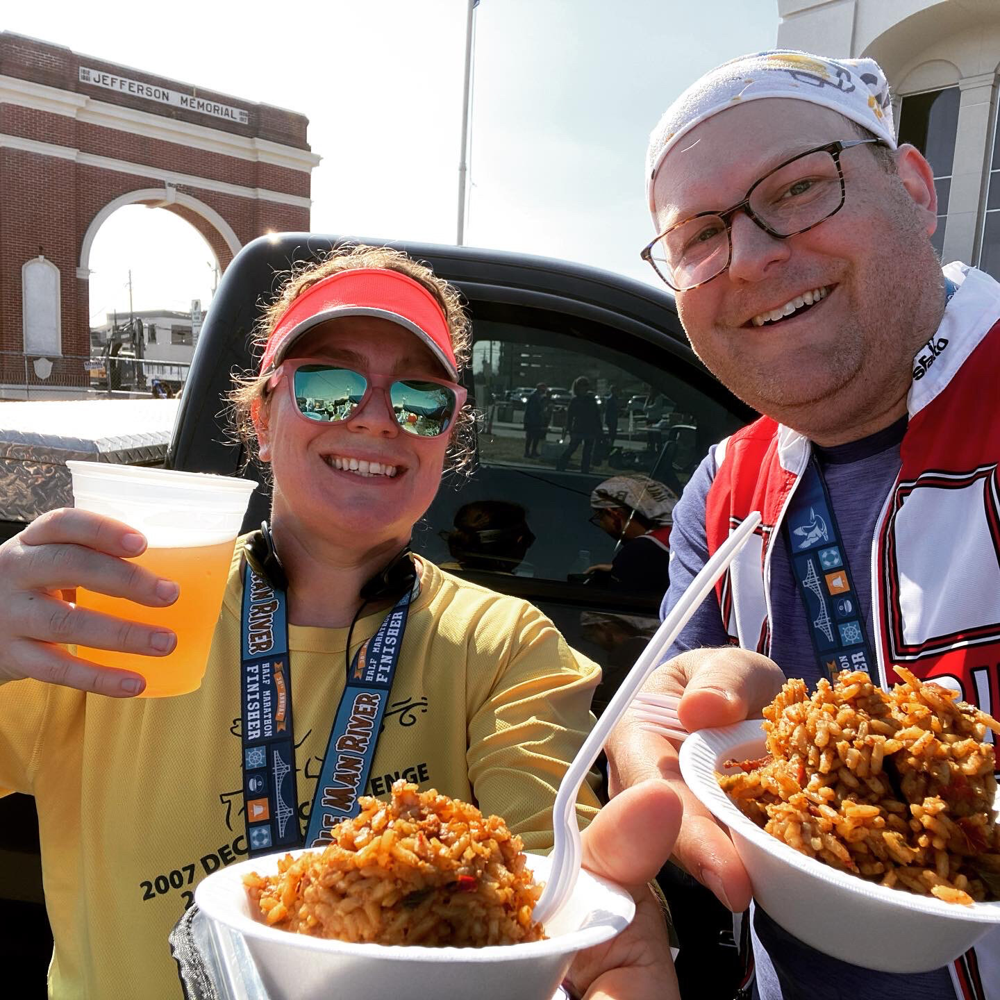

Well, today is the last day of 2019, and it appears that I didn’t write anything here all year. It was an interesting year for various reasons. Some good, some bad.

I always used to put a picture of Pierre on these posts, but unfortunately we had finally say goodbye to our little old man this year. It was tough - I had had him for 17 years. That’s 17 years of coming home and having him run up to me and say hello. That’s a long time to all of a sudden not see him.

There were good things this year as well. I got glasses. We had a great time going back to Mardi Gras for the first time in years. I went to Kentucky and visited some awesome distilleries with my best friends. We had a wonderful vacation to Sonoma. I am at my lowest weight since 2013, and feel in really good shape to drop below 200lbs in 2020. Carrie and I also ran two half marathons, and I’ve enjoyed running more than I ever have. Lastly, I’ve continued to get better at golf, which has always been a goal of mine.

So while there was sadness this year, there was also joy and hope. Here’s to a great 2020!

