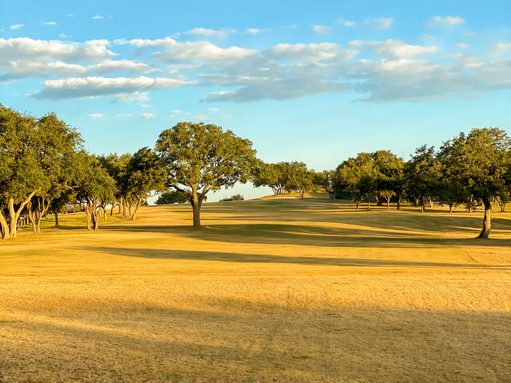

I always thought to myself, “Yeah, I have goals…” But I never wrote them down, or told anybody about them, or really thought much about it. I mean, there were big things I knew I wanted to do… get married, graduate from grad school, get a job, etc. But I never really thought about it on a yearly or monthly basis, “What’s the thing that I need to be doing right now?”

And I’m not talking about career goals here. We have an entire process at work for that. I’m talking about my personal goals. I figured this year I’d try something new, and write about them here. Make it public, help to keep myself accountable. A lot of these are hobby related, I’m not really getting into deep emotional growth. Those sorts of things I will keep to myself. I mean, I can’t share all my secrets, right? ;)

So here we go, my first ever yearly goal listing!

1. Continue my improvement as a golfer:
    
    1. Shave 2 strokes off my handicap: I finished the year in 2019 with my lowest handicap every: 18.5. That’s still not where I want to be. I’m hoping to get to get down below 16.5 by the end of 2020.
        
    2. Make the Daniel Cup team again: We have a fun Ryder Cup style competition at Great Hills every year. I made the team last year for the first time, and it was a blast. I’m hoping to play well enough to get on the team again this year.
        
2. Get under 200 lbs: I guess technically the goal is to continue to get healthier and keep our good exercise and food habits, but this number is the thing that I’ve put the bullseye on. I haven’t been under 200 lbs since 2013. That was when I sort of let my weight get away from me. But Carrie and I had a great 2019 on the health front. I’m really enjoying running for the first time ever, and I’m in the best position to hit this number than I’ve been since I went above it.
    
3. Learn to fly fish: Last year I had a goal to go fishing on my own, and I hit that! I didn’t catch anything, but I made it out there. I still want to continue to do that, but I’ve finally given in to the mystique of fly fishing. The goal here is to learn the basic technique, go on at least one guided trip, and go out on my own at least once.
    
4. Re-embrace fermentation: There was a while where I had at least one thing fermenting at all times, whether it be beer, bread, pickles, or kombucha. But I’ve really gotten on off the fermenting train lately. That ends this year! My goal is to make one of each the following: beer, bread, and kimchi. Anymore than one are bonus.
    
5. Go camping: This was the one goal that I didn’t hit from last year. I’ve never really been camping, and I’d love to give it a shot. I’ve felt this distinct desire to connect more with nature as I’ve gotten over, and this seems like a good place to start (baby steps and all that…).
    
6. Not let laundry stay unfolded for more than a day: I think that I’m pretty good about getting the laundry washed and dried. However, I am admittedly horrible about folding and putting away laundry. I’m generally bad at picking stuff up… this is I feel the low-hanging fruit on changing this part of my nature.
    

We only have so much control over the dumpster fire that is happening around sometimes. But, right now at least, I do have control over these things, and I hope to make my free time worth it. More creation, less consumption: creating experiences, food, fun, a better me, what have you. Here’s to a great 2020!
