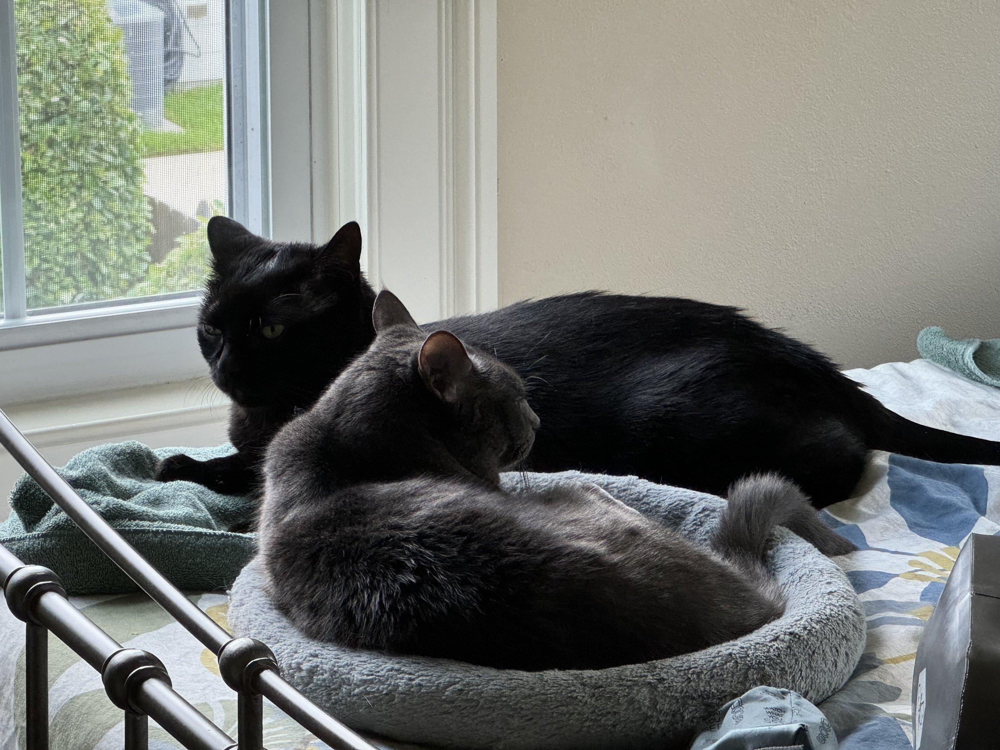

\[caption id="" align="alignnone" width="4032"\] Henri (the black one) and GiGi (the gray one) relax in a rare moment of snuggling that didn’t lead to fighting. We’ll miss our kitties on our trip, but they’re in good hands! \[/caption\]

Well, it’s been a while. Looking at the previous post - goals for 2020 - a few things may have happened since then. But this isn’t the post to get into any of that. I’m here to talk about something that Carrie and I are very excited about: hiking the Tour Du Mont Blanc (TMB)!

We head out tomorrow, flying to the Netherlands to hang there for a few days before heading down to Zurich and then Chamonix to start hiking.

I’ll be posting links every day we hike to track us on our Garmins, so if you’re up in the morning US time and want to see where we are, check it out. You can get the links here or [@djwhitebread on threads.](https://www.threads.net/@djwhitebread)

If you want to keep track of the photos I take as we go along, you can check out [this shared album over on iCloud](https://www.icloud.com/sharedalbum/#B105oqs3qlprcQ).

While we will miss our two kitties while we’re gone, we’re looking forward to celebrating our 20th wedding anniversary by doing something hard and challenging. I have a fear of heights, and there are some interesting parts of this hike, so it’s going to be an adventure.

Ok, time to finish packing. Look for updates soon!
