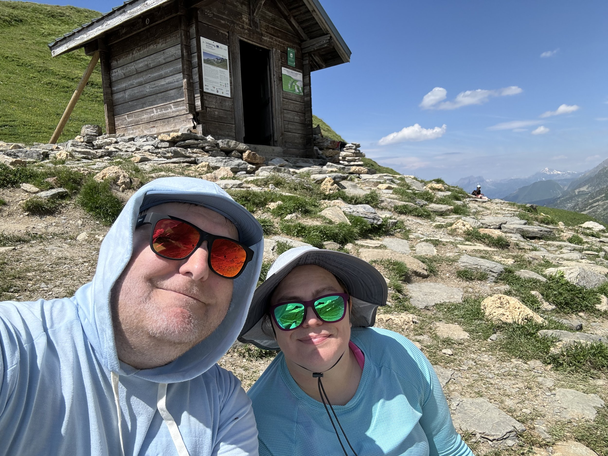
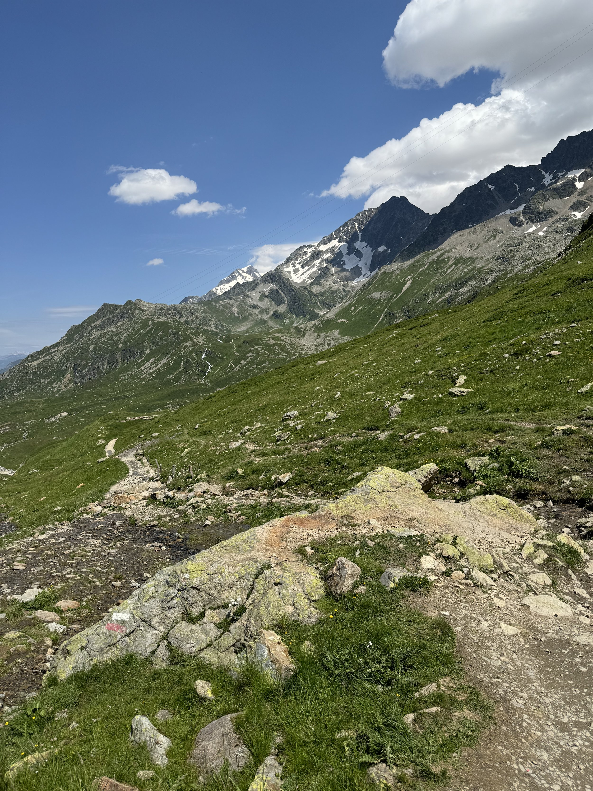
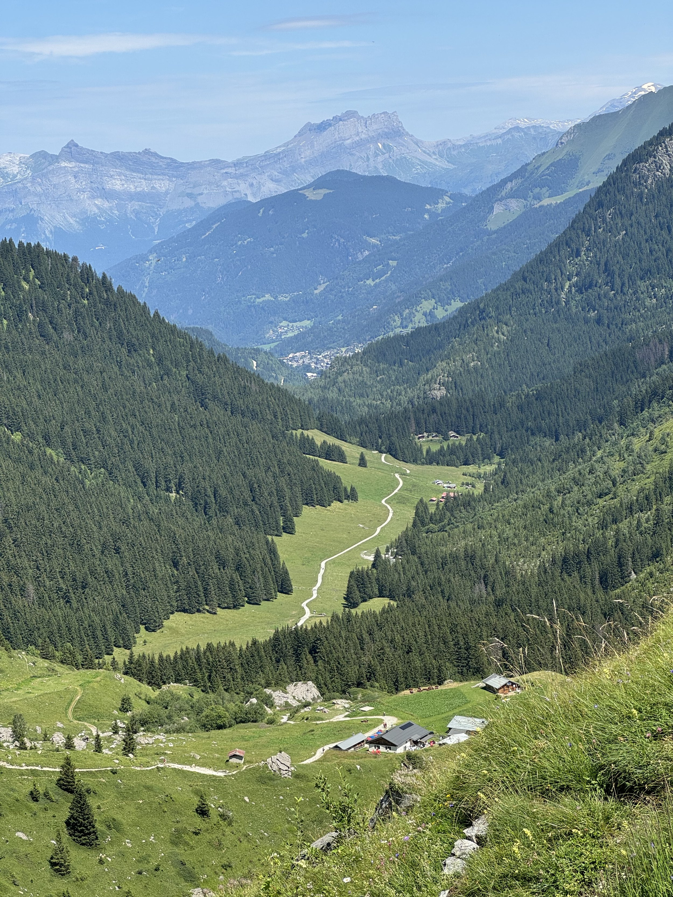

Day 2 started well. Generally we had our nutrition better situated and our water plan was better (definitely both could be better). Amazing views crossing the Col de Bonhomme.

Once we were done with the climbing, however, we realized that we only had 45 minutes to make it to our taxi. I also misread the instructions so I thought we had less distance to where the taxi was.

At some point on the descent Carrie and I decided to split up and I would try to get down as quickly as possible to hopefully catch the taxi driver and try to convince him to wait for Carrie. It was during this process I realized there were several more kilometers to go down than I had previously thought. I went hard and when I got to the taxi guy (who was still there, thank goodness) I had to use my very bad French to make sure it was our guy. He eventually smiled and told me not to worry and that he would wait for Carrie no problem.

Carrie was also going down as fast as she could. When she got down there we both rode over to the hotel pushed to our limits.

Because of that, we have decided to take today and tomorrow off and just enjoy two days in Courmayeur, IT. Our hotel here is very cute, and it’s the first good internet connection we’ve had in a while. Looking forward to some rest and Italian food. We will take up the hike on Tuesday to do stages 5-7.

If there’s one thing the great coaches at CrossFit Renew have taught me, is that you have to listen to your body. As Tim often says, let your breathing dictate your pace, not your pace dictate your breathing. We had that mantra in mind yesterday… well until the end lol. But we’re listening to our bodies and getting some recharge so we can finish the last three days strong.

And for what it’s worth, stage 2 was the hardest, so at least we checked that box.

Took a lot of pictures yesterday, they should all be in the shared album. A few samples are on this post. [https://www.icloud.com/sharedalbum/#B105oqs3qlprcQ](https://www.icloud.com/sharedalbum/#B105oqs3qlprcQ)

