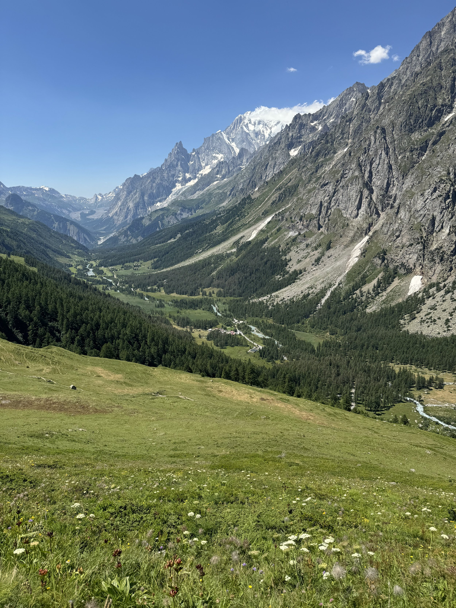
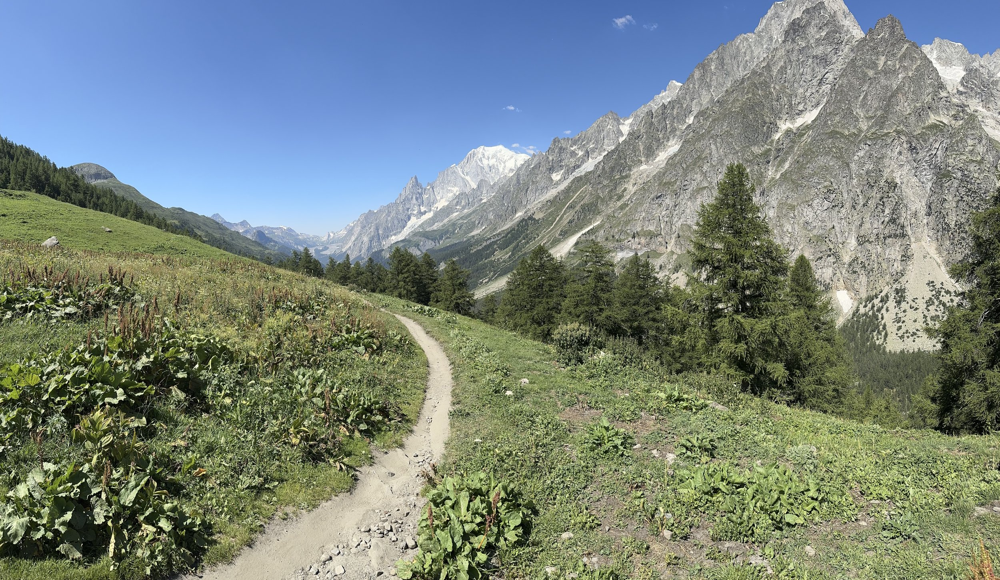
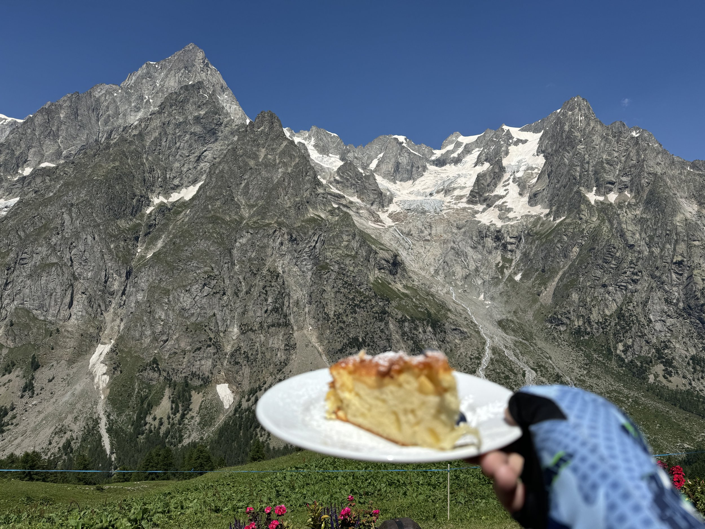
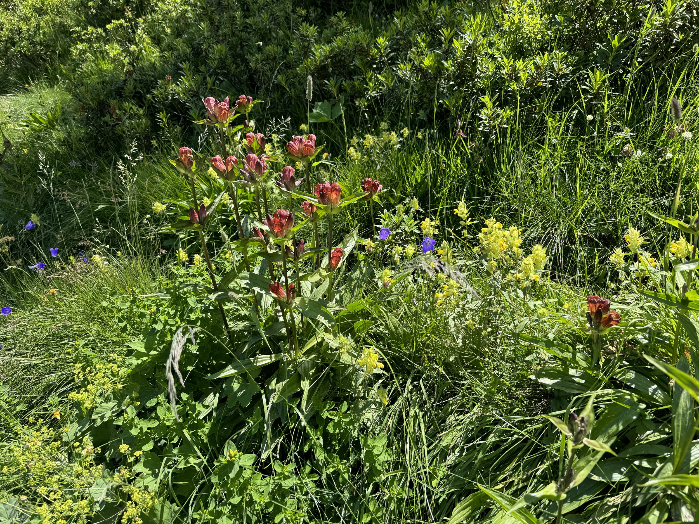

I’m so very glad we decided to go do a shortened day hike today. The scenery was the most postcard-worthy things we have seen yet. We took the bus down, and after about 2k of solid uphill we were rewarded with the most amazing panoramic view I think I have ever seen (this shot doesn’t do it justice, the album has the pano shot I took).

We had a light lunch of spec and brie sandwiches, an espresso, and a delicious piece of apple cake.

After that we had a very lovely 5k hike that was net down the mountain. Every time I turned around there was some new beautiful thing or a new angle on the mountains. I took an obscene amount of photos today. We also got to see all the wildflowers, as well as the cows eating the wildflowers which will eventually lead to the special summer cheese.

We ate enough, we stayed hydrated, and we kept our heart rates under control. It was a perfect active recovery day.

Tonight we have reservations a restaurant in town, so I’m sure that will be delicious.

Tomorrow we head into Switzerland 🇨🇭 and spend the night in Champex. Will report back then!
