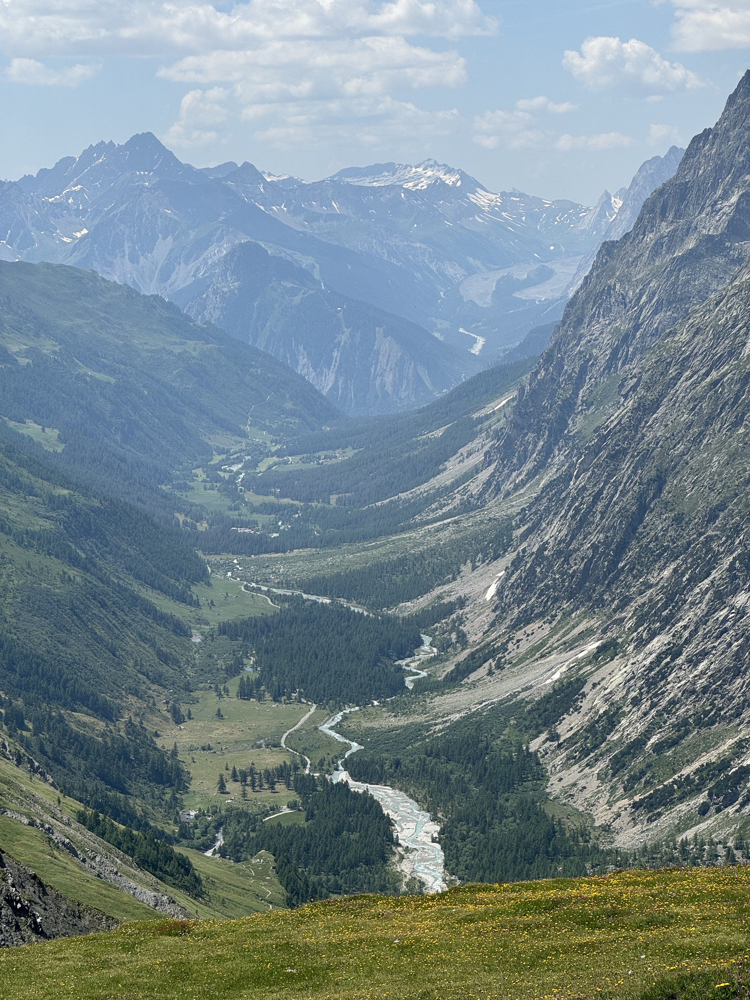
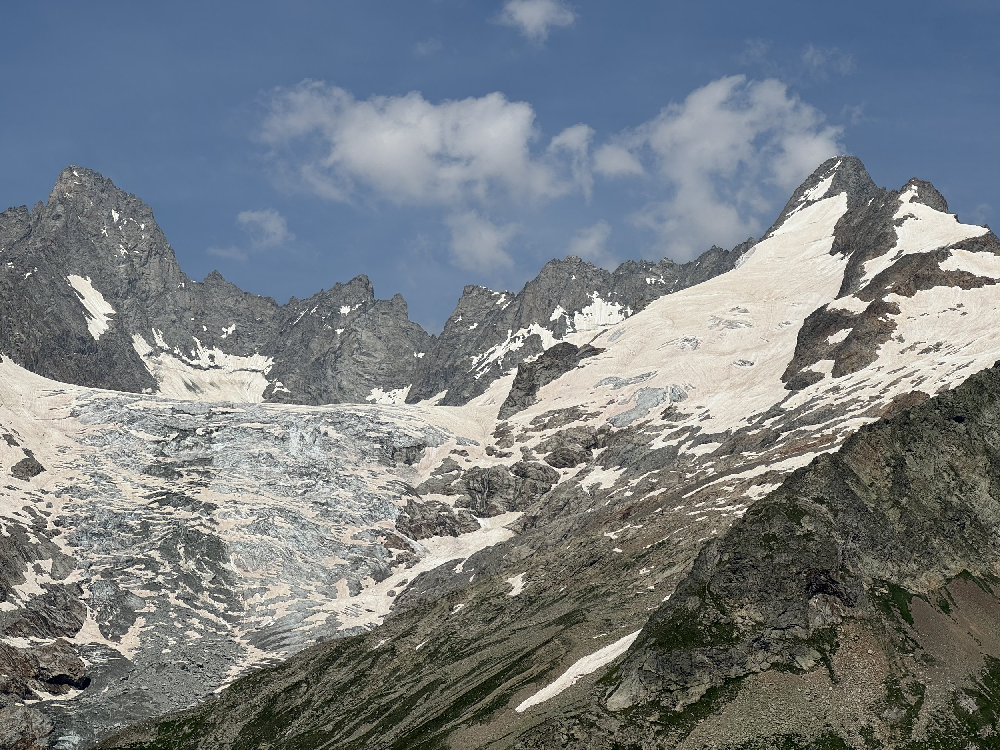
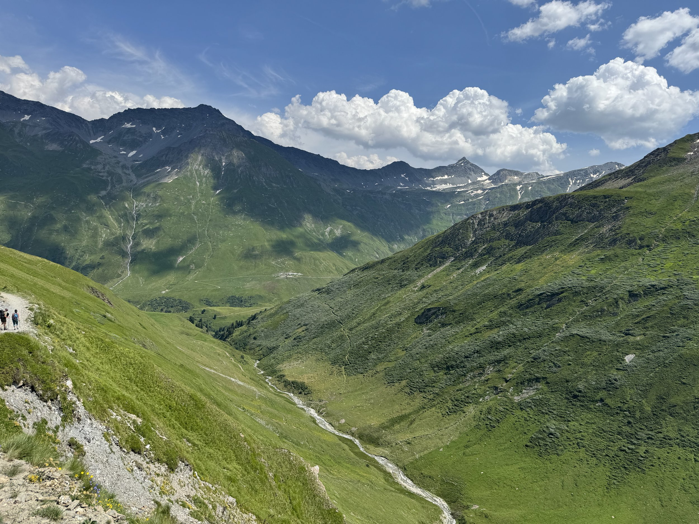
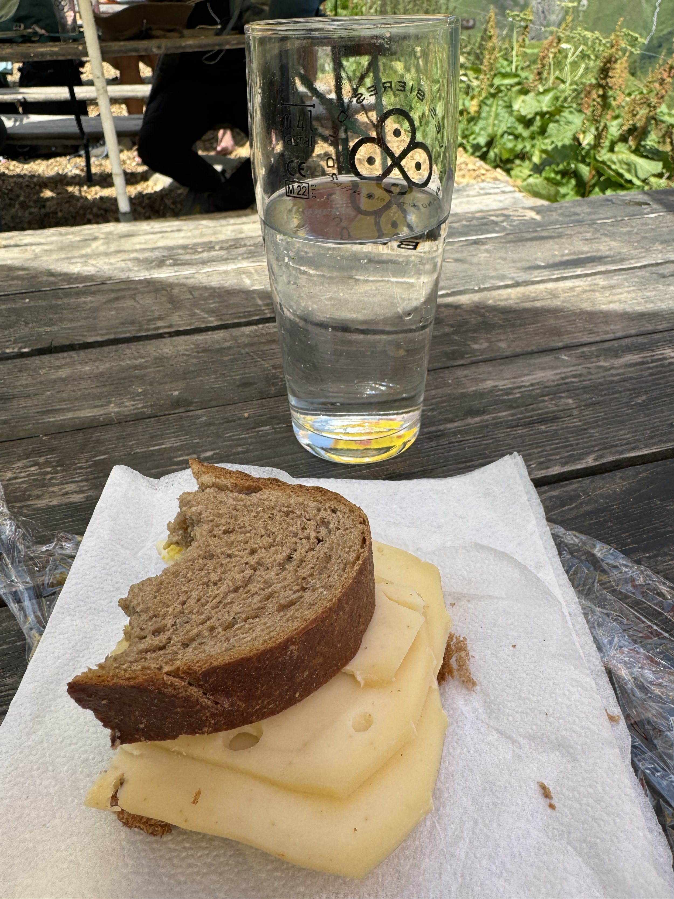
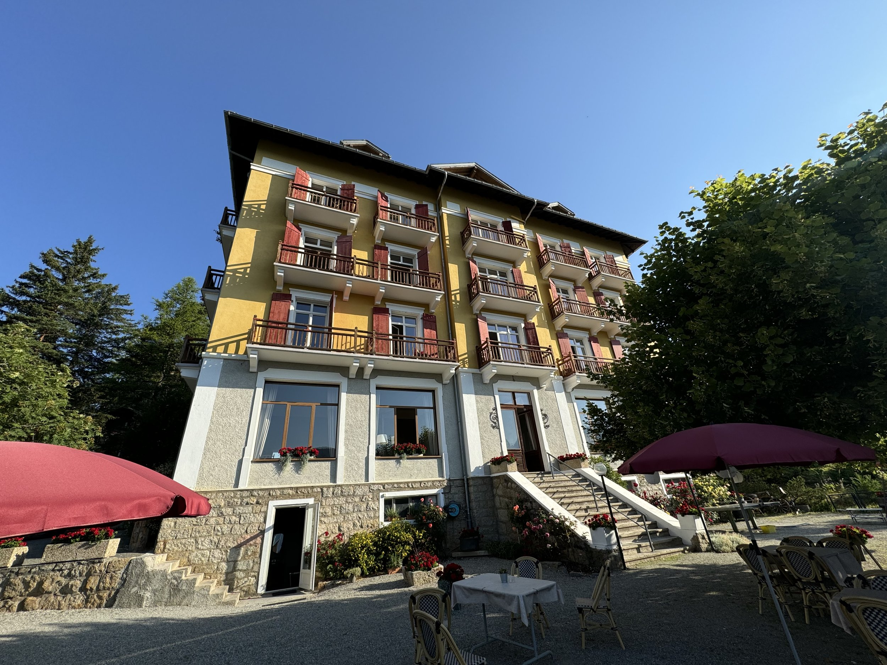
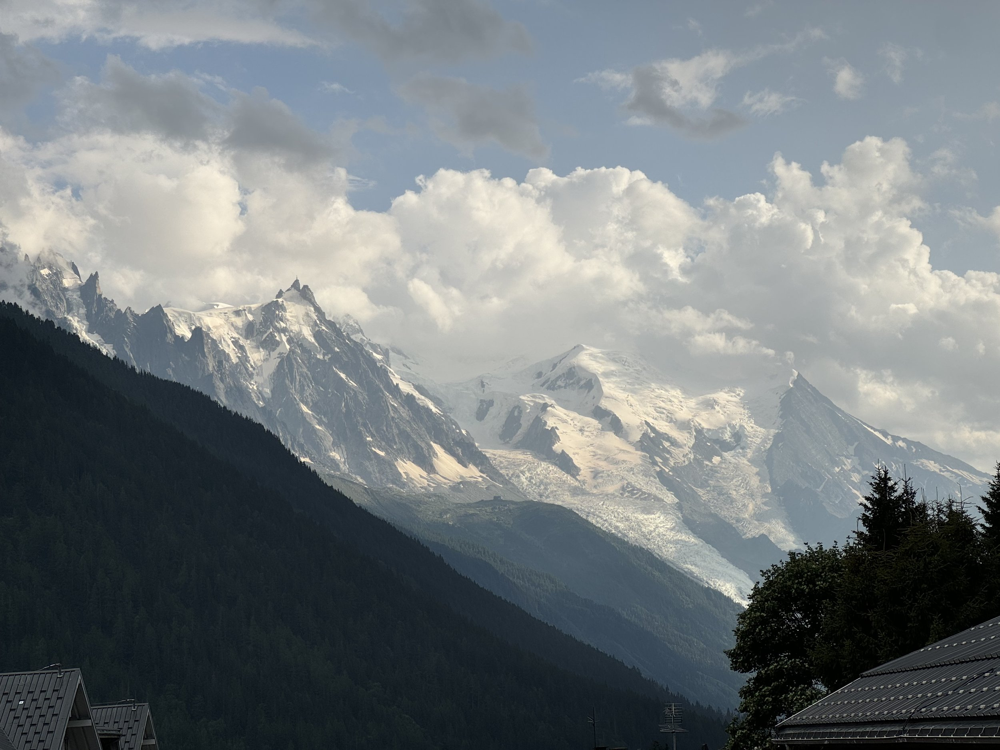

Yesterday we crossed from Italy into Switzerland on foot, which is a crazy thing to say. I ate an energy bar on an international border, while staring down a valley where I could see another international border. Wild.

It was a very pretty hike, but it was the first time my fear of heights kicked in. I had a panic on this one part where I had a hard time putting one foot in front of the next and moving my poles. It was something about the angle of the trail and the very steep we were on. But I pushed through and once we turned the corner up the switchback the feeling subsided.

It was the first part of the whole experience where slipping had very bad consequences. It was also just straight up steep. It took us a while to get up to the top of Grand Col Ferret. But the view at the top was pretty amazing. The rest of the day was just hot and dusty as we descended into Switzerland. We ended up taking the bus one town sooner than written, but we were both done.

We did have the unique experience of having a cheese sandwich while looking at the cows from which the cheese is made.

We had lovely accommodations in Champex Lac last night. Dinner was great. The hotel was super cool.

Today we took some trains to get down here right north of Chamonix in Angieterre. We are going to hike our way to Chamonix tomorrow, but we’re not doing the ladders. I don’t trust myself not to freak out. But there are several variations depending on the weather and how we feel in the morning.

It’s raining here for the first time this trip, but the weather has brought a nice cooling breeze. Tomorrow is supposed to be a little cooler, which will be welcome.

