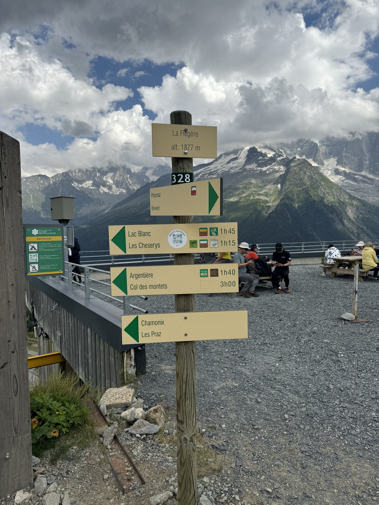
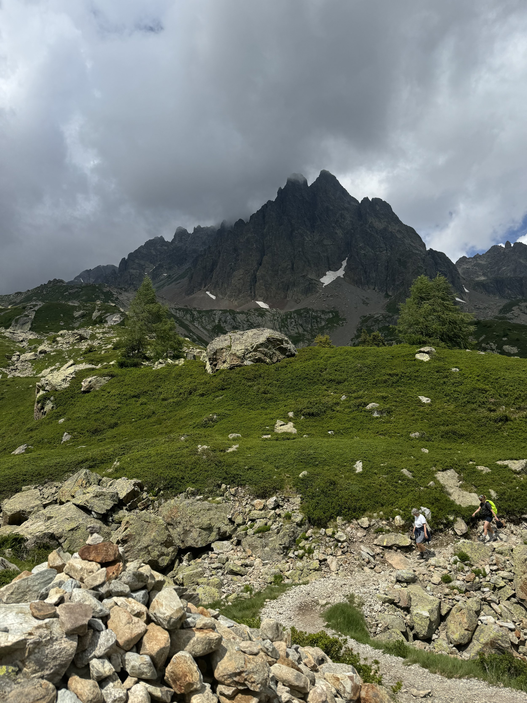
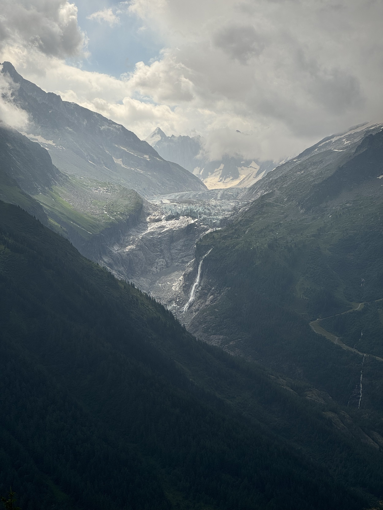

We’re waiting for the train to leave Chamonix, and I definitely have mixed feelings. I’m sad to leave this beautiful place with the amazing food, great wine, and just mind blowing natural beauty. But I’m also looking forward to getting back to our house, our cats, and our friends and family.

We ended up hiking 7 miles yesterday, with a pretty steep climb that allowed us to skip the ladders. We had a rain storm come through (though we luckily dodged the thunderstorm that came through across the valley). We also used our water filter bottle for the first time to get water out of a mountain waterfall. But it was a good hike, and we topped it off taking a cable car down from the mountain.

I’m going to write a more in-depth day by day review of things when I get back to my laptop. But in short, it was very hard, very beautiful, and really required leaning on each other. I’m just glad there is no hiking today!
