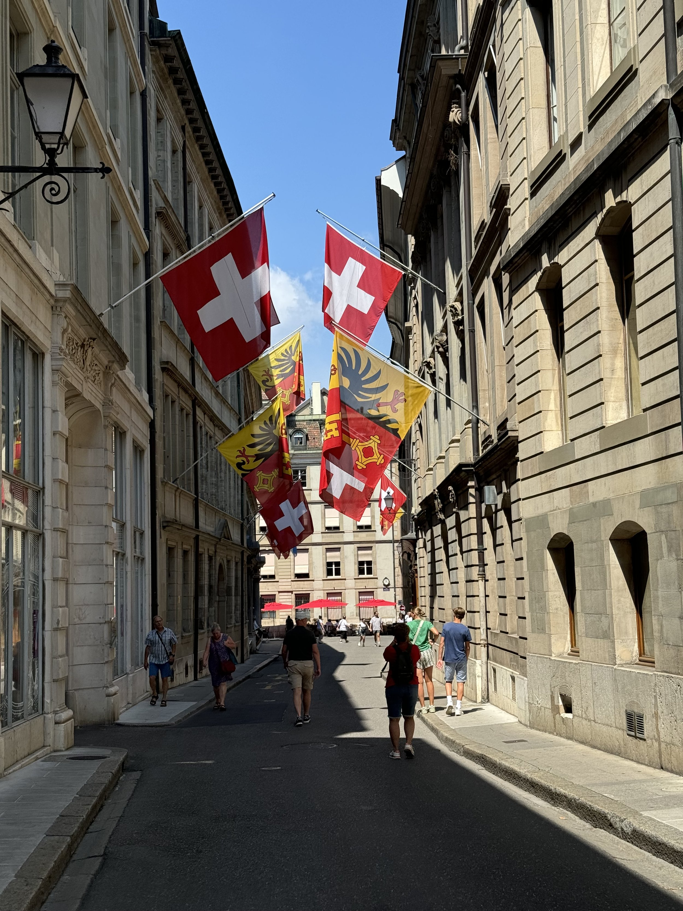
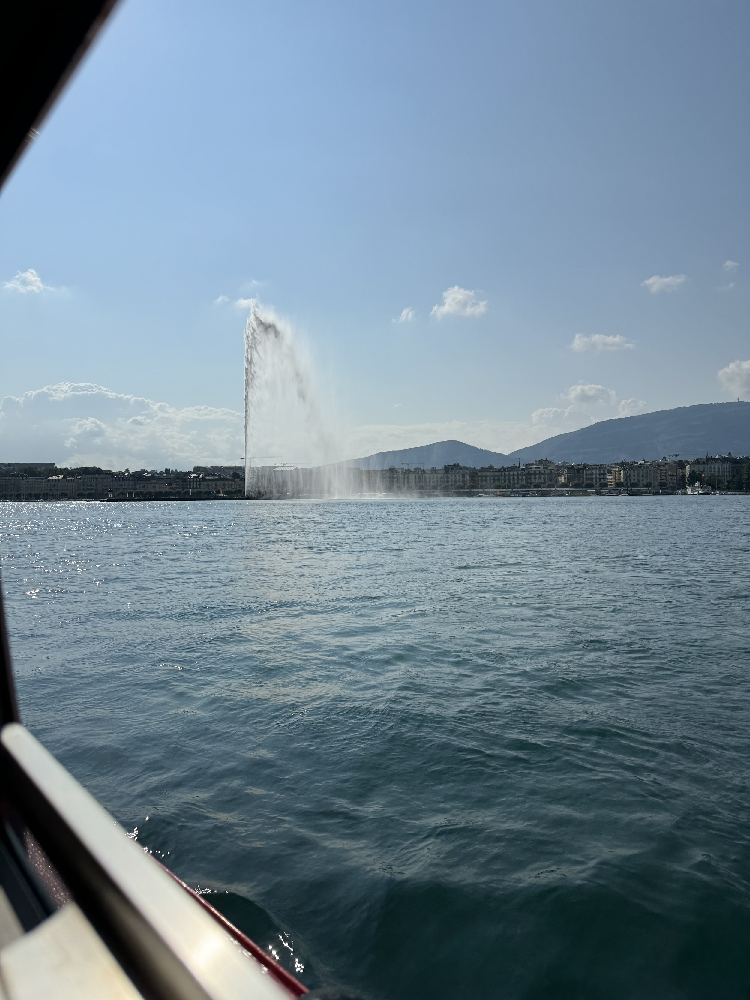
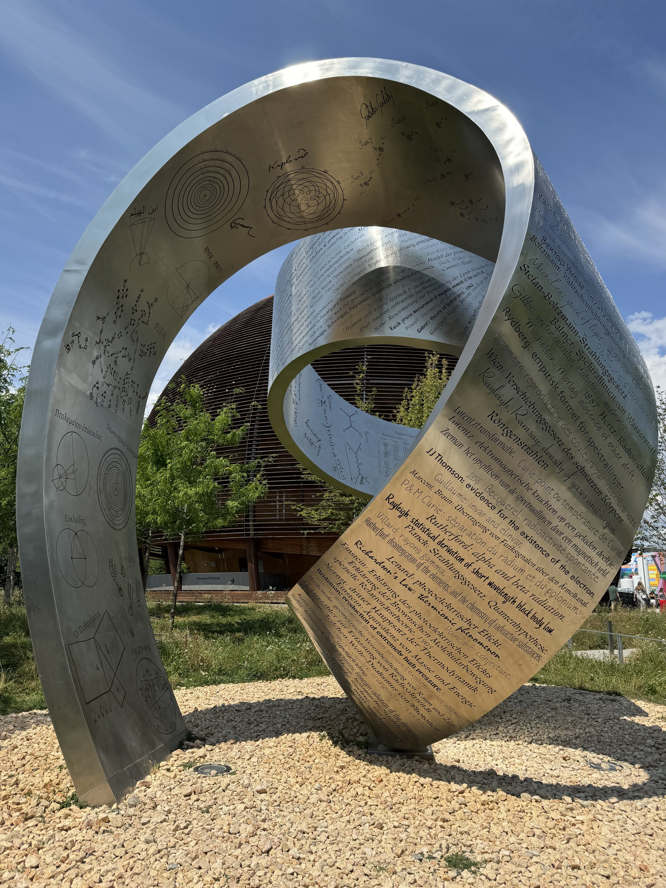

Woke up this morning to our flights out of Zurich being cancelled. We had been rebooked, but since we were on separate reservations, the system had put us on separate itineraries. So I spent a while on the phone with United, but the guy I talked to was very helpful and got us all rebooked. I even got some of the miles I used on Carrie’s ticket back? Airline fare rules are so weird.

So we’re headed to Zurich today, and I made a reservation at the Zurich airport hotel. I feel very fortunate that we’re at a point in our lives where we can absorb this without an issue, I know that’s a privilege that I’m very thankful for.

We’ve had a fun time in Geneva. We visited CERN, so the academic in me was very excited. Here’s to no more changes!

