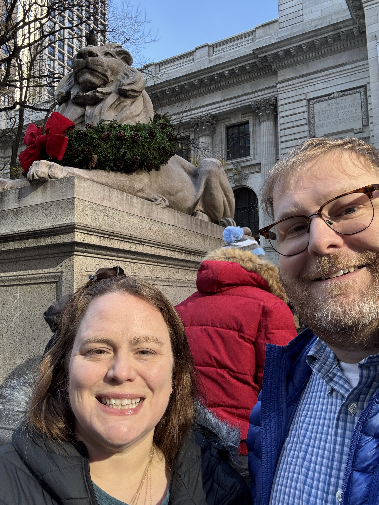
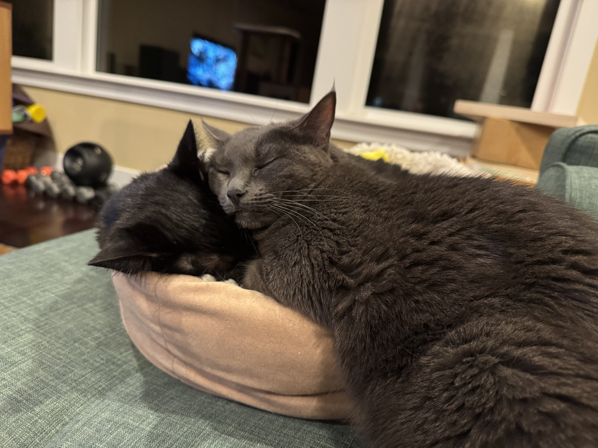

\[caption id="" align="alignnone" width="4032"\] Me in front of a palace in Vienna, Austria. I was lucky enough to get to go on a quick trip to Austria for work this year. \[/caption\]

While November of 2024 didn’t exactly pan out like I was hoping, I want to make sure that I set goals for 2025 to try to improve myself. I can’t control a lot of things in this world. But I can control me, and I want to end 2025 in a better state than I started it.

1. **Get below 200 lbs** - this is very ambitious. But I feel like that’s where I need to be weight wise to achieve a few other things. I know there is a school of thought that says my goals should be the things that I want to do once I’m at that weight, not the weight itself. But I need to drop weight - that’s the major blocker to achieving a lot of my fitness goals, and honestly, it’s just physics. Do a pull up, well I need to get stronger in my upper body pulling, but it would also be a lot easier if there was less to pull up. Running a sub 2 half marathon again, or a sub 30 5k. Again, for every kilo you lose you go faster. But that’s not just it, I also just want to fit into more clothes, and have better numbers, and on and on. So I’m going to make the core thing, dropping the weight, the goal. Now, if I hit 205 or even 210, honestly, I’ll consider this is a success. I just need to see consistent, significant movement.
    
2. **Run a continuous 5k (stretch: under 30 mins)** - In all the running I’ve done in recent years, I’ve followed a so many minutes on, and then 1 min walk strategy. And for doing half marathons it’s a great way to train and not get hurt. But it isn’t the best for going quickly over a short distance. I really believe I should be able to a) run a 5k without taking a walk break and b) do that in under 30 mins. So whatever I need to do from a mobility, training, or weight loss perspective, I’m game.
    
3. **Do a strict pull up** - This is one of those things that has haunted me my entire life. Not only is it important in CrossFit, it just seems like one of those life skills that could come in very handy one day.
    
4. **Go fishing consistently** - I will soon be obtaining a fishing kayak, and I am very excited (look for future posts as that progresses). I started trying to go fishing right before the pandemic, but it was really during and after the lockdown that I have really gotten into it. In all the stress, when I’m fishing I feel all that float away, even if I’m not catching anything. And I have always loved being on the water, and now I will have my very own little boat. Like I said, more to come here.
    
5. **Spend more time reading** \- I really do like to read, I just find it hard to make time for it. Carrie and I have talked about setting aside some time each week to read as opposed to watching random stuff on TV, and I like this idea. I think I need to start to read more non-fiction. I’m not going to set a book goal or anything like that. I just want to spend a little bit of time consistently not staring at a screen, but still learning and being entertained.
    

\[caption id="" align="alignnone" width="2316"\] Carrie and I in front of the NY Public Library. So glad we got to make a quick trip to NJ and NYC in December! \[/caption\]

So that’s this year’s goals. I would say some more general goals would be making sure we travel, see our friends and family, and do more things in the two cities that we live in. Life is short, and I’m definitely at the point where I just want to seize it.

I hope everybody has a great 2025.

\[caption id="" align="alignnone" width="5712"\] Henri and Gigi in a rare moment of being snuggly. \[/caption\]
