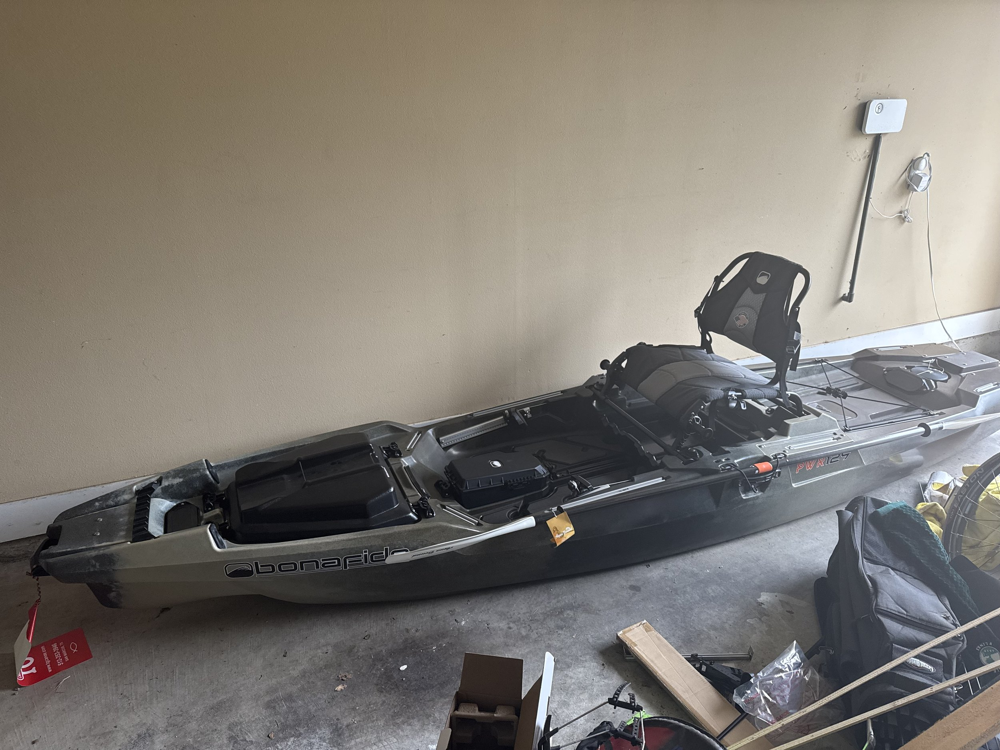
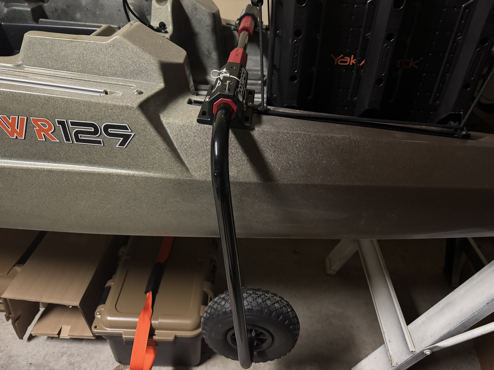
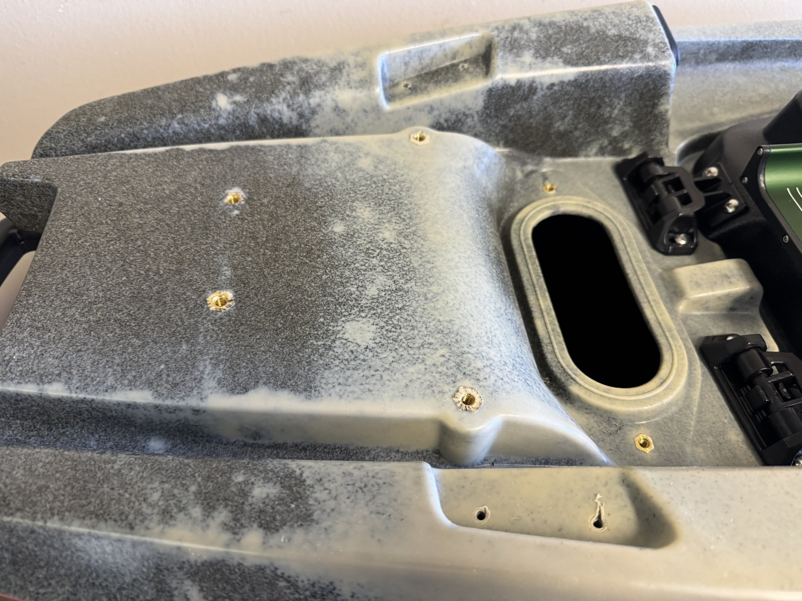
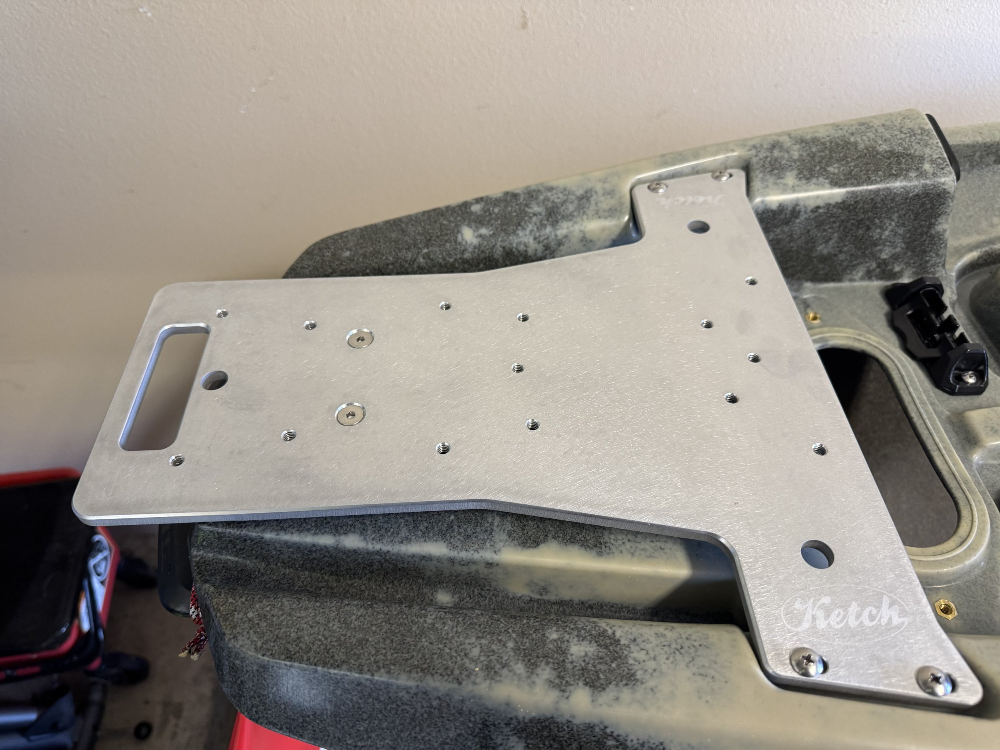
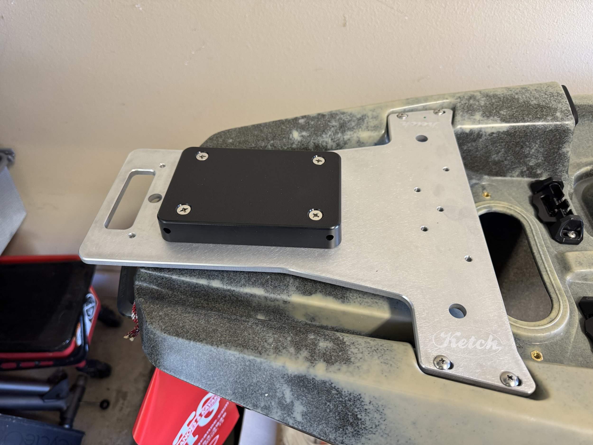
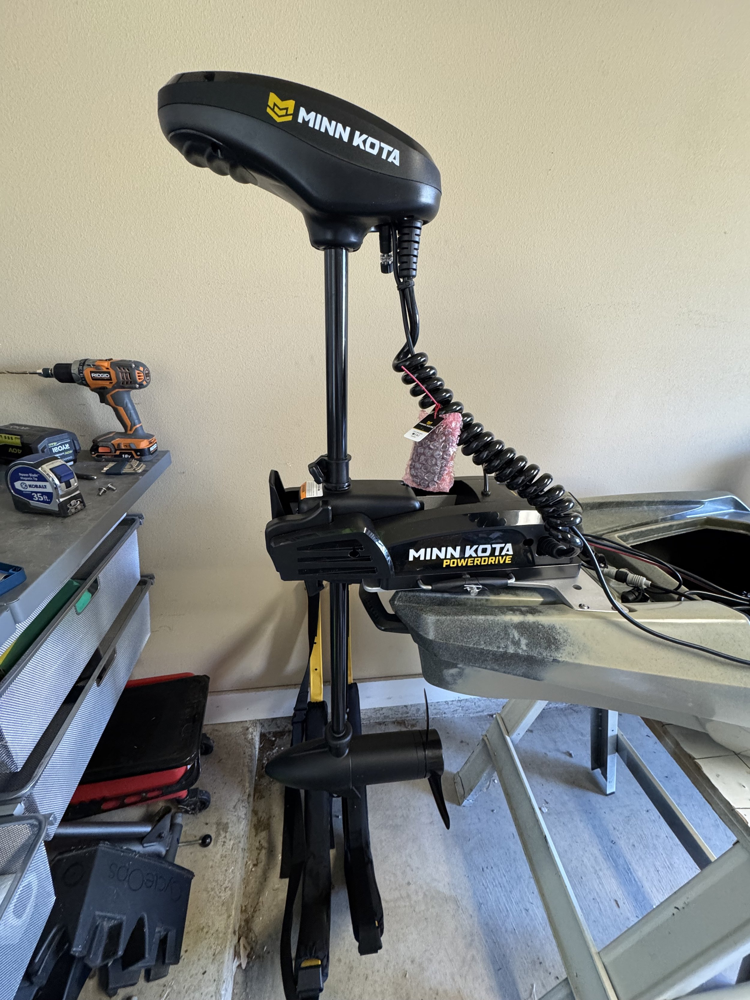
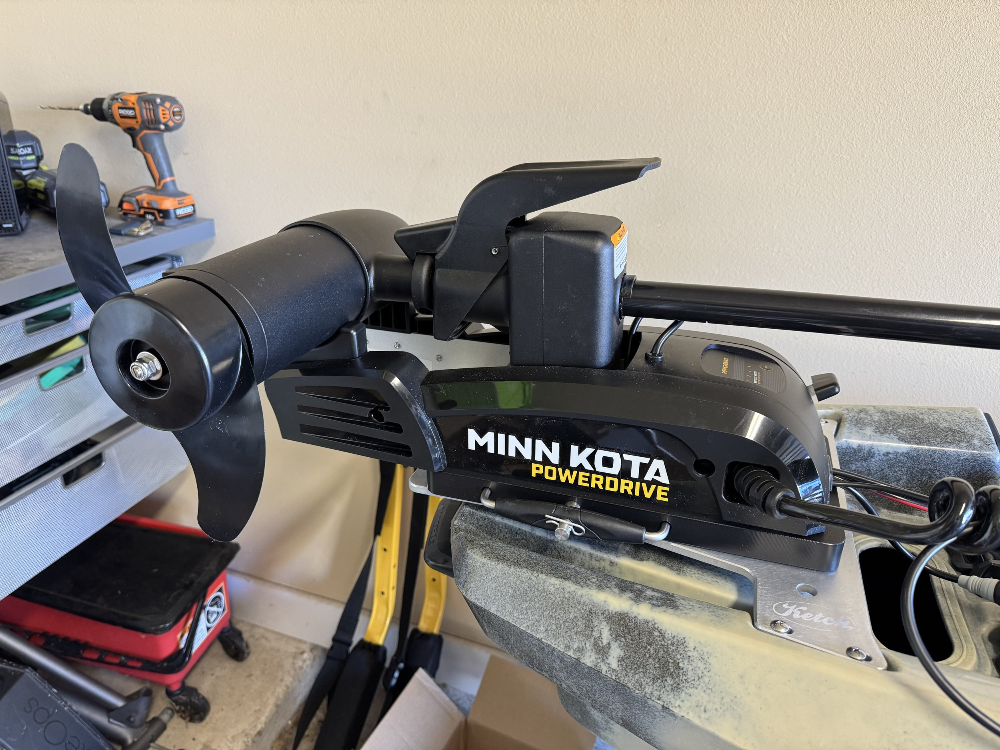

\[caption id="" align="alignnone" width="4032"\] The Bonafide PWR 129 right after I got it home. \[/caption\]

After several years of planning, I have finally acquired my kayak! It’s a Bonafide PWR 129, and I am really excited about this boat. The above picture was right after I got it home. Huge shoutout to [TG Canoes and Kayak](https://tgcanoe.com) down in San Marcos for hooking me up with this thing!

\[caption id="" align="alignnone" width="5712"\] The SideKick wheel system is an easy install. \[/caption\]

First thing was to install the Sidekick wheel kit that Bonafide makes for their newer kayaks. Since I will be transporting it on top of the car, having wheels built in is really nice. Keeps you from having to deal with a kayak car once you get the boat down to the water. Also, as you can probably tell, I was able to get the kayak up on some saw horses (thanks, Peter!) to get it up off the ground.

\[caption id="" align="alignnone" width="5712"\] The stripped down bow of the PWR 129. \[/caption\]

Today I wanted to get the trolling motor mounted to the kayak, even if I wasn’t going to be able to finish the wiring (I’m waiting on a wire stripper to arrive). The first step was taking off the rod strap and the dummy bolts from the bow. Above is the bare bow with also one of the wiring panels taken off. I love this feature from Bonafide - they have these removable panels that allow you to route stuff inside the hull. So you don’t have to drill holes to run wires. If you mess up one of these little panels, they’re cheap to replace.

\[caption id="" align="alignnone" width="5712"\] The Ketch bow mount plate installed. \[/caption\]

I then installed the [Ketch PWR 129 bow mount plate](https://ketchproducts.com/product/ketch-pwr-129-bow-mount/) as seen above. Installing this plate was the one time I intend to have to drill into the hull. But I really like the fact that it’s aluminum, and it’s super stable. It’s very well made, the craftsmanship from Ketch really shows. They had a great [YouTube video](https://www.youtube.com/watch?v=t8TEgVztlvo) for how to install it, and I followed along and got it installed without an issue.

This point in the story is where I should insert some context on the particular trolling motor that I got for the kayak. Every video or blog or anything you will see on the internet about motorizing your PWR 129 will talk about the MotorGuide Xi3 kayak trolling motor. It was the motor I intended to put on there. However, MotorGuide announced last year that they were going away as a brand. One of the other brands of their parent company (Lowrance), who also makes trolling motors, was going to be their main trolling motor brand. So all the Xi3s got snatched up. I thought I had a line on one, but then right before I was going to order it… it also disappeared.

After much searching, I found that the guys at NuCanoe, another brand of kayak popular with anglers, had started selling MinnKota PowerDrives with a cut down shaft to 36”. Since they are an official MinnKota reseller, you still get all the original warranty. So the MinnKota PowerDrive is what I went with. I ordered from a company called EcoFishing, but it seemed to still come from NuCanoe. Either way, the shipping was fast and their service was good.

Unfortunately, there really isn’t any content out there about installing this motor. I’m using the wiring kit that Bonafide had been selling for the Xi3, and luckily wires are generally just wires. But coming from the computer world where there are lots of standards and everything is very precise, this whole kayak fishing world is definitely out of my comfort zone. A lot more DIY than I’m usually comfortable with. But I don’t know, I’ve just sort of embraced it. I kind of had to if I want to get out on the water. Ok, so back to the kayak.

\[caption id="" align="alignnone" width="5712"\] MinnKota PowerGuide quick-release puck \[/caption\]

The trolling motor comes with a quick release mount, so the first step is to get this puck attached to my bracket. I actually ended up using the screws that were for some part of the Bonafide Xi3 kit that I don’t need, and they were perfect fits. After this, I had to attach the other part of the quick release mount to the trolling motor itself. I always get a little nervous when the first part of the instructions involve unscrewing the side plates off of something, but honestly, it was super straightforward.

\[caption id="" align="alignnone" width="3024"\] Deployed MinnKota PowerGuide \[/caption\]

\[caption id="" align="alignnone" width="5712"\] Stowed MinnKota PowerGuide \[/caption\]

The quick release is great. You just place it on the puck and slide in the u-bracket. It comes with a little locking pin, but you can also put a padlock on there if you need to leave it for a bit unattended. The mount through the Ketch plate feels super solid. The MinnKota doesn’t have the one pedal like the MotorGuide for deploying and pulling up, so it will be interesting to see how this is going to go when I’m on the water. I have some stuff that I can use to create a pull for both the body and the little pedal, so I might put that one, but we’ll have to see.

The next bit set of tasks revolve around actually wiring everything up. I did a few prep tasks on that, but once I get the stripper and crimper, I will be able to do a proper job of getting everything wired. My hope is to get out on the water on the 25th as we’ll be in New Orleans next weekend for the Krewe of Janus Ball.

I will be posting here as I continue to customize the kayak, and of course the results of actually getting it out on the water!
