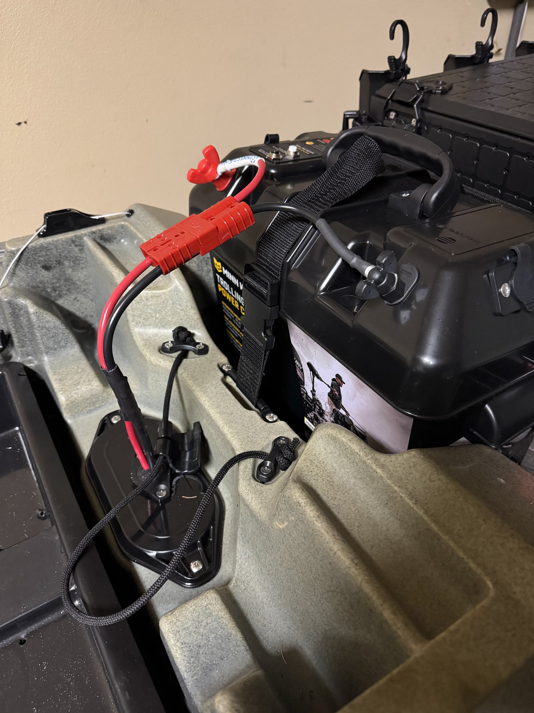
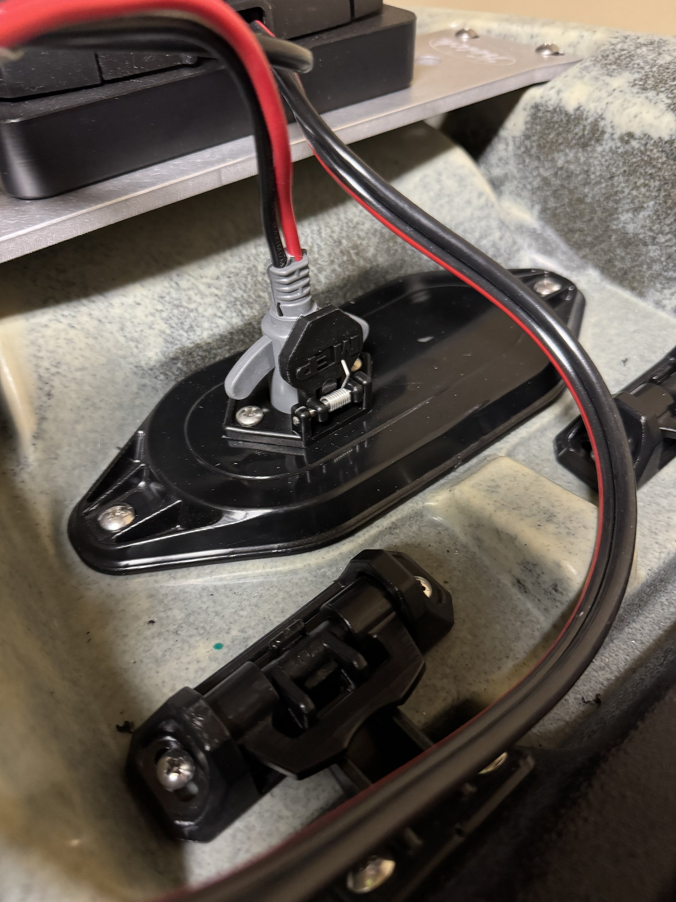
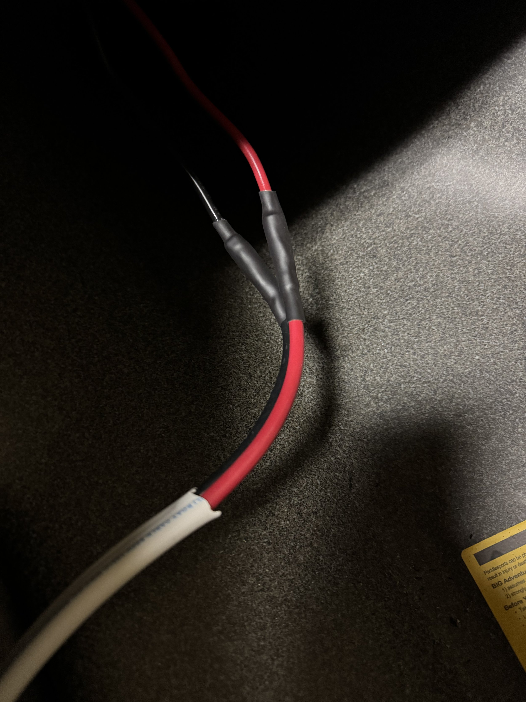

Today I had some time to work on the kayak. Last week when I posted I was still trying to figure out where to put the circuit breaker for the main motor circuit. You want it close to the power source, but there really wasn’t a good spot. I looked into some options of trying to create something, but it wasn’t panning out.

Then I discovered that you can buy battery boxes that have a circuit breaker installed in them. This concept was perfect. It was the right size to still fit in the battery well behind the seat, it put the breaker adjacent to the battery, and it gave the battery some protection from water. I ordered one of those and it showed up early in the week. I also had gotten my crimpers and wire strippers in the mail this week, so I had everything I needed.

\[caption id="" align="alignnone" width="4284"\] The battery box with the quick disconnect halves attached. \[/caption\]

I moved the mount for the wheels back a bit and that allowed the battery box to fit in. It came with a strap that fit nicely through the bracket to secure it down. Connected the battery to the box circuity and the quick disconnect plug to the terminals on the outside. A strip, crimp, and shrink tube and the connection to power was complete. I have the wire routed through the left side of the kayak inside the hull. The next thing was to cut off some of the wire coming out of the motor and attach the plug on there that matches the outlet I installed last weekend.

\[caption id="" align="alignnone" width="4284"\] Plug that connects the motor to power. \[/caption\]

I cut off a decent amount of the wire coming out of the motor, and spliced the plug on. I will say, getting used to exactly where you need to crimp is not the most straightforward thing. At least with the heat shrink tubing, it gives you a little more security. This tubing has a glue inside as well, so once it shrinks that glue melts and makes a nice seal.

\[caption id="" align="alignnone" width="4284"\] Inside kayak splice to motor plug receptacle. \[/caption\]

I made the last splice inside the hull which connected the main length of wire coming from the battery to the wires coming off of the receptacle I installed last weekend for the motor plug. (I of course disconnected the battery before doing this as this completes the circuit.) Once this connection was made I went back and reconnected the battery and heard the motor beep. At this point I knew I was close.

I went through the pairing procedure with the remote, and then it was the moment of truth. Would the prop spin?

Success!

I’m very proud of this, which I know is kind of silly. But I really have never done anything like this since building my senior thesis hardware component, and honestly, that just involved some soldering and putting things in a bread board. Compared to what some people have in their kayaks and boats, this is trivial. But I brought it into existence, and that feels pretty damn good.

Still left to do before I can get it in the water:

1. Make an appointment with TPWD to get the boat registered and get my numbers put on.
    
2. I need to get the rack installed on top of my Bronco Sport so that I can actually bring it to water.
    
3. Still need to figure out the placement for a few things on the kayak. I know this will evolve over time, but there’s some key things I need to find a place for.
    
4. Adjust the pedals for my leg length. This is a pretty straightforward task, but I noticed today the stock position is really close in. They are very easy to adjust, but I need to actually sit in it.
    

The junk removal folks are coming on Friday, so that will also mean that I should be able to get things rearranged and the kayak holder mounted.
