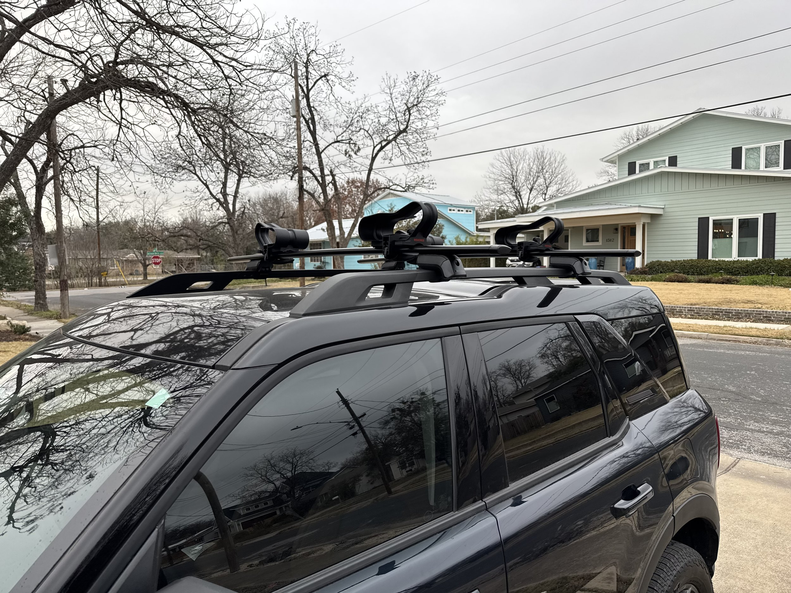

One big step taken this weekend which is I got the crossbars and cradles put on the Bronco Sport. These are the Yakima cross bars with their Big Catch cradles - the only kayak mount that is actually rated to hold modern fishing kayaks. It’s nice as well because it came with all the straps necessary to secure the kayak. I think I will have to adjust the cross bars a little to get as much distance as possible between them, but that’s an easy fix. I want to give a huge thanks to [The Rack Shop](https://therackshop.com). I showed up at 1:30, with them closing at 2, hoping to just make an appointment, and my man went ahead and stayed and got it installed on the spot. Amazing! If you need any sort of rack or accessories, go check them out!

There isn’t a lot of progress from a finished perspective on the kayak this week, but I figured out how to get the trolling motor to deploy and stow from the cockpit area. The kit I got for the Motorguide had some stuff for this, but the MinnKota has two levers that I have to pull, so I was able to modify the setup to make it work. While I did test it with some temporary stuff, I had to order some random things to actually finish it off. I’ll take pictures once it’s actually setup for real.

I will say, I’ve been thoroughly enjoying the problem solving of getting this thing all setup. I really didn’t expect to - I’ve always kind of felt I wasn’t good a this. But I think the kayak is looking pretty good and it’s functional. Getting the MinnKota was scary because there was nothing on the internet about this. But honestly, it’s been a real good surprise how much fun I’m having with this.

So it’s been a good distraction from all the fascism going around.

This week I’m heading to Boston for work. I haven’t been to Boston since the mid-00s, so it will be neat. We’re going to be in the suburbs, so it’s not like I’m having a meeting in the middle of town, but it will cool to get this customer visit in.

Hopefully next weekend I can finish up the build on the kayak on Saturday and get on the water on Sunday.
