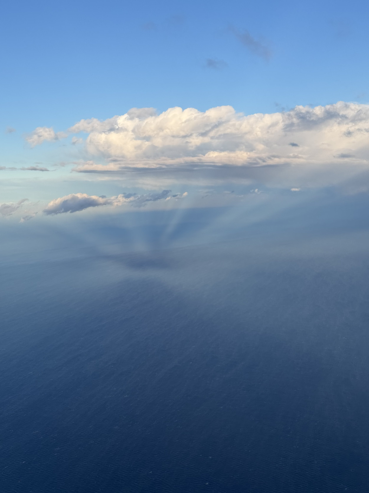

I’m in Boston for a few days for a work meeting. When I have traveled for work in the past it’s almost been exclusively overseas, so it was always at least 5 days if not seven or more. This trip is two nights… fly up, meet, come home. Not bad. I would like to make it back up here at some point as a tourist.

When we were landing we swung over the Atlantic and came in from the east and while we were over the ocean the mist coming off the water was interacting with the setting sun in a crazy way. Just wanted to share that.
