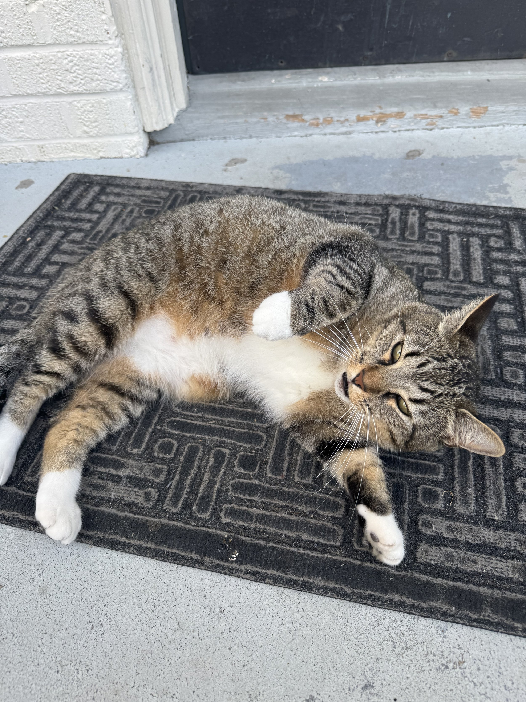
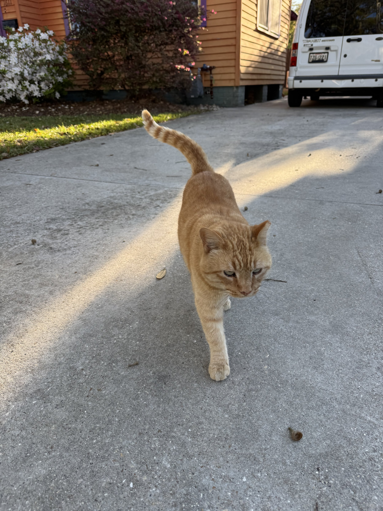
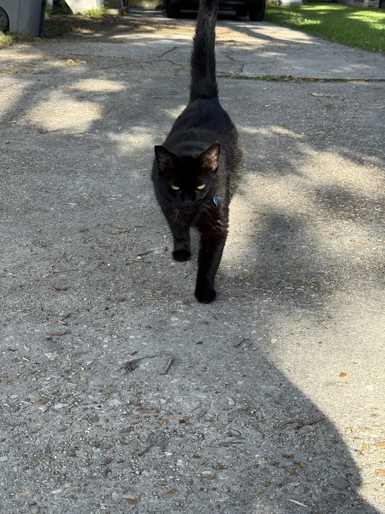
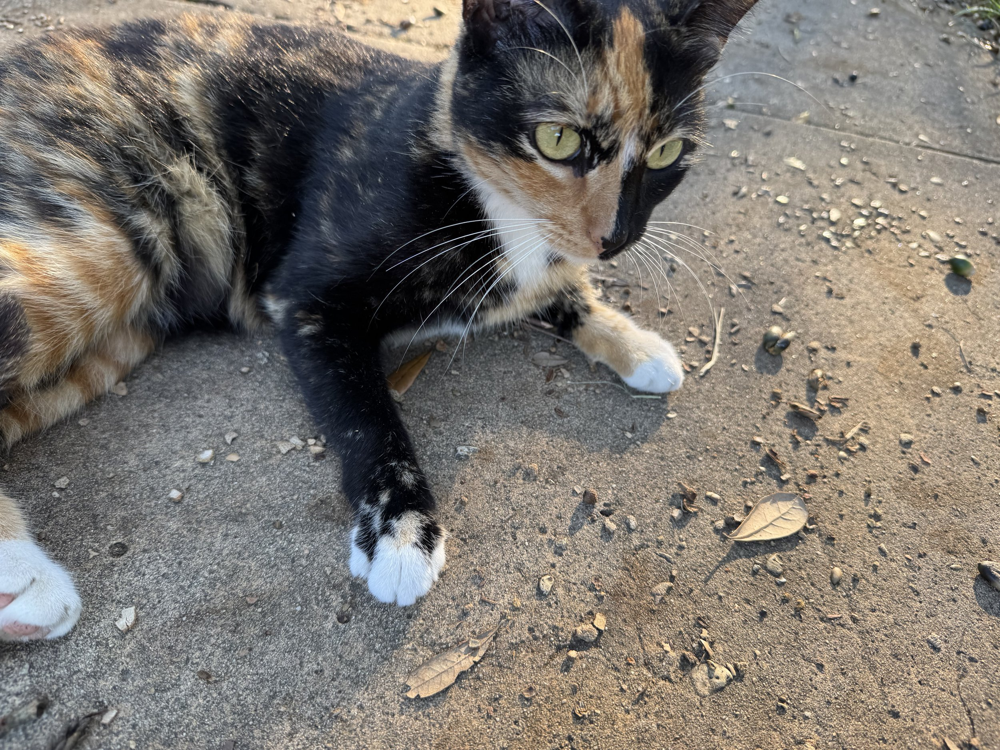
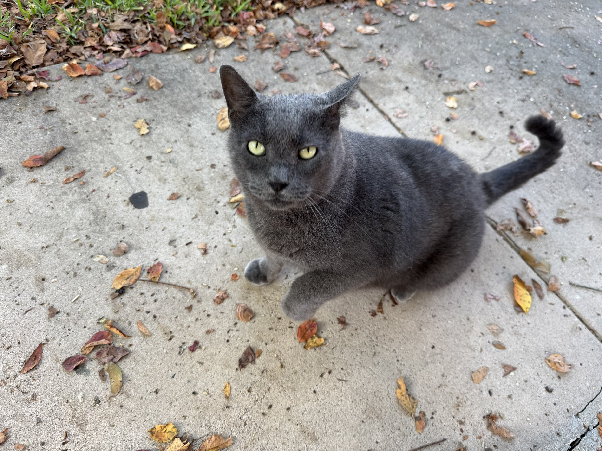

As we are about to head back to Austin for a few weeks, I wanted to take a minute to highlight one of the things that really brings me joy. One of the great things about our neighborhood in Baton Rouge is all the cats. And for the most part, a lot of them are very friendly. Today I wanted to talk about all my cat friends.

This is Asher. He lives in the apartment below us. He’s a very chatty guy. Also, yes, that is a total trap. He doesn’t like his tummy rubbed, even though he will gladly show it to you while he flip flops. He often greets me when I go walking or running in the morning.

This sweet little orange guy lives on my Friday walk route. He’s a friendly little dude with a sweet meow. He is a somewhat shy, but eventually always comes around and wants rubs. He’s kind of short from front to back - but he’s solid.

This little void lives across the street from the orange, amusingly enough. He’s a sweet guy who’s very talkative, and clearly loves snacks. Two void stereotypes. He’s a little bowling ball. Sweet cat.

I met this girl for the first time last week. She was so sweet. But she didn’t meow at all. I love cats that have that split face coloring. She even let me rub her belly. She seemed young, but she has a clipped ear, so clearly somebody is taking care of her. She’s so sweet, I really wish somebody would bring her indoors.

Last, but certainly not least, is the cat I see the most often on my walks: Chonky GiGi, or CGG for short. I call her this because, well, she’s a big girl, and she’s the same coloring as my cat GiGi. She’s awesome. Super friendly, always runs up to get some attention. A lady walked by with a dog the other day and the dog whimpered while moving away from CGG and she just squared up to him. She clearly rules her part of the block.

There are definitely other cats that I have seen, but these are the ones that for the past few weeks I’ve seen the most. And of course, there are cats that I see that want nothing to do with me, so obviously it’s much harder to get a picture of them. I’ve seen that meme about how cat people get so excited when they see a cat, like they’ve never seen a cat before. Ask anybody who has spent time with me, I am that meme.
