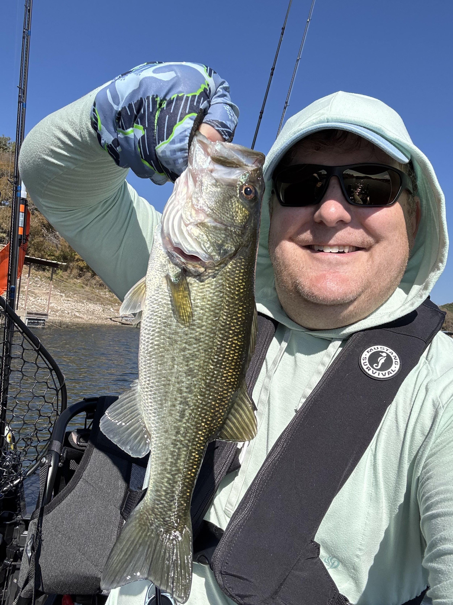
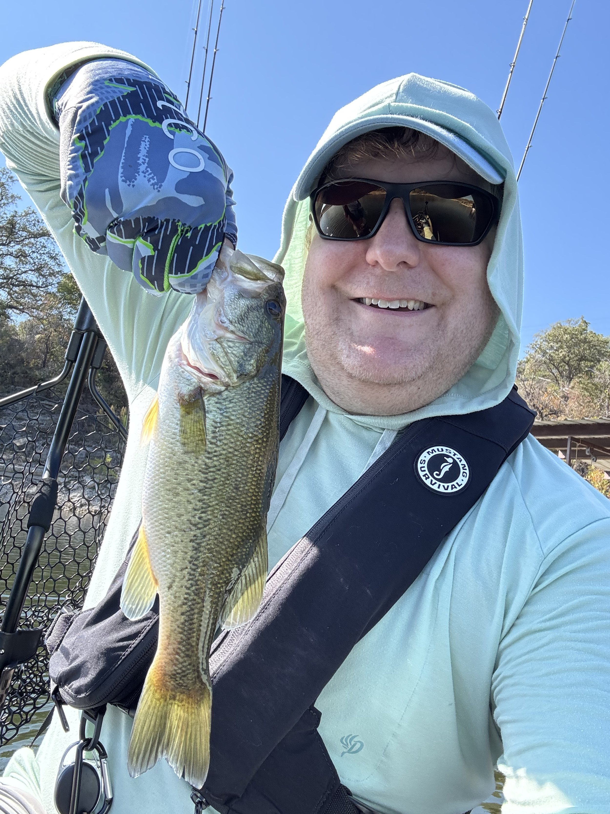

I had the best of plans to get out on the water in my kayak to do some fishing, but a case of food poisoning ruined that a few weeks ago. But with our upcoming trip back to Baton Rouge for the holidays, that left one weekend to get out and try to catch some fish, and I was excited to bring the kayak to Cypress Creek park on Lake Travis to see what I could find.

I didn’t get anything near the park on a variety of baits. I finally ventured out a bit and found these two in some pretty shallow water.

Neither were very big, probably 1.5 lbs or so. I thought I had something going as I caught both on a drop shot with pink in the lure. But as I hit several spots on the way in with the same lures I got no bites at all.

I look forward to getting back out to lakenWalter E. Long after Christmas. The grass should have died off, and hopefully I’ll be able to track them down.
