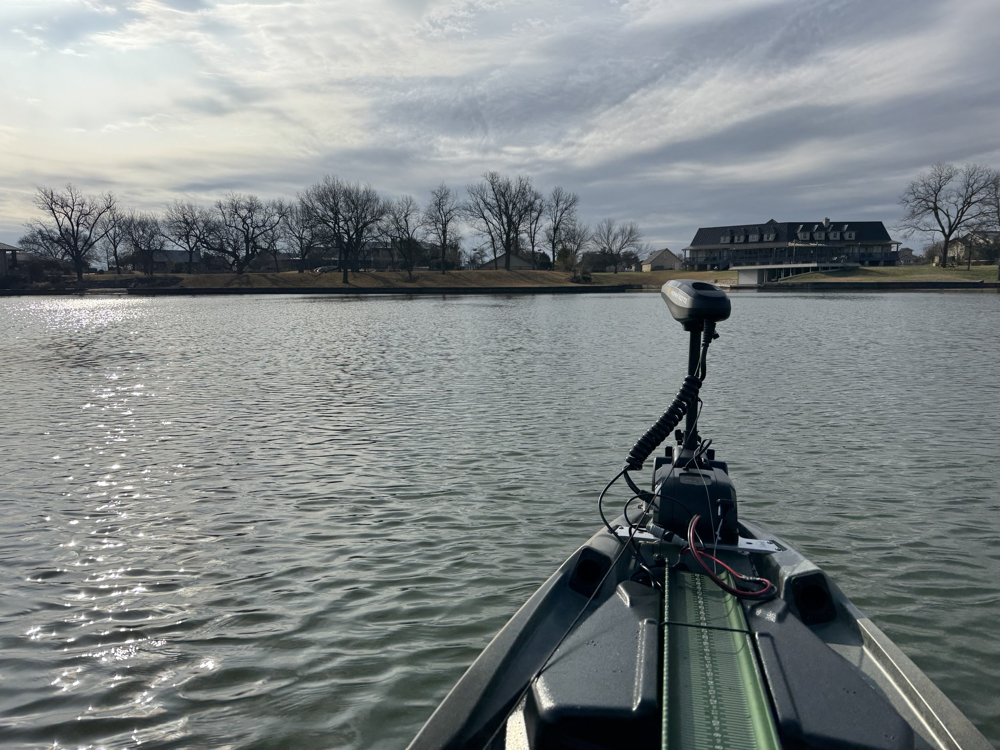
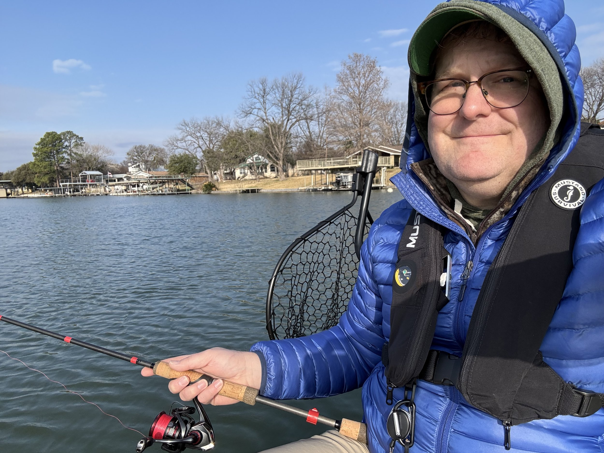
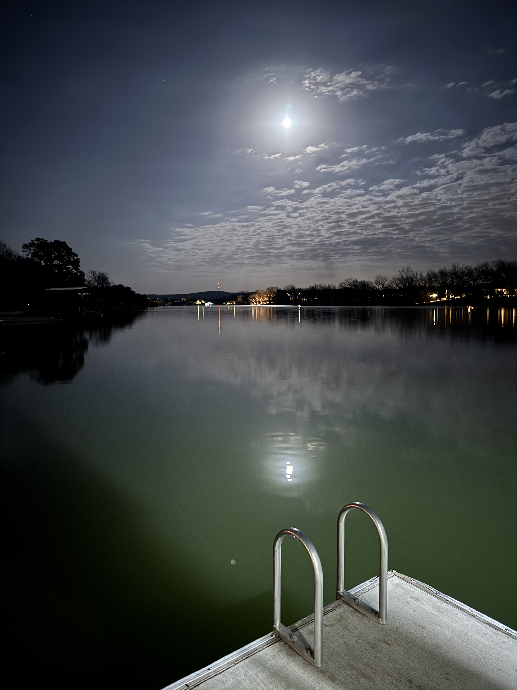

We spent this weekend out at lake LBJ with some friends. My friend brought his new fishing kayak, and I brought mine. The Bronco Sport was pretty full on the way out there. This trip was the longest distance I’ve driven with the kayak, so I was a little nervous on the way out, but it held up fine. Friday morning I took the kayak out in the cold and hit the lake.

It took me a little while to get used to controlling it. On the first trip out the rudder wasn’t down all the way, so once I got that cleared up the ability to steer with my feet is really nice. It also took me a little while to get comfortable standing, but I figured that out as well. The PWR129 has great, “secondary stability,” meaning that it will wobble a good bit but then you hit a point and it just stops. So once I learned to let it just wiggle knowing that I could lean into that stable point, standing up got a lot more comfortable.

\[caption id="" align="alignnone" width="4032"\] It was very cold on Friday. This rod later snapped in half when I was trying to set the hook on a fish Saturday night. \[/caption\]

Unfortunately, I didn’t catch any fish in the kayak this trip, so that milestone is still out there. I caught a good size bluegill and a nice size bass from the dock at our house, which was nice. But that cold water and rapidly shifting temps in both directions seemed to be putting the fish in a weird mood. I think in about 2-3 weeks it’s going to be great fishing out there.

The weekend before, I was hoping to get a little time on the water at lake Walter E. Long just east of Austin. But when I got there, got everything all unloaded, and got the kayak in the water I noticed that the trolling motor didn’t have power. It was nothing easy, so I had to pack everything back up and head home. I quickly discovered when I got home that several of my wiring splices had come loose. I guess it was the vibration from the car ride. All-in-all I consider it a blessing in disguise because I got some much nicer butt connectors, a better crimper, and some shrink wrap tubing and redid them all. Now my splices are super solid.

\[caption id="" align="alignnone" width="3024"\] The moon at the lake Thursday night when we arrived. \[/caption\]

One last kayak story… I didn’t charge my trolling motor battery Friday overnight. I paid for this decision on Saturday. I wasn’t catching anything, and I knew the wind was going to slow me down coming in, so I decided it was time to head home. I crossed the lake over to our side, made it about three houses, and the motor just stopped. Battery was dead. I had my paddle, but the wind had picked up while I was back in some canals off the main lake. I started paddling and during the gusts it was all I could do to not go backwards. Eventually I got to a point where the lake turned and I was able to get some wind relief from the houses by hugging the shoreline. But that was a long, hard paddle back to the house. But it was good in some sorts, to get to practice what happens when I run out of battery or something else goes wrong with the motor. You can always paddle!
