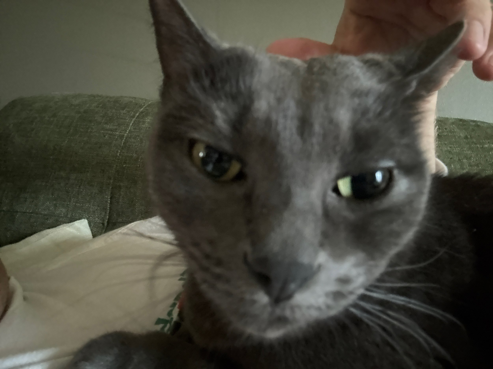

\[caption id="" align="alignnone" width="4032"\] GiGi needed extra snuggles the morning after driving to Baton Rouge. \[/caption\]

It’s always weird when we transition from Austin to Baton Rouge (and vice versa). This time is particularly odd since I will be heading back to Austin for work for a few days in the middle of the week. And then you throw in the extra craziness of Carnival, and it has been (and will continue to be) weird.

We did get a new dishwasher last week in Austin, and that was very exciting. Our old dishwasher had stopped cleaning properly, and the racks were falling apart. The new one cleans really well and is so quiet!

Not much happening on the fishing front right now. I did bring a pole with me to leave here. Looking forward to taking advantage of some spring fishing in the ponds around town in Baton Rouge. But I’m really looking forward to getting out on the water when we get back to Austin at the end of the month. The warming water temps should have all the fish active, but it won’t be hot yet.
