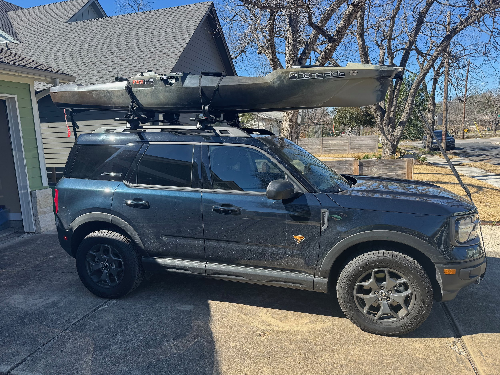
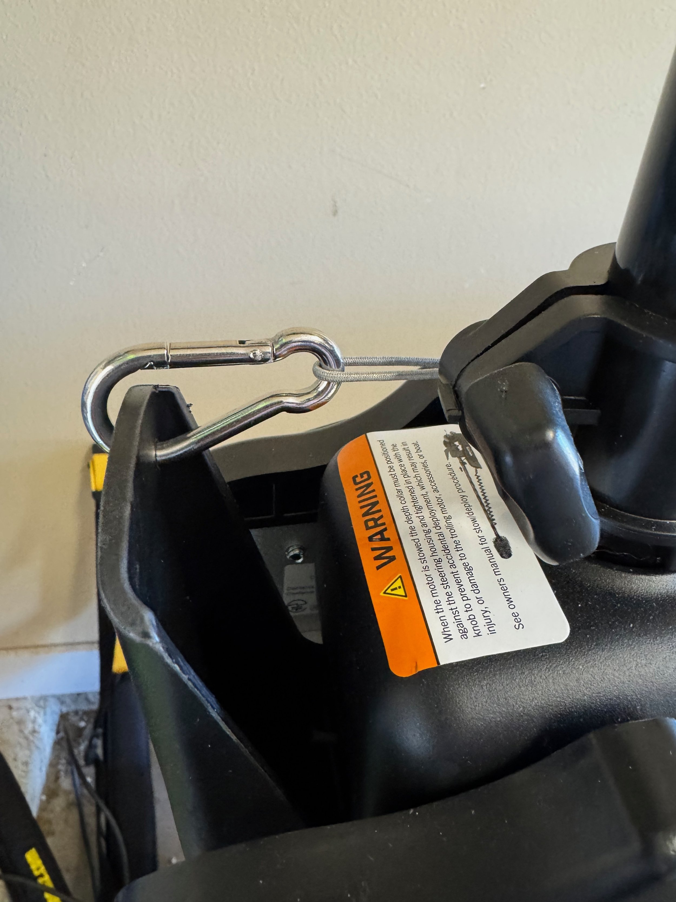
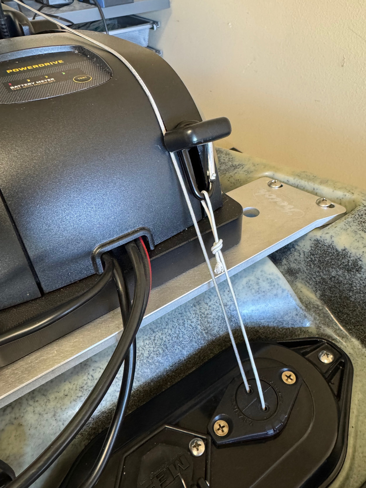
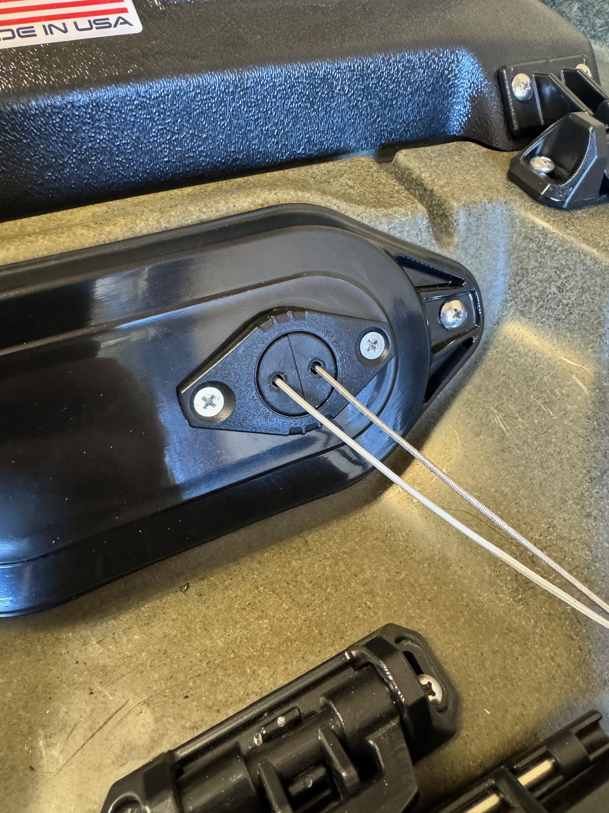
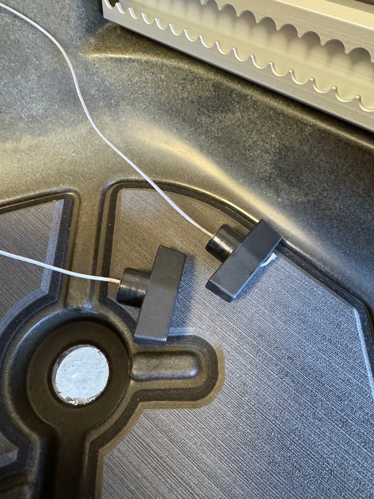
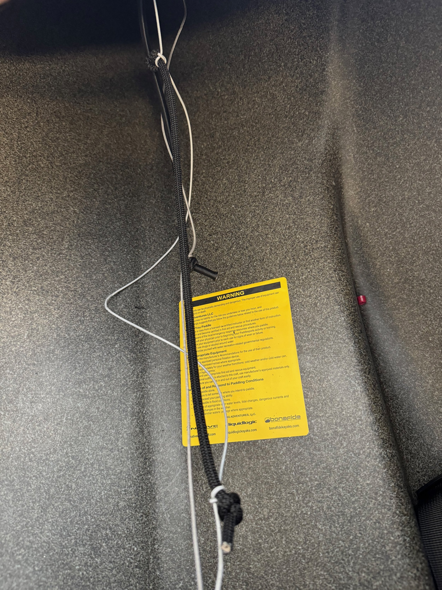
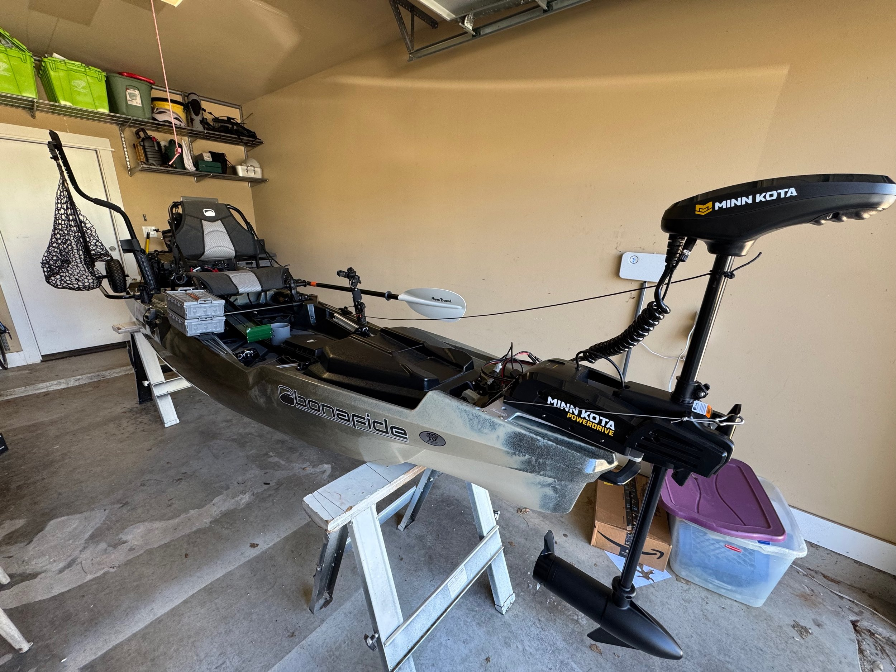

\[caption id="" align="alignnone" width="5712"\] The PWR129 stripped down on top of the Bronco Sport. \[/caption\]

First off, I did a test run of getting the kayak up on the Bronco Sport, getting it strapped in, and driving it around the neighborhood. It’s a little bit of work out (I have something on the way that should help with that, more on that in a later post), but I got it up. Once all the straps are tightened it doesn’t want to go anywhere. It will be interesting to take it on the highway. Also, this practice run allowed me to work out some ordering issues (for example, you can’t load anything through the tail gate once you tie down the back) and work through the packing checklist. I didn’t know how easy the loading and unloading process was going to be, but now I feel confident that I have it under control.

I was able to do some work on the kayak setup as well as several parts arrived while I was in Boston.

With me using the MinnKota Powerguide instead of the MotorGuide Xi3, I had a need to adapt the motor deploy system that came with the wiring kit that I bought. The Xi3 has one big pedal to release and store the motor. The MinnKota on the other hand has two levers. One you see in the picture on the left which is used to hold the motor when it is completely stowed. However, with how the motor sits on the mounting plate, I also need to open that lever when I deploy to get it around that mounting plate.

The picture on the right shows the lever that you need to pull to release the motor to be pulled up. So I had the need to depress two different levers at different points in the process. I used the carabiner that came with the kit to attach to the big lever in the front, and found a very thin carabiner around the house to attach to the metal part of the release pedal. I used spectra cable with some simple loop knots as the pulls for each lever. These run into the hull using the YakAttack thru-hull wiring kits. With the carabiners it’s easy to remove the motor for transport.

There’s another thru-wiring plate where the spectra cord comes out, and I tied on some simple T-pulls to the end of the cable. There was one trick that I learned from the Bonafide guys who sold the wiring kit that I thought was really clever.

You use a piece of bungee cable and tie the spectra cable to it with slack in the spectra cable between the two knots. This helps to create some tension in the spectra cable to resist you pulling and make the process easier.

I had to buy more spectra cable, more bungee cord, the T-pulls, and another set of thru-hull wiring plates. But then it all came together really easily.

The other key part of the system that came in the Bonafide kit was some cord that you actually use to pull the motor up and let it down. This cord is attached to the trolling motor shaft with a loop, and you keep it tight with a YakAttack gear track cleat. Below is the video of me deploying and retrieving the motor:

So this was really the last big thing that I needed to do to make the kayak useable. My current plan is to get it on the water for its inaugural fishing voyage this coming Saturday. I have an appointment with Texas Parks and Wildlife this week, so I should have boat registration numbers before Saturday. Sunday is supposed to be raining all day, so it will be a great day to work on the last little details for the kayak before we head out on a fishing trip with some friends at the lake the following weekend. So this is what the boat looks like all kitted out (it’s missing my safety flag on the back, but otherwise, this is what it will look like on the water).

