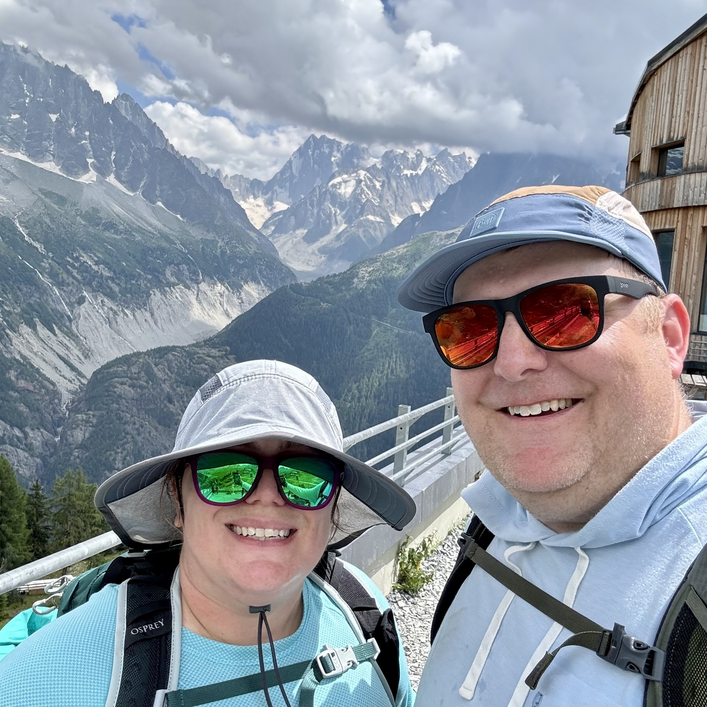

This week was my first full week of working out that I’ve had in quite some time. I did take one day where I went for a long walk instead of doing a run, but I was really sore from the Bulgarian split squats that I did the day before, and I think it was the right call.

The key is consistent movement, after all, and I figured a 45 minute walk was better than a 30 minute run where I just felt like trash.

\[caption id="" align="alignnone" width="2316"\] At the end of our hiking adventure last summer. \[/caption\]

This week was also our 21st wedding anniversary. I still think about stuff from when we got married, and I think to myself oh that wasn’t that long ago. But it was 21 years ago. Pierre was actually younger than our current cats when we got married - that’s crazy. But I look forward to many, many more years with Carrie. I love spending time with her, whether that be here or traveling somewhere. I love you, Carrie!
