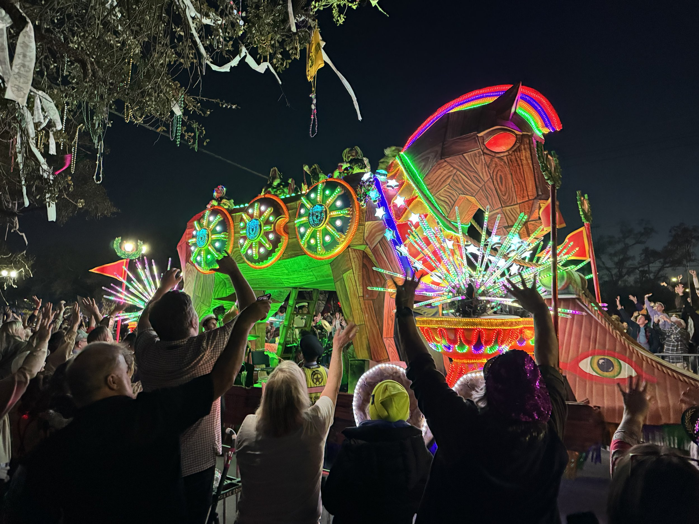

\[caption id="" align="alignnone" width="5712"\] One of the floats in Orpheus \[/caption\]

Mardi Gras was this week, and as always we had a wonderful time. The parades with their floats and marching bands are always cool to see, but the best part is getting to spend that much time with all our friends.

Rex on Mardi Gras morning was shortened by not having bands because of the weather that blew through later in the day, but Carrie and I have never gotten so many “float beads” than we did this year. Each float in Rex throws their own bead with a medallion that is tied to the theme of that float. Since the crowd was so much lighter due to the weather, we were really able to get a lot of these beads. Definitely one of the cooler things you can catch (that you don’t have to fight for, e.g., a Muses shoe) during Carnival.

On a completely different note, after Mardi Gras I got back to my efforts to become a better runner. After two good but short runs during the week, I set out for a 55 minute run on Saturday. What was awesome about this is I only walked for about 20 seconds when I turned around to come home. That is the longest run with the least amount of walking in it I’ve done in 15 years? Definitely since I stopped bike racing in 2013. One of my goals this year was to run a continuous 5k, and at this point I definitely think I have that in the bag, I just have to do it. The stretch goal is to run a sub 30 5k. I still have a ways to go on that one.

The previous few weeks were hard to get runs in with a lot going on, but now that the time has changed, and we have more light after work, I find it much easier to get those after-work runs in when needed. Looking forward to the next few weeks in Baton Rouge to get some consistent running in around the neighborhood and the lakes.
