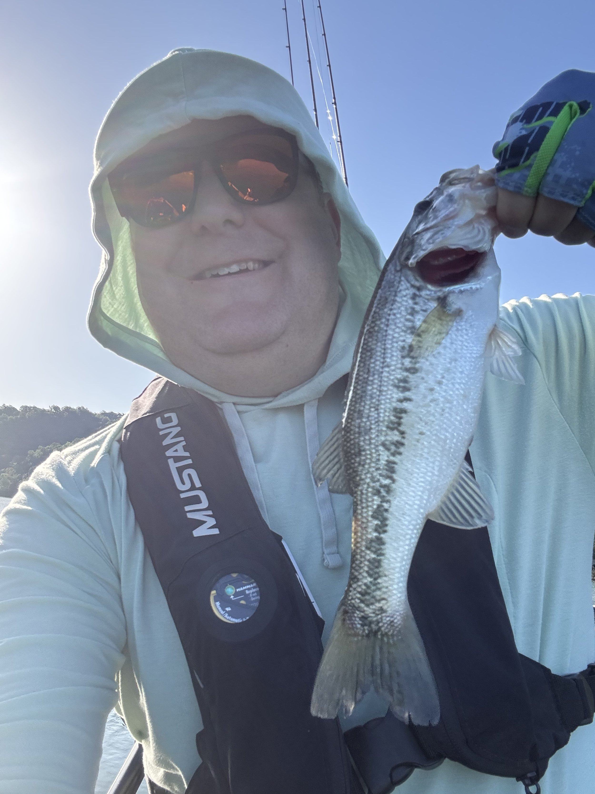
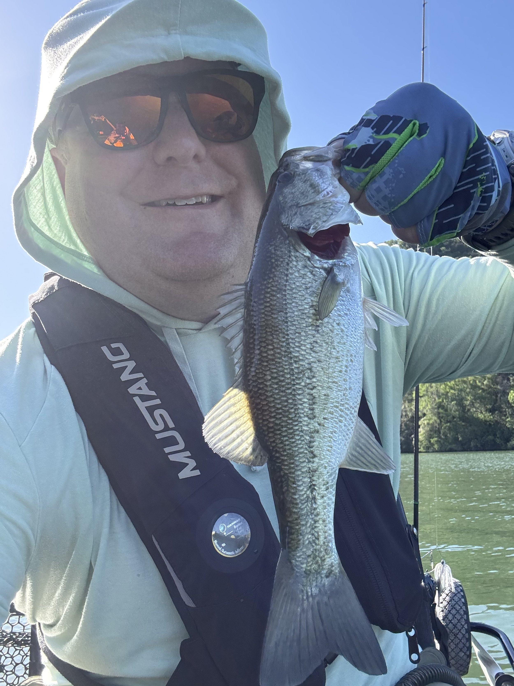
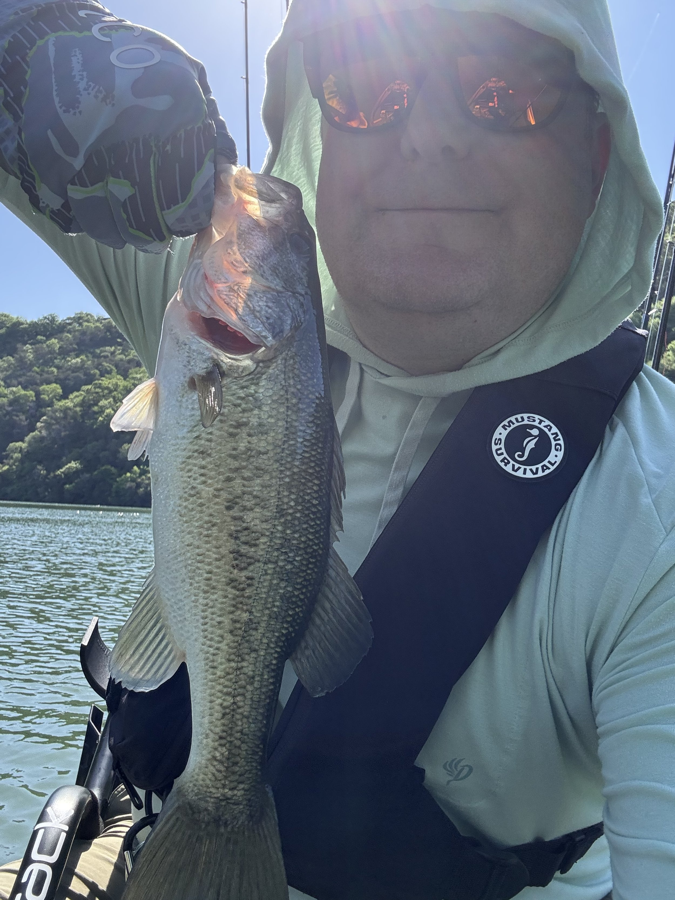

I went out on Lake Austin this morning as this is probably the only day in April I will be able to get out there between Easter and NI Connect. And the best part… I caught the first fish in the kayak! The skunk is off! I mean, they weren’t giants, but it was great to actually get bites and get them in the boat.

The first two were on a drop shot with a 4” Missile Magic Worm in Blueback Secret. The third one was on a 2.75” Swammer on a Dirty Jigs Tactical Mini Underpin 1/8oz. From that point on I couldn’t get anything.

Definitely learned more lessons today. I think my casting is also getting better. I still stay in one spot too much and don’t just cover water. I really wanted to catch a spinner bait or chatterbait fish today, but I lost my chatter bait pretty early on, and while I didn’t lose my spinner bait, the fish didn’t want that.

I was mainly fishing the shore around docks and such, but I wonder if we’re actually completely post-spawn, and therefore were there some fish who were looking to eat in the middle of the river on structure.

The next time I’ll be able to take out the kayak, it will be June, and we’ll definitely be deep into summer pattern at that point. So that will be a new nut to crack.
