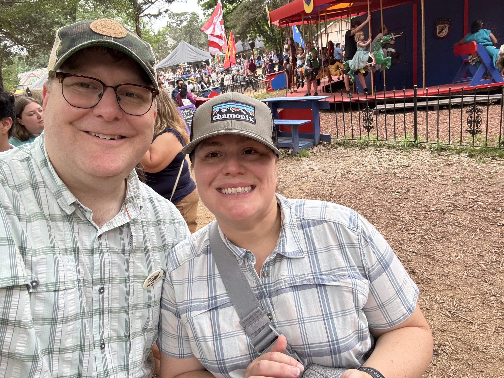

\[caption id="" align="alignnone" width="4032"\] Carrie and I at Sherwood Forrest Faire \[/caption\]

We had a great weekend. Friday I flew back from a work trip. I managed to keep myself from getting stranded in Denver by switching to an itinerary through Houston while I was literally on the plane that had gotten delayed going to Denver. Thanks, United Premier 1k service line!

Saturday we got our long runs in and then went to the Sherwood Forrest Faire. Always a good time. My favorite part is always the bird show. I love watching the birds fly around from perch to perch, they all have such personality, especially Ziggy the vulture.

Today was Easter. We went to mass and then head a lovely dinner with friends. I was able to catch up on a little work between mass and dinner, which was nice.

But I could definitely go for a three day weekend. A day to get caught up around the house and just get things in order would be fantastic. I know, world’s tiniest violin and all that. It has been great having weekends full of time with friends and doing awesome stuff around the great city we live in. But the little bit of introvert in me definitely pops up occasionally, and is like, “It’d be great to have a day to get things picked up and organized.”

Oh well, we can’t have it all. Final week of preparations for NI Connect next week in Ft. Worth! Looking forward to it.
