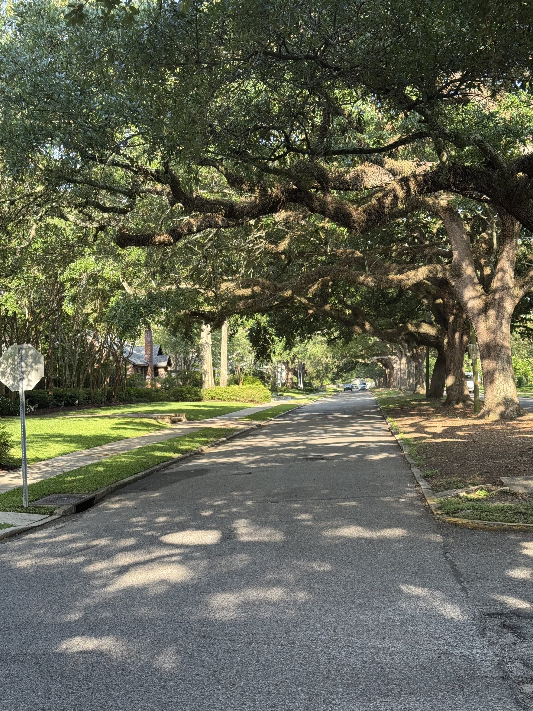

I’ve told people before that one of the things that I forget I miss about Baton Rouge and south Louisiana in general is the trees.

Austin has trees. But they’re not the same. They don’t get as big. They don’t get as grand. There are definitely some parts of town that have better canopies, but it gets sparse pretty quickly. Heck, they named the soccer team after oak trees, but they don’t compare.

Big trees make me relax. They bring me peace. It’s one of my favorite things about Baron Rouge.
