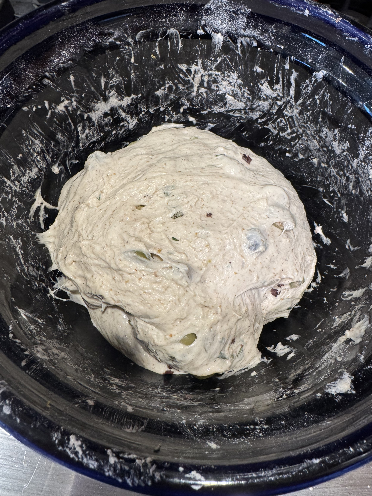
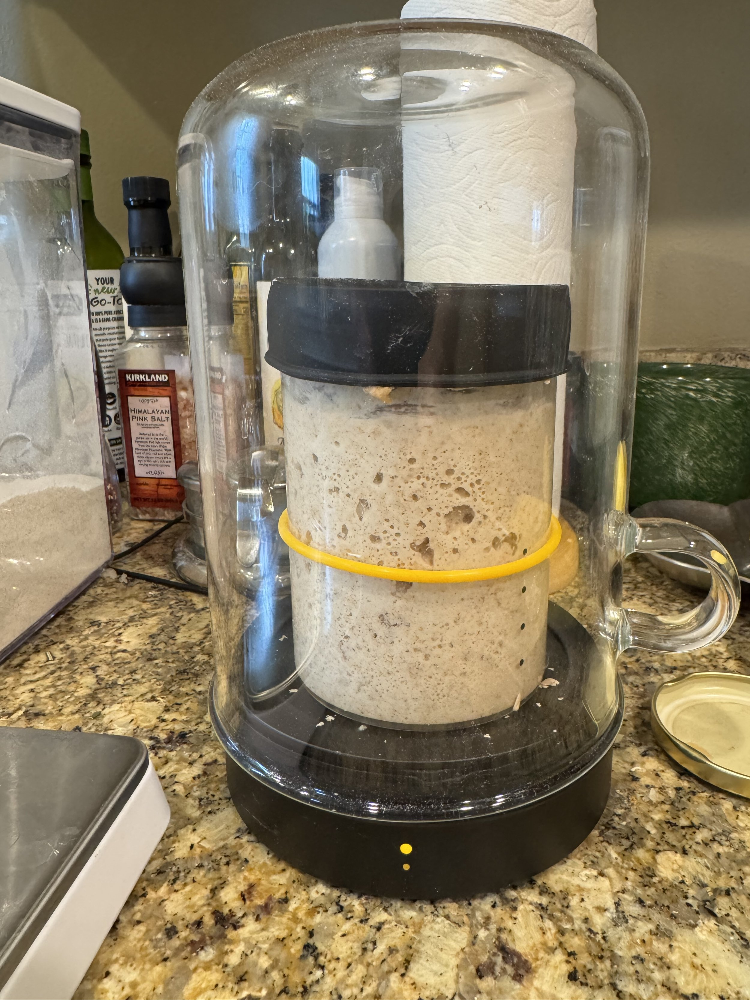

I brought my sourdough starter with us to Baton Rouge this trip because I wanted to make some bread. My sourdough starter’s name is Chad. I was given Chad by a friend many years ago, and it has gone through many periods of being asleep in the fridge. But he is back.

The first loaf I baked the other day came out… ok. It was too dense. It tasted good, but it just didn’t rise like I wanted. Today I made an olive loaf, and I will bake it tomorrow.

I got the above device to keep Chad happy and healthy. It’s the Goldie by Sourhouse. It’s been awesome. It keeps a consistent temperature for optimal starter health. And it looks cool. If you have an active starter, I recommend it.
