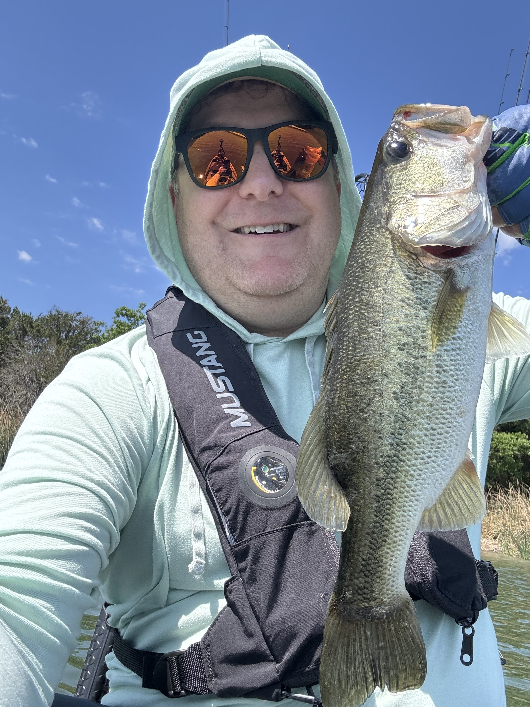
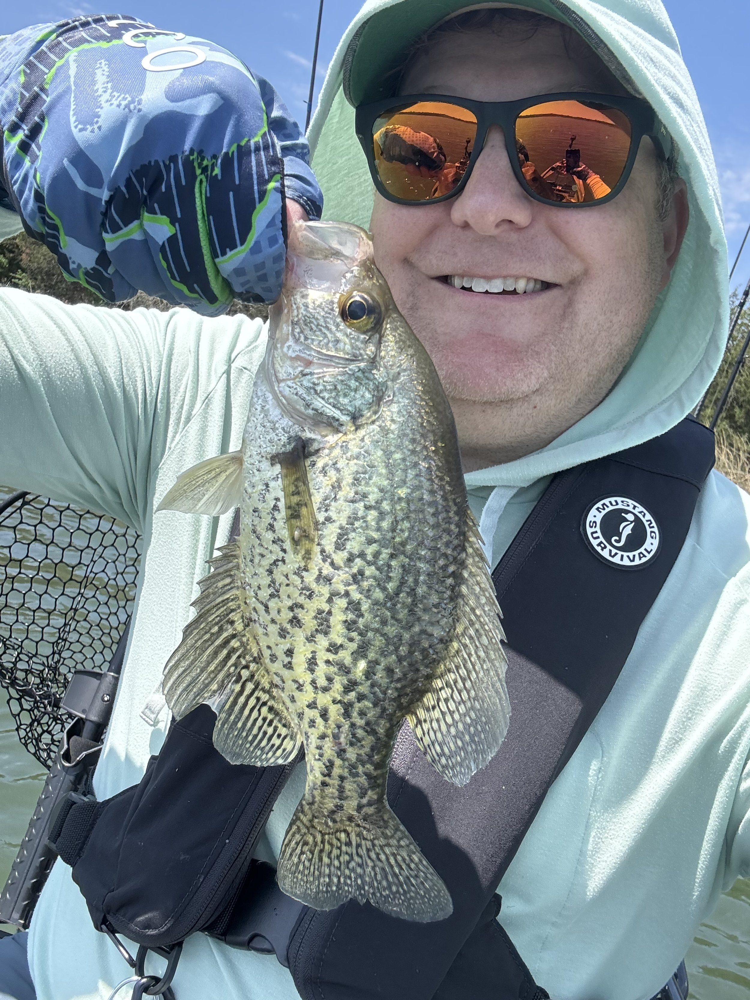

I will post a recap of NI Connect over on LinkedIn, but with that in the rearview mirror, and us heading back to Baton Rouge next weekend, Sunday was the one chance I was going to have get out on the kayak.

I headed over to Water E. Long lake (also known as Decker lake). It’s been lowered to work on the dam, so there’s no “big” boats out there, and it’s apparently one of the big kayak fishing places in town. I probably got out on the water finally around 9:30 or 10.

While I bounced around the first few little coves without much luck, the first fish I caught on a drop shot sort of by accident just having the drop shot hang down by the boat while I was trying to get something else figured out. But, I cast back out there and caught another fish, and then realized I was on a flat with a lot less grass (there is a ton of grass near the shore). As it should be shad spawn season, and thus bass should be chasing shad, I decided to switch to a shad mimic bait using the “jig and minnow” technique. First cast… fish! I had an hour where I was catching fish every couple of casts. It was pretty amazing.

I hopped around to a few other spots, caught a few fish, but never quite found the blitz of the initial bite. I had about 5 or so fish that bit but they were able to throw the bait before I got them to the boat. All in all I had 12 bass and 1 crappie in the boat. What a day!
