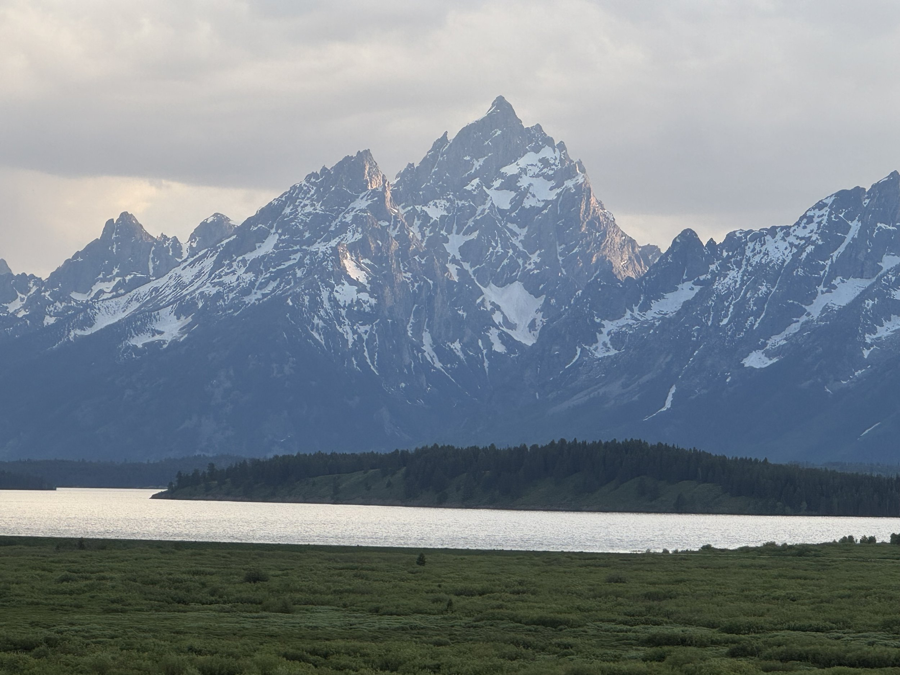
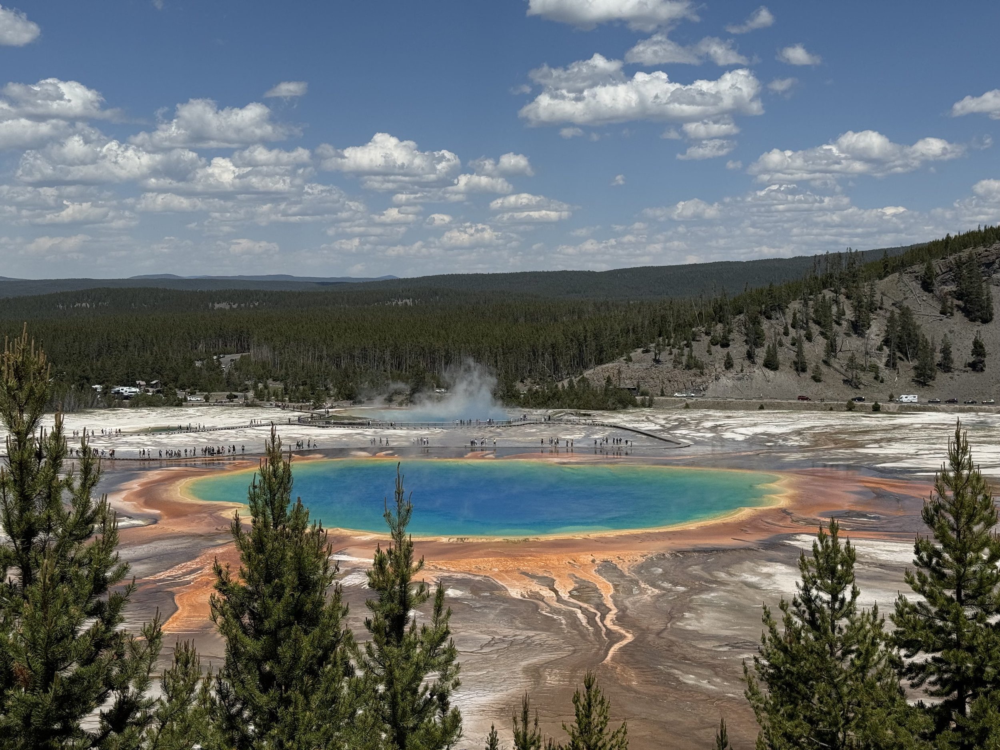
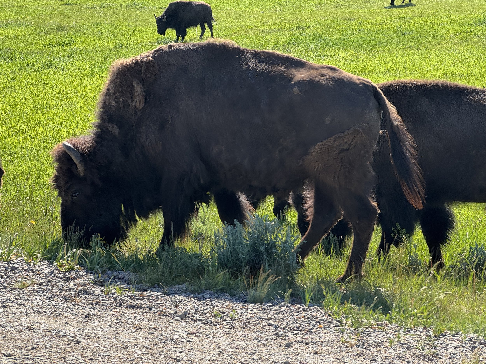
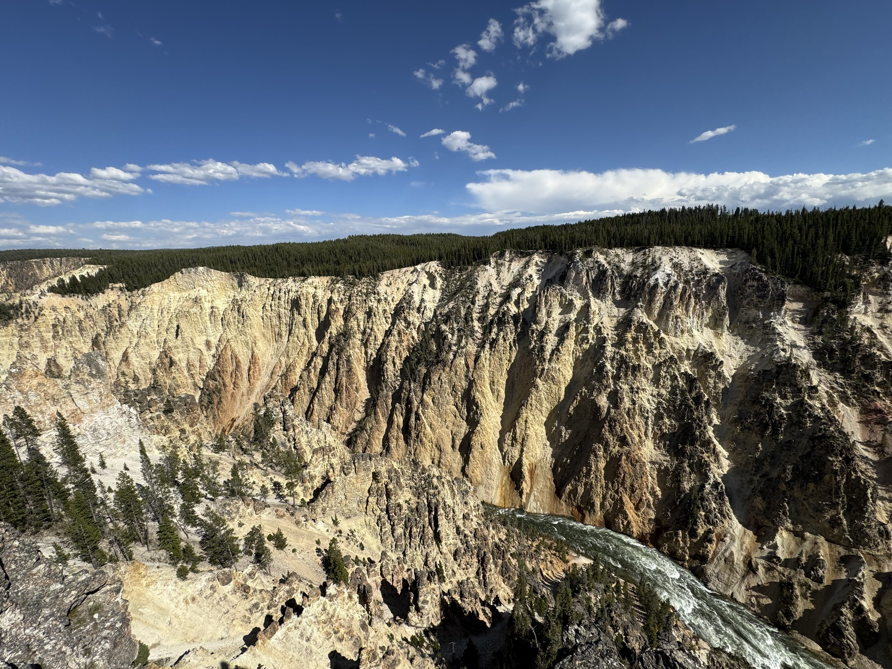
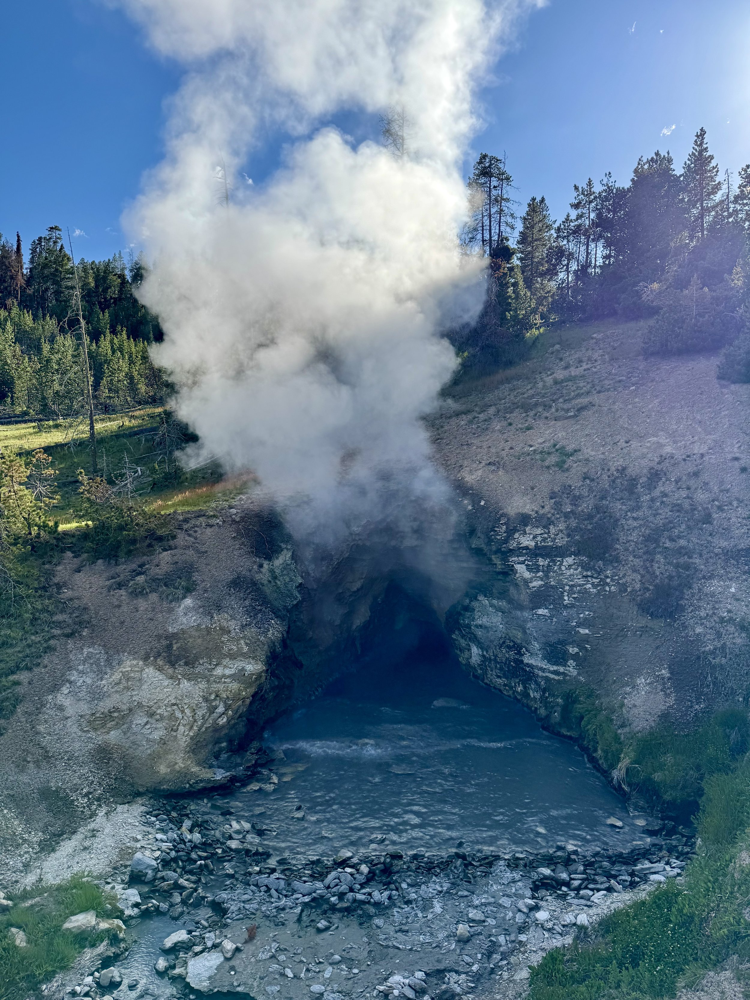
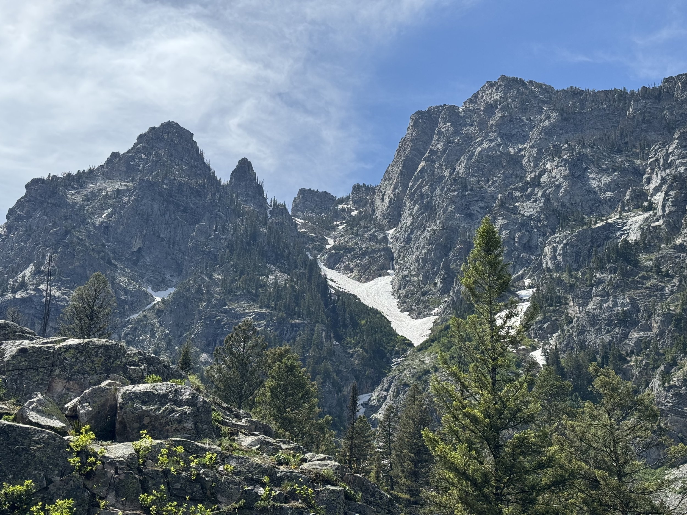
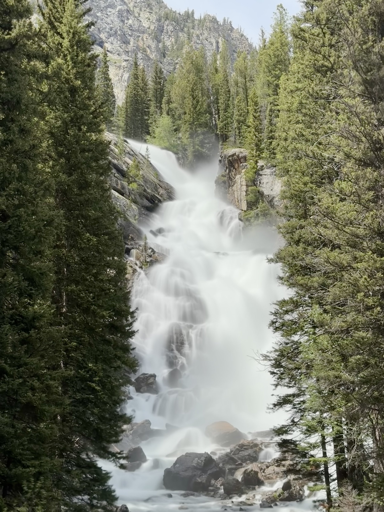
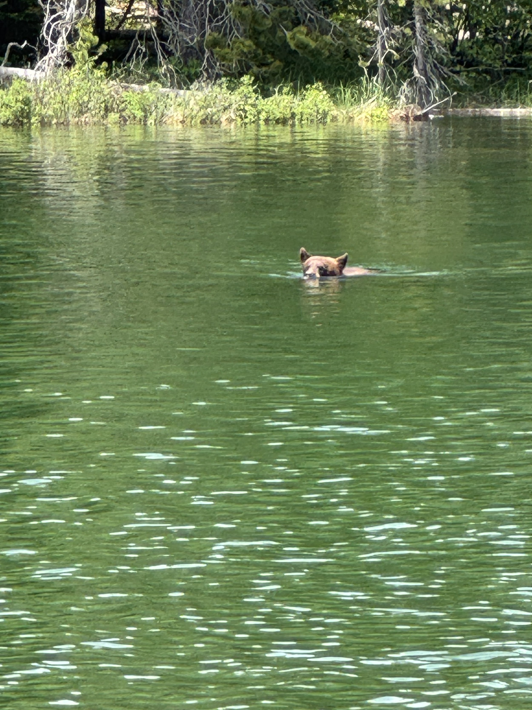

Last weekend we had the great opportunity to visit our friends in Jackson, Wyoming. One of the best scenic landings at an airport I’ve ever experienced. You fly in right by the Tetons and over all the lakes. It was truly stunning.

We spent our first full day there exploring the southern half of Yellowstone. What a unique place. Between the geysers, the prismatic pools, and bubbling mud, I will definitely not be forgetting that anytime soon.

The second day we spent exploring Grand Teton national park. The mountains are just stunning the way they rise out of the perfectly flat valley. Did some light hiking, and got to get way closer to a bear than I thought we’d ever get. (Keeping a safe distance, of course.)

All-in-all, it was a wonderful weekend. The food was good, it was great to hang out with our friends, and the scenery was amazing. Would go back in a heartbeat!
