On New Year’s Eve I decided I wanted to go walk 10 miles with 20lbs in my rucking backpack. I decided on a route that would take me down Far West and up Ladera Norte. If you aren’t familiar with Austin cycling, Ladera Norte is a pretty standard hill climb here in town. It’s very steep, and it provides a good challenge without having to ride out.

I decided that this was the perfect route for my ruck. I headed out with 2 liters of water, some food, and ready to go at 8 AM.

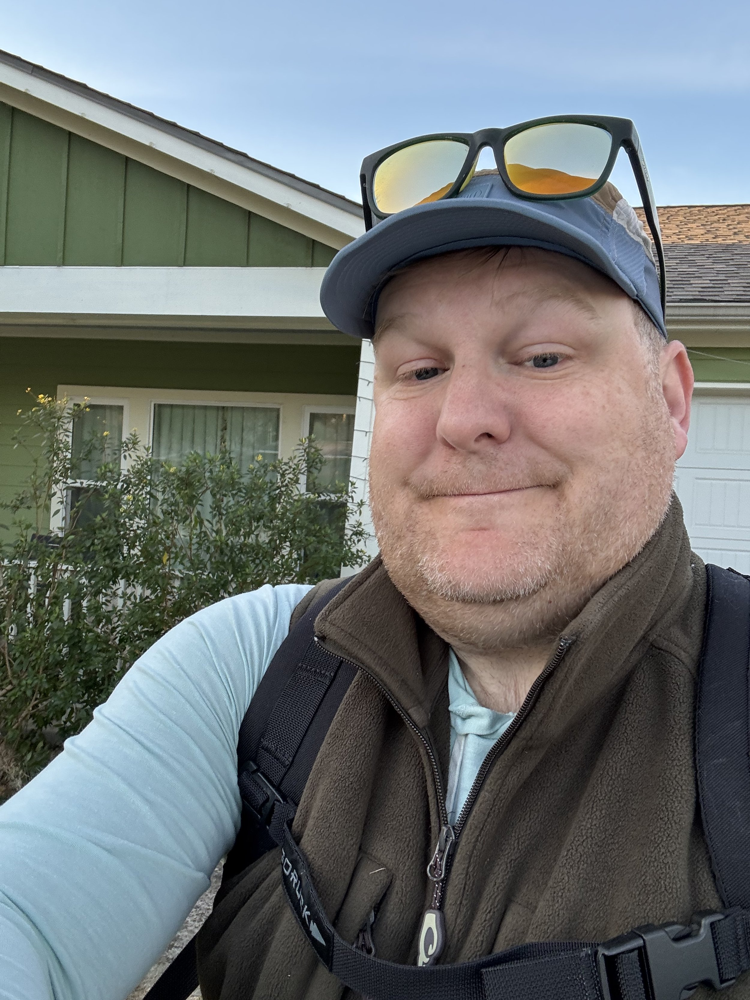

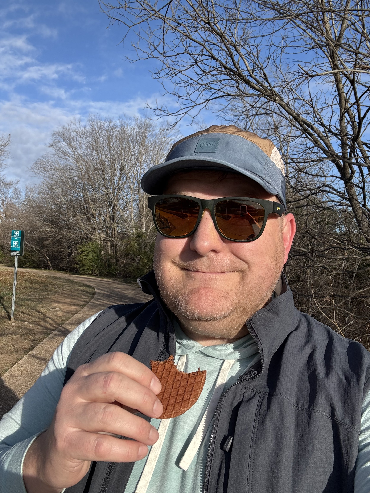

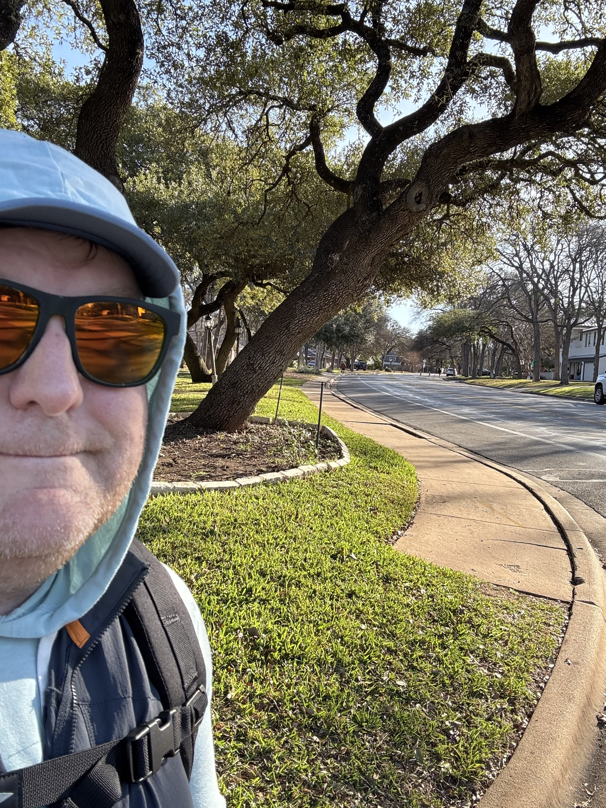

I made it up to the top of Far West feeling great. Had a stop before I cross MoPac to have a snack and change out my thick vest for my thinner vest. The nice thing about rucking is that you have a backpack to bring stuff with you.

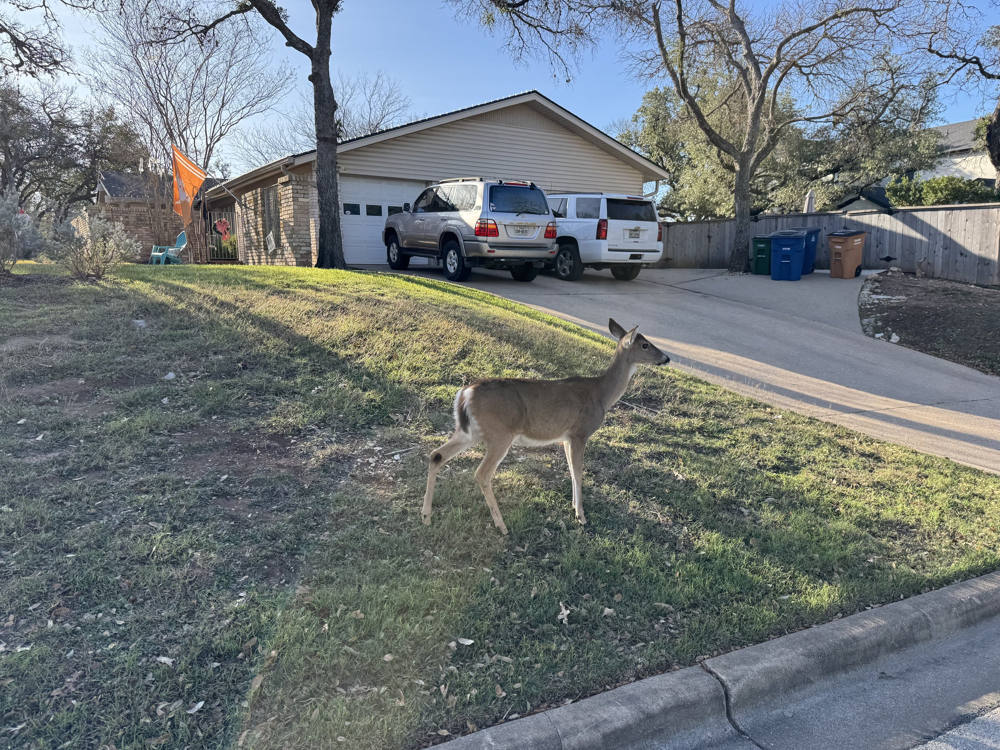

This deer crossed the street right in front of me and was just walking through this yard without any concern for my presence. Her two fawns were still on the other side of the street, and they were much more concerned with me. The photo doesn’t do it justice just how close she was to me.

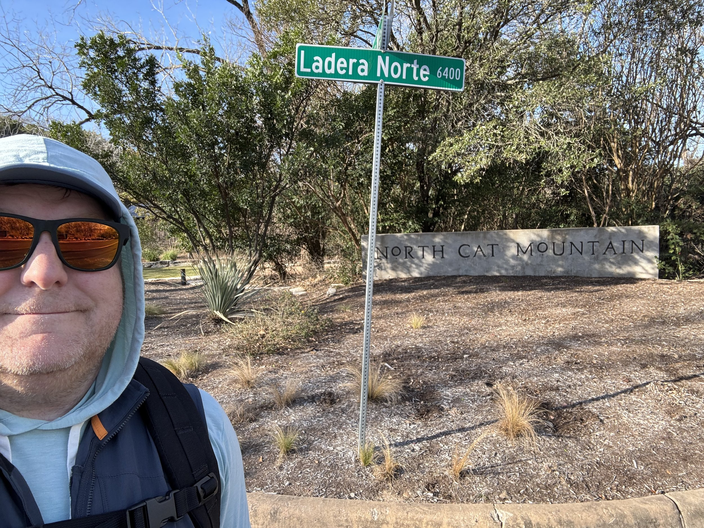

I was excited to start up this hill, I guess technically called North Cat Mountain. It doesn’t start out too bad, but it gets really steep for several 100 meters in the middle. Then you get a false flat for a bit and then a final little wall.

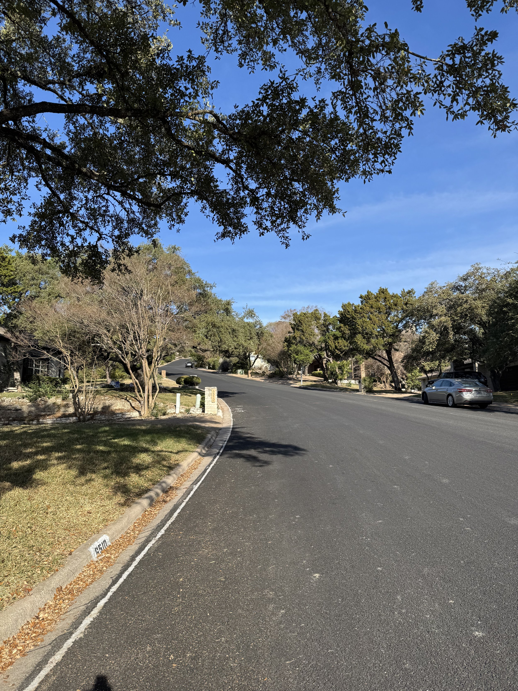

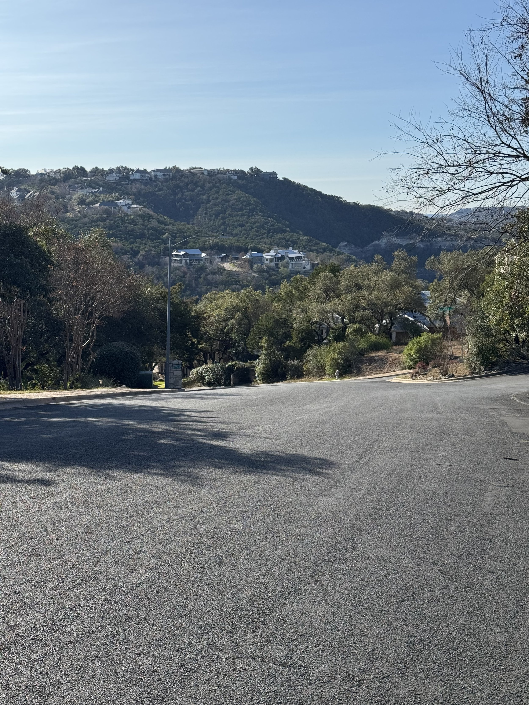

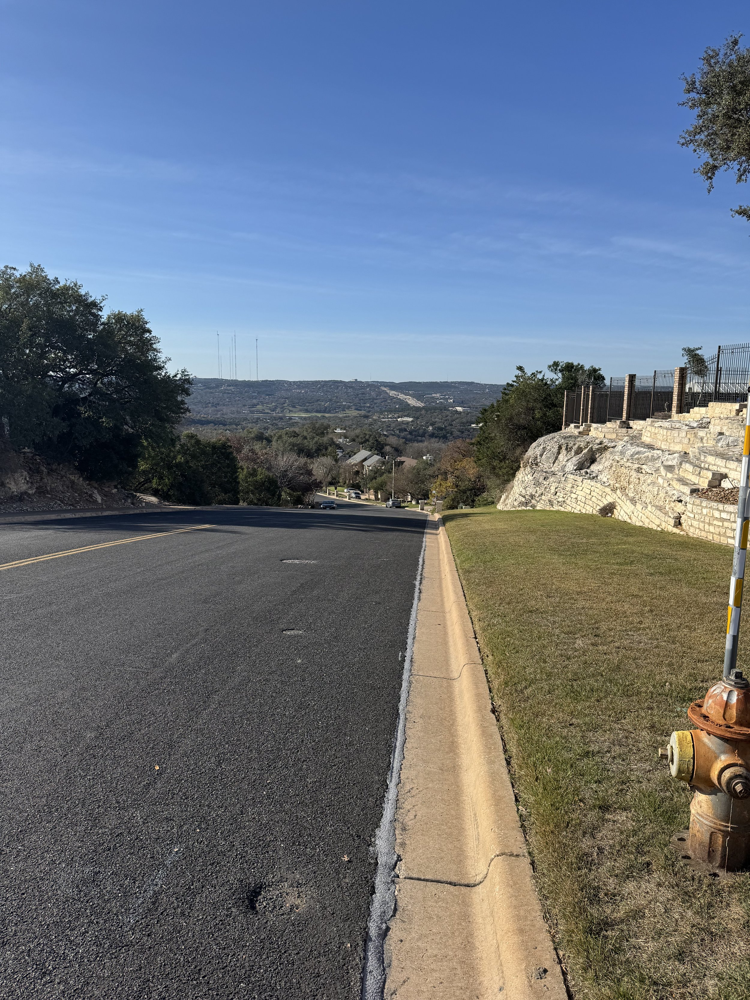

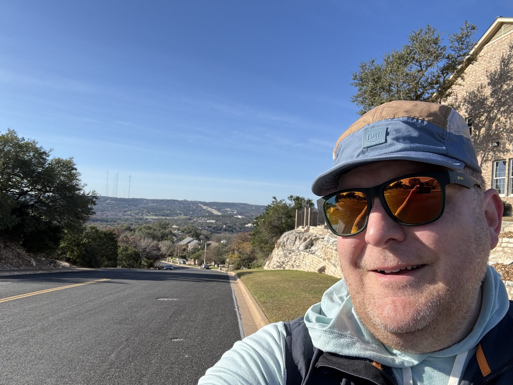

I was nice to get to the top. That was hard. It is crazy to me that I used to ride my bike up this hill on a regular basis. At that point I was over 5 miles and the hardest part was done. From here until MoPac was all mainly downhill, which was welcome.

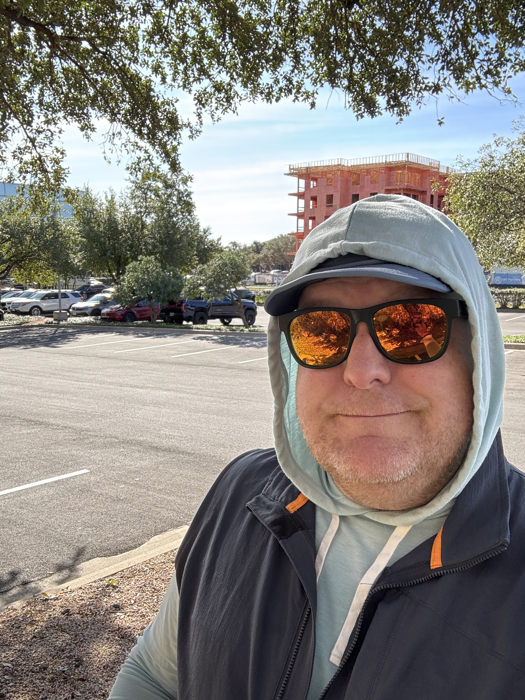

Right before I cross MoPac I stopped, had my last snack, finished my L of electrolytes, and got ready for the last 2 and a quarter miles. Around 2 miles to go my feet were just ready to be done. I still felt great from an engine and mind perspective, but my feet and legs were done. I was able to get through the last 2 miles and it was a great feeling as I turned on our street and saw our house.

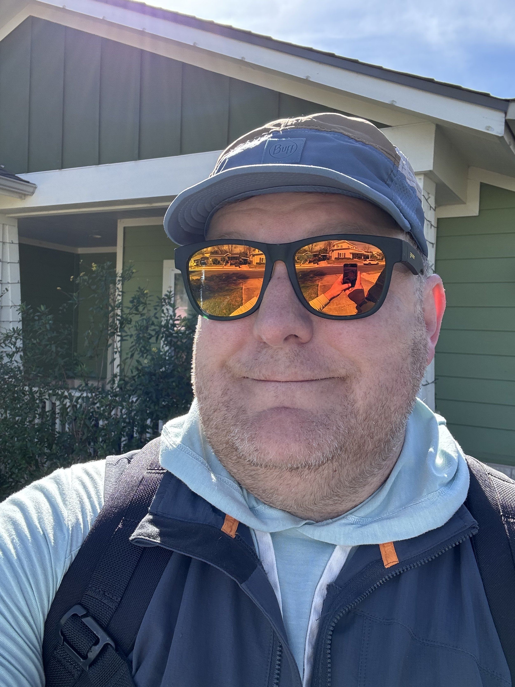

I got home right at 12, so it was 4 hours of wall clock time (I had stopped to feed some friends of ours’ cats, and then 4 water and snack stops). My watch said 3:38 of moving time, so I felt like I kept a consistent pace. I’m glad I went with 20 lbs and not 30 lbs. That would have been a bit much.

It was a great way to finish the year and set the tone for a year of healthy choices. In the next post I’ll review my goals from 2025 and then lay out the 2026 versions.
