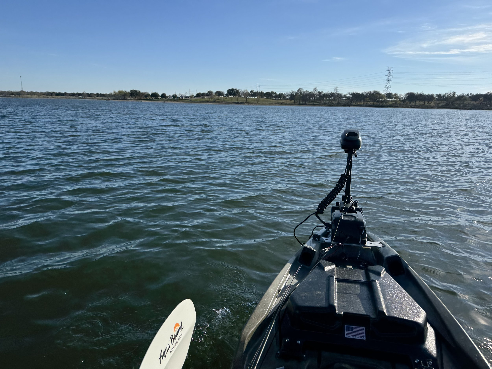
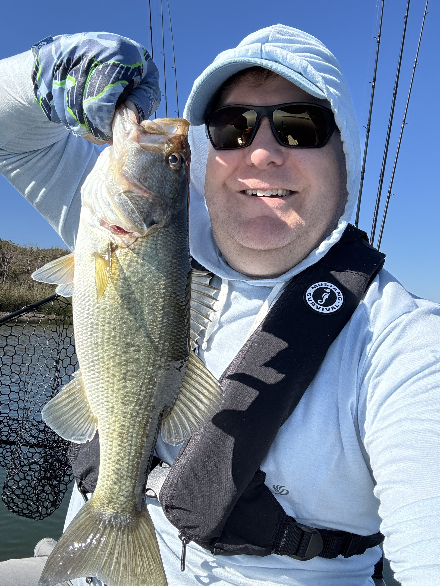
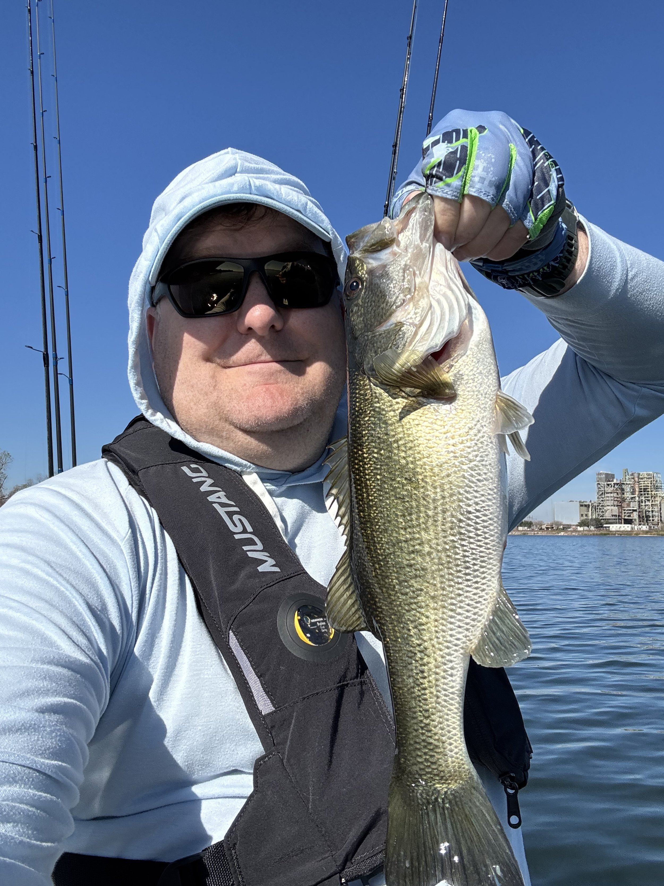
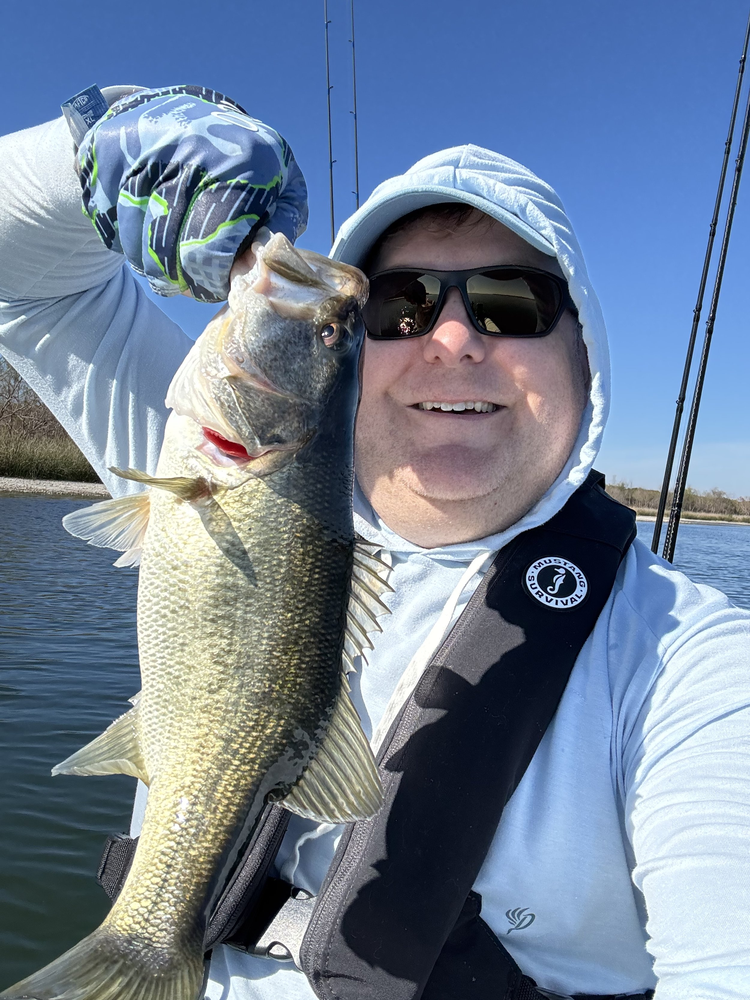

Welcome to 2026, and of course the world has craziness waiting for us. As this weekend was my birthday, I wanted to fill it with some fun stuff. I had had a good couple of weeks off from work (including my all-time long rucking adventure, a post on that later), and I got to cap that off with my birthday.

As we go into 2026 I will post my personal goals on here like I did last year, I also want to update everyone on my 2025 goals. Those posts will come in the next couple of weeks.

But for my birthday I did get to go out on my kayak and fish. The weather was beautiful and I even caught a few fish! Always nice to get out on the kayak, especially when the fishing is decent. It wasn’t great, but I did finally seem to stumble in to a pattern with the drop shot. That is really my highest confidence technique, and the one I go to when nothing else is working.

