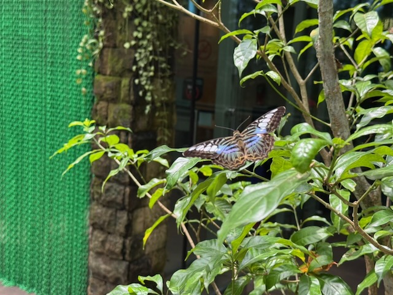
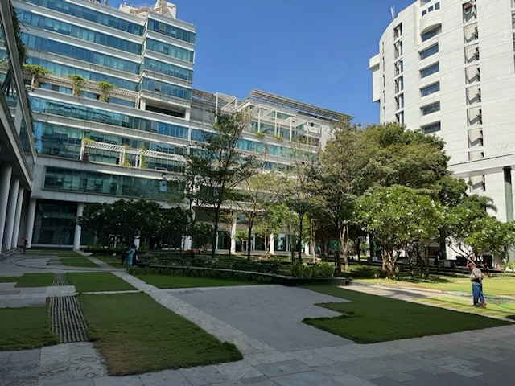
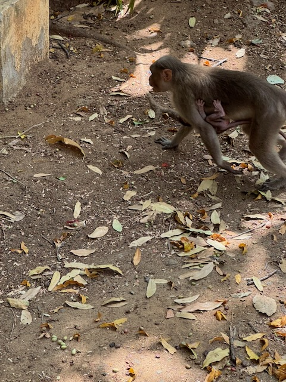
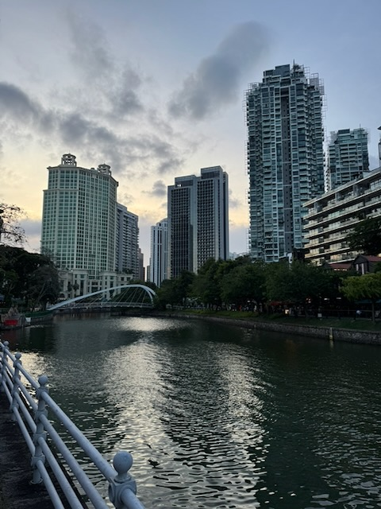
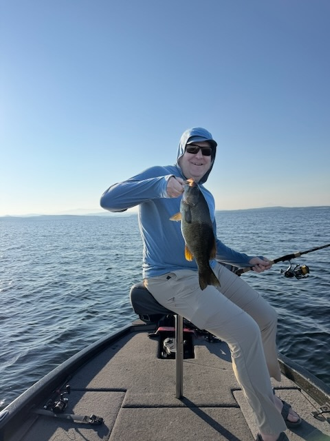
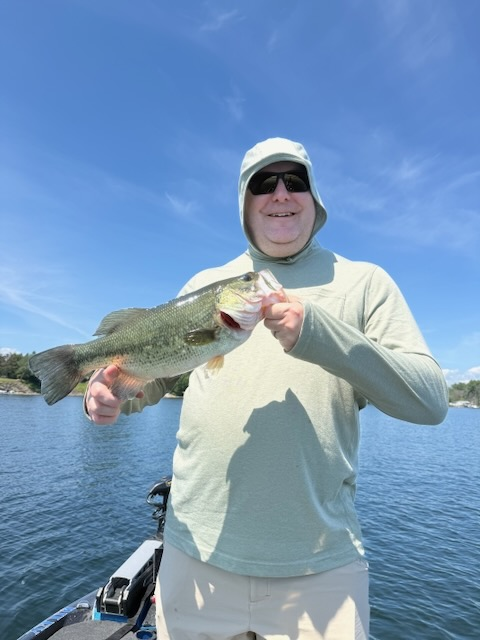

It's already halfway through this year. A lot has gone on this year for Carrie and I, but it is surprising how quickly we got here. When we got back to Austin after being in Baton Rouge for Mardi Gras, it was just March, and here we are.

I took the opportunity after Mardi Gras until we went back to Baton Rouge in June to get very focused on my exercise and nutrition. It was good to have several solid months of schedule. Made some good progress on my fitness goals, and I continue to hit PRs on my lifts at 48 years old, which is pretty cool. I have gotten back to running again, working through some injury issues, so that's nice. The goal is to complete two half-marathons this fall. One in October in College Station and one in December in New Orleans.

While we were in Baton Rouge in June I had to travel to India for work. It was a lot of traveling for a short stay in India, but it was a great trip. I went through Singapore on the way there and back, and it's always good to see a new place. As always, the food in India is amazing, and I also got to get some great Cantonese food in Singapore. A few pictures from the trip are below. 

When we got back to Austin we had our July 4th holiday at work, and then the following week I headed up to Vermont to go fishing with a friend of mine from grad school. It was beautiful up there, and we had a great time fishing. We caught a ton of fish, and it was great to get a break from the heat. 

We don't have a lot going on between now and Labor Day. Excited to get into a routine for a few weeks. I do hope to get out on my kayak once or twice this summer, and I need to start getting my mileage up with the running. 

Lastly, I've moved the blog to a new platform. I was using Squarespace for a long time, and it's a great platform for somebody who has an e-commerce business and such, but it was thorough overkill for my personal blog. Now I'm taking advantage of GitHub pages and Hugo which is a markdown-based static site generator. It's more than enough for what I need for this page.

Here's to a good rest of the summer!
